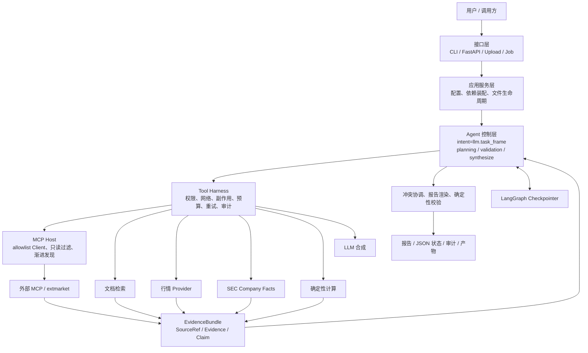
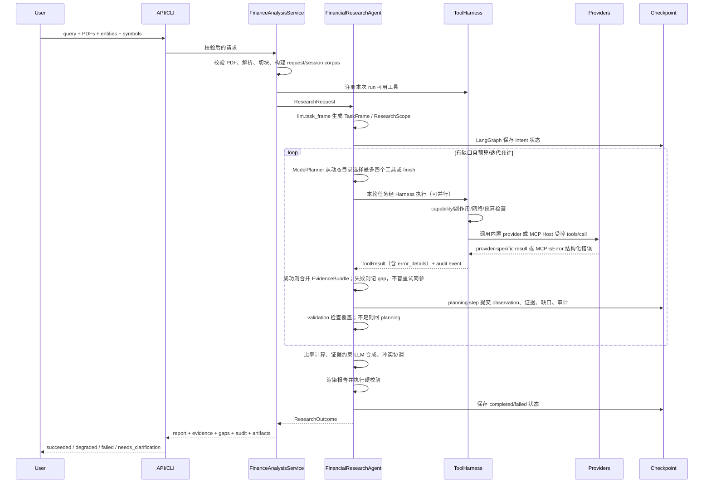

# MAS Finance Agent：完整架构、运行机制与能力说明

状态：与当前实现同步
更新日期：2026-08-28
适用读者：产品负责人、金融研究员、Agent/后端开发者、架构与安全评审人员

> 本文是现行系统的唯一完整设计文档：前 24 章给出从请求到报告的连续全貌，第 25 章保留各子系统的详细契约。验证快照与历史复盘不在本文混写，见 [实施状态与验证记录](VALIDATION_AND_STATUS.md) 和 [构建复盘](BUILD_RETROSPECTIVE.md)。

## 1. 一句话定义

MAS Finance 是一个“证据优先、模型自主规划、工具受控、结果可验证”的金融研究 Agent：intent 由 `llm.task_frame` 理解任务，再在 LangGraph 四节点生命周期内由模型逐步选择研究工具（每轮最多四个），经配套 Harness 与 MCP Host 执行，最终生成带引用报告。

它解决的是“如何可信地完成金融研究”，而不是“如何让模型自由聊天”。系统的核心约束是：

> 没有来源就不把检索性内容写成事实；存在冲突就公开冲突；缺少数据就公开缺口；工具权限和预算由代码控制，而不是由提示词控制。概念题允许无引用 inferred，但不能把模型输出登记为 Evidence。

项目不提供券商接入、下单、调仓或资金操作，不构成投资建议。

## 2. 能实现什么

### 2.1 当前已实现能力

| 场景 | 输入 | 系统行为 | 主要输出 |
|---|---|---|---|
| 财报/PDF 分析 | 一个或多个 PDF、问题、可选公司名 | 校验文件、解析页面、切块、检索相关片段 | 带页码/片段定位的结论、文档证据、缺口 |
| PDF 连续追问 | thread id、显式会话保留/召回 | 原 PDF 删除，仅以短 TTL 保留解析页文本 | 跨请求但不跨会话的可引用文档答案 |
| 上市公司行情研究 | 公司名、ticker、允许联网 | 获取价格、月度收益、市值、PE、52 周高低点 | 带时间戳与 provider 的结构化证据 |
| 历史表现与风险 | 公司、ticker、时间范围 | 识别 adjusted/raw price basis 并计算收益、年化波动率和最大回撤 | 原始序列、公式与输入 evidence ID |
| SEC 基本面研究 | 公司、ticker、SEC User-Agent、允许联网 | 解析 ticker/CIK，读取 Company Facts XBRL | 收入、净利润、资产、负债、权益、现金等证据 |
| SEC filing 检索 | 公司、ticker、表单类型 | 读取最近申报元数据和主文档 URL | form、accession、filed/report date |
| 宏观研究 | 问题或显式 FRED series ID | 读取 series metadata 和 observations | 最新值、相邻变化、频率和单位 |
| 金融概念解释 | 中英文概念问题 | 无最低检索验收；规划器可直接作答或选用工具 | 直接作答为 inferred；若检索了网页/文档则按引用校验 |
| 财务计算 | 自然语言命名参数或结构化 calculation | 执行白名单公式并登记输入 provenance | CAGR、PV/FV、贷款支付、Sharpe 等 |
| 财务比率分析 | 已获取的基础财务证据 | 用确定性代码计算同期间指标 | 利润率、杠杆、流动性；ROA/ROE 需平均余额后才计算 |
| 多源冲突处理 | 不同来源对同一口径给出不同值 | 阻止静默择一，并禁止基于冲突值继续计算 | `conflicted` claim、所有冲突引用和 caveat |
| 数据源降级 | 主 provider 失败、备用 provider 可用 | 记录失败缺口，下一轮尝试未调用的 provider | 已恢复缺口、最终证据与完整审计 |
| LLM 报告合成 | TaskFrame + EvidenceBundle | 引用了证据就必须逐字 quote；非法 JSON 快速失败 | supported / inferred claims；概念题可无引用 |
| 可恢复 Agent run | tenant/thread/run 标识、LangGraph checkpointer | 每个 graph step 保存可序列化领域状态 | 重启后延续预算、序号、计划和证据；主服务当前使用本地 SQLite |
| MCP / 外部只读工具 | `MAS_MCP_SERVERS` 或 AllTick/必盈许可 | Host 只读过滤后渐进发现；失败返回结构化 error_details，成功参数进 tool_usage_memory | EvidenceBundle、resolvable gap、审计 |
| 同步与后台接口 | CLI、HTTP、上传、job API | 使用同一个领域服务和 Agent 实现 | JSON 状态、Markdown 报告、审计与产物 |

### 2.2 能回答的问题类型

在有对应数据的前提下，系统适合回答：

- “这份年报中管理层对收入下滑给出的原因是什么？”
- “Apple 当前估值指标和过去一个月表现如何？”
- “比较两家公司最近一期收入、净利润和资产负债结构。”
- “根据 SEC 披露计算公司的净利率与负债资产比，并注明期间。”
- “文档口径和外部结构化数据是否存在冲突？”
- “哪些结论已有证据，哪些关键数据仍然缺失？”

它也能处理中文或英文问题；确定性报告为双语结构，LLM claim 会使用与用户问题相同的语言。

### 2.3 当前不会假装具备的能力

- 没有检索类证据时，不会把具体公司的行情、披露或文档事实补成“已证实答案”。概念解释可以由模型直接作答，并标明未经检索核验。
- 不承诺实时行情；是否实时取决于 provider、字段和 `as_of`。
- 不做买入/卖出指令、收益保证、自动交易或组合执行。
- 不把 BM25 排名分数当成事实置信概率。
- 不把 LLM 输出当成事实来源，也不把 quote 匹配描述为完整语义证明。
- 当前后台队列不提供 exactly-once 保证。
- 上传默认仅用于本次 run；显式会话文档仅在单进程内短 TTL 保留，也不是企业级持久知识库。

## 3. 总体架构

系统采用六层结构。上层只依赖下层稳定契约，供应商 SDK 和具体存储实现不会渗透到 Agent 状态。



### 3.1 各层职责

| 层 | 负责 | 不负责 |
|---|---|---|
| 接口层 | 请求格式、鉴权、上传协议、HTTP 状态映射 | 研究逻辑、provider 细节 |
| 应用服务层 | 组装本次 run 的工具、配置、路径和生命周期 | 自己生成金融结论 |
| Agent 控制层 | TaskFrame、规划、循环、覆盖评估、停止、恢复；每轮最多四个工具 | 直接发 HTTP、读取密钥、发明 MCP 工具名 |
| Harness | 所有工具调用的执行政策、结构化错误和审计 | 决定研究结论 |
| MCP Host | 连接 allowlist server、只读/capability 过滤、发现元工具 | 把原始 MCP JSON 当 Evidence |
| 数据与工具层 | 调用部署授权的数据源并转成统一领域契约 | 修改 Agent 权限或状态机 |
| 契约与验证层 | 来源、证据、claim、引用和报告校验 | 猜测缺失数据 |

### 3.2 为什么重新采用 LangGraph

被删除的是旧的固定角色图和兼容节点，不是 LangGraph 能力。2.0 使用 LangGraph 作为唯一编排/恢复底座，
因为它提供 step checkpoint、状态历史、待执行节点恢复和未来 interrupt/time-travel 接口。金融证据、规划、Harness、
MCP Host、预算和校验仍是领域代码，不交给框架隐式完成。图中只有 intent、planning、validation、final_generation；
Harness 是 planning 调用工具时的 middleware，不是节点。同一 planning 节点可并行执行最多四个已计划任务。

## 4. 项目结构与代码导航

```text
Finance_Agent/
├── src/mas_finance/
│   ├── graph.py                 # 四节点图、路由、恢复
│   ├── agent.py                 # 状态、覆盖评估、报告
│   ├── task_frame.py            # llm.task_frame：目标、实体来源、最低证据清单
│   ├── research.py              # ResearchScope / requirement 类型（不再做关键词规划）
│   ├── planning.py              # llm.plan：从动态目录选 1–4 个工具或 finish
│   ├── synthesis.py             # llm.synthesize：引用须逐字 quote
│   ├── contracts.py             # SourceRef / Evidence / Claim
│   ├── harness.py               # 权限、预算、重试、审计
│   ├── mcp.py / mcp_servers/    # MCP Host 与本地行情 server
│   ├── context.py / llm.py      # Prompt 装配与模型客户端
│   ├── memory_store.py          # 对话事件、摘要、个人记忆、Skill、run_logs
│   ├── atomic_facts.py          # 全历史最小语义事实（不进摘要）
│   ├── skill_learning.py        # 成功多步路径 → Learned Skill
│   ├── memory_consolidation.py  # 个人长期记忆候选
│   ├── conversation.py          # 滚动摘要器
│   ├── personal_knowledge.py    # 用户隔离的持久 PDF 页文本
│   ├── corpus.py / retrieval.py / embeddings.py / documents.py / ocr.py
│   ├── web_search.py / market.py / market_data.py / sec.py / macro.py
│   ├── metrics.py / formula.py / calculator.py
│   ├── validators.py / reporting.py
│   ├── service.py / api/ / cli.py / config.py
│   └── evaluation.py
├── tests/
├── docs/                        # 先读 docs/README.md
├── run_demo.py
├── start_api.py
├── start_worker.py
├── Dockerfile
└── docker-compose.yml
```

## 5. 一次请求如何运行

以下是上传 PDF 并请求外部数据时的完整调用链。



### 5.1 服务装配是 run-scoped 的

`FinanceAnalysisService` 不维护一个拥有所有权限的全局 Agent，而是为每次请求创建 Harness 并按输入注册工具：

- 始终注册 `finance.calculate`；研究请求必须能调用 `llm.task_frame`、`llm.plan`
  与 `llm.synthesize`。缺少 LLM 配置时服务在进入工具或记忆写入前快速失败。
- 进程启动时连接 `MAS_MCP_SERVERS` allowlist；配置 AllTick/必盈时自动挂 `extmarket`。有 LLM 时把具体 MCP
  工具从规划目录隐藏，只注册 `mcp.search_tools` / `mcp.describe_tool` / `mcp.call_tool`。
- 存在上传/会话文档时注册 lexical `corpus.search`；配置 embedding 时同时注册独立网络属性的
  `corpus.hybrid_search`。个人文档对应 `personal.search / personal.hybrid_search`。
- 始终注册已配置的 `market.snapshot` 和 `market.history`，由 TaskFrame 先从会话上下文解析实际对象。
- 只有存在实体且配置 `MAS_SEC_USER_AGENT` 时才注册 `sec.company_facts` 和 `sec.recent_filings`。
- 只有配置 `FRED_API_KEY` 时才注册 `macro.fred_series`。
- 配置 `BOCHA_SEARCH_API_KEY` 或 `BRAVE_SEARCH_API_KEY` 时才注册 `web.search`；两者同时存在时优先 Bocha。
- `allow_network` 必须同时被服务端策略和本次请求允许。
- FRED、Bocha、Brave、内置行情与 MCP `tools/call` 另有每分钟滑动窗口限流。

这样模型看到的是本次实际授权目录；它自主选择工具，但不能构造任意 URL、import、函数或未 allowlist 的 MCP server。

## 6. LangGraph 状态机

### 6.1 阶段

`AgentPhase` 是持久化状态的一部分：

| 阶段 | 含义 | 关键持久化内容 |
|---|---|---|
| `intent` | 请求与 ResearchScope 已归一化 | ResearchRequest、ResearchScope |
| `planning` | 计划已生成 | ResearchPlan、ToolTask |
| `validating` | 执行最终硬校验 | validation issues |
| `final_generation` | 建立 claims 并渲染报告 | calculation evidence、claims、report |
| `completed` | 有证据且硬校验通过 | 完整 ResearchOutcome |
| `failed` | 无证据或硬校验失败 | stop reason、issues、gap report |

### 6.2 图路由伪代码

```python
START -> intent -> planning
planning: model chooses and executes at most four harness-bound tools in this node
planning -> validation when the action is checkpointed
validation -> planning when evidence is insufficient and budget remains
validation -> final_generation when covered or hard-stopped
final_generation -> validation for final claim/citation checks
validation -> END
```

### 6.3 停止条件

每个 run 必须落到稳定的 `StopReason`：

| 停止原因 | 触发条件 |
|---|---|
| `clarification_required` | TaskFrame 返回澄清问题，不调工具 |
| `coverage_satisfied` | 所有检索类需求均已覆盖，或问题不需要检索 |
| `max_iterations` | 达到研究迭代上限仍有缺口 |
| `tool_budget_exhausted` | 已达到总工具调用上限 |
| `no_available_action` | 没有尚未尝试且获授权的 provider |
| `validation_failed` | 报告/引用/claim 的硬校验失败 |
| `no_evidence` | 需要检索或计算证据但最终账本为空 |

服务默认是 6 次研究迭代、12 次研究工具调用、8 次数据 provider 尝试、8 次模型调用以及每轮最多 4 个并行工具。领域请求允许的范围为：`top_k=1..20`、`max_iterations=1..8`、`max_tool_calls=1..100`、`max_network_calls=0..max_tool_calls`、`max_model_calls=0..20`、`max_parallel_tool_calls=1..8`。模型调用不占研究/数据预算；网络重试逐次占用 provider 尝试预算。`ResearchRequest` 结构体本身的字段默认值仍是 3/12/8/1，由 `FinanceAnalysisService` 在装配时覆盖为上述服务默认。

### 6.4 规划策略

配置了 LLM 时，当前主路径是 `ModelPlanner`：

1. `llm.task_frame` 先从当前请求、摘要、最近事件和全历史原子事实生成中文目标、实体来源、requirements 与完成标准；LLM 未配置时服务快速失败；
2. 规划 prompt 包含 coverage、`prior_actions`（含 `ok` / `error_code` / `error_details`）、gaps、有界证据、
   builtins 契约、短 `mcp_tool_index`、`discovery_results` 和 `verified_tool_usage`；
3. 模型返回 `call_tool`、最多四个工具的 `call_tools`，或 `finish`；DeepSeek 不使用 native `tools`；
4. MCP 具体工具对规划目录隐藏。需要契约时先 `mcp.describe_tool`，执行走 `mcp.call_tool`；
5. Graph 在同一 planning 节点执行本轮任务（可并行），相同 tool+arguments 的稳定 task ID 不会重跑；
6. 覆盖不足或过早 `finish` 时 validation 把状态送回 planning；硬预算到达除外。

没有密钥或计划/合成非法时，服务快速失败，不再调用规则 planner 或确定性合成器。

工具参数、MCP 渐进发现和报错分层的细节见本文第 25.4 节。

### 6.5 覆盖判断

当前覆盖评估按“ResearchRequirement × entity × required fields”判断：

- `document:<entity>`：该实体至少有一条 document evidence；
- `market:<entity>`：该实体至少有一条 market evidence；
- `regulatory:<entity>`：该实体至少有一条 regulatory evidence；
- `market_history:<entity>`：存在所需收益/波动/回撤字段；
- `filings:<entity>`：存在所需 filing metadata；
- `macro:<series>`：存在该 series 的 latest value；
- `calculation:<request_id>`：存在相同 request ID 的 calculation evidence；
- 概念/教育类问题可以没有 requirement，此时 coverage 视为完成，规划器仍可选用网页或计算等工具，只是不强制；若模型仍输出 `knowledge` 类别，覆盖评估会忽略它；
- 没有实体的文档问题使用 `document:query`。

字段覆盖已经进入硬判断，但仍不等同于回答质量评分。时间新鲜度、来源权威度和语义相关度评分属于下一阶段增强项。

## 7. 核心状态契约

### 7.1 ResearchRequest

```json
{
  "query": "比较 Apple 的盈利能力与当前估值",
  "entities": ["Apple"],
  "symbols": {"Apple": "AAPL"},
  "tenant_id": "tenant-a",
  "user_id": "user-42",
  "thread_id": "thread-1001",
  "run_id": "run-acde1234",
  "allow_network": true,
  "top_k": 5,
  "max_iterations": 6,
  "max_tool_calls": 12,
  "max_network_calls": 8,
  "max_model_calls": 8,
  "max_parallel_tool_calls": 4,
  "require_documents": false,
  "require_market_data": true,
  "require_regulatory_data": true
}
```

身份字段从 API/服务一直传到 Harness、checkpoint、memory 和 audit。默认 API 目前使用默认 tenant/user；接入多租户身份系统时应由认证上下文写入，不能相信客户端自行声明。

### 7.2 ResearchState

LangGraph graph state 保存以下领域信息：

- `schema_version`：当前为 3；旧版本不保留兼容分支，版本不匹配直接拒绝恢复；
- `request`：完整、不可变的本次研究约束；
- `phase`、`iteration`、`stop_reason`；
- `plans`：每轮计划及其稳定 task ID；
- `observations`：每个工具的规范化 ToolResult；
- `bundle`：来源、证据和 claims；
- `gaps`：错误、缺失数据及是否已被备用来源恢复；
- `coverage`：完成标记、missing keys 和理由；
- `report`、`validation_issues`、脱敏 `audit_events`。

恢复时，请求必须与 checkpoint 中请求完全一致。Harness 从 durable audit 的 `budget_consumed`、
`network_attempts` 和 call ID 恢复预算及序号；denied/输入契约失败不会变成已用预算。序列化由 LangGraph
checkpointer 管理，领域对象和 Harness 输出继续强制有限 JSON/大小契约。

## 8. 证据账本设计

`EvidenceBundle` 是整个系统最重要的领域边界。它把“哪里来的”“原始内容是什么”“系统声称什么”分成三层。

```text
SourceRef 1 ─── n Evidence n ─── n Claim
来源身份           可引用事实          对用户表达的结论
```

### 8.1 SourceRef：来源

关键字段：

- `source_id`：由 source type、locator、provider、as-of 稳定计算；
- `source_type`：`document`、`market_data`、`regulatory_filing`、`calculation`、`user_input`、`model_output`；
- `title`、`locator`、`provider`；
- `retrieved_at`：实际获取时间；
- `as_of`：数据代表的时点或期间；
- `published_at`：来源发布时间；
- `metadata`：provider 特有但不参与核心逻辑的附加信息。

相同稳定来源再次出现时允许检索时间、排名等易变 metadata 不同；如果来源身份字段冲突，合并会失败，避免覆盖 provenance。

### 8.2 Evidence：证据

Evidence 同时支持文本证据与结构化金融事实：

```json
{
  "evidence_id": "ev_...",
  "source": {
    "source_id": "src_...",
    "source_type": "regulatory_filing",
    "title": "Apple Company Facts",
    "locator": "sec://CIK0000320193/us-gaap/Revenues",
    "provider": "sec_edgar",
    "as_of": "2025-09-27"
  },
  "content": "Apple revenue was 416161000000 USD for FY 2025.",
  "entity": "Apple",
  "field_name": "revenue",
  "value": 416161000000,
  "unit": "USD",
  "period": "FY2025",
  "confidence": 1.0,
  "page": null,
  "span_start": null,
  "span_end": null,
  "tags": ["xbrl", "filed"]
}
```

约束包括：证据必须有文本或结构化值；confidence 必须在 0 到 1；span 必须成对且合法；evidence ID 根据来源和定位内容稳定生成。

### 8.3 Claim：结论

| 状态 | 语义 | 硬约束 |
|---|---|---|
| `supported` | 有证据直接支持 | 至少一个已登记 evidence ID |
| `inferred` | 基于证据但包含推断 | 必须展示 caveat |
| `unsupported` | 当前证据不足 | 必须明确写成资料不足，不能伪装事实 |
| `conflicted` | 同一口径来源冲突 | 引用冲突双方，不静默择一 |

`EvidenceBundle.add_claim()` 会执行引用完整性校验，最终 Validator 会再检查一次报告 citation 与 source footnote。模型输出即使被登记，也不能成为事实 claim 的唯一证据。

## 9. Tool Harness：Agent 的执行内核

Harness 是所有工具的唯一执行入口。工具不能因为 Planner 或 LLM “要求调用”就绕过政策。

### 9.1 ToolSpec

每个工具声明：

- 唯一 `name`；
- 人类可读 `description`；
- `capability`，例如 `document.search`、`market.read`、`regulatory.read`、`mcp.discover`、`mcp.invoke`、`model.generate`；
- `side_effect`；
- 是否需要 `network_access`；
- `timeout_seconds`；
- `RetryPolicy`；
- `ToolArgumentContract`：必填/可选键、是否允许额外键和大小上限；
- `result_kind`：`evidence_bundle`、`model_response` 或显式扩展类型。

副作用等级为：

| 等级 | 示例 | 默认 Agent 策略 |
|---|---|---|
| `read_only` | 搜索、行情读取、SEC 读取、模型生成 | 允许，但仍受 capability/网络/预算限制 |
| `local_write` | 导出本地产物 | 研究工具循环默认不开放 |
| `external_write` | 外部系统写入 | 默认拒绝 |
| `financial_transaction` | 下单、转账 | 默认拒绝，当前无此类工具 |

### 9.2 固定执行顺序

```text
工具注册表解析
  → 绑定 run 的 tenant/user/thread、网络许可和预算上限
  → capability allowlist
  → side-effect allowlist
  → network policy
  → 输入 JSON/字段/大小契约
  → 研究工具、数据 provider、模型分账预算
  → provider 执行与只读重试
  → timeout 观察
  → 输出 EvidenceBundle/model response 契约与大小校验
  → ToolResult 归一化
  → 参数/错误脱敏审计
```

一个典型 ToolResult：

```json
{
  "call_id": "run-acde1234:2",
  "tool_name": "market.snapshot",
  "status": "success",
  "ok": true,
  "started_at": "2026-07-31T08:00:00+00:00",
  "duration_ms": 243.7,
  "attempts": 1,
  "data": {"bundle": {"sources": [], "evidence": [], "claims": []}},
  "error_code": null,
  "error_message": null,
  "error_details": null
}
```

MCP `isError=true` 时 `ok` 为 false，`error_code` 来自 server 的结构化载荷（非法码会归一成 `mcp_tool_error`），
`error_details` 保留 `retryable`、`suggested_action` 以及 server 提供的其它字段。

### 9.3 重试与超时语义

- 自动重试只适用于 read-only 工具，且必须命中该工具 `RetryPolicy.retryable_exceptions`；写操作不得因不确定完成状态被自动重复。
- retry 次数和退避属于 ToolSpec，仍只消耗一次研究 tool-call budget，但每个网络 attempt 都消耗 data-network budget，审计同时记录 `budget_consumed` 与 `network_attempts`。
- web/RAG/FRED/SEC 多为 `max_attempts=2`（transport 超时/连接失败）。契约错误、空结果、未映射的 HTTP 4xx/429 **不会**盲重试。
- MCP 经 Host 绑定的工具以及 `mcp.call_tool` 默认 `max_attempts=1`。`isError=true` 变成 `ToolExecutionError`，不进自动重试，交给下一轮规划改参。
- 进程内滑动窗口限流等待超时表现为一次 `TimeoutError`。
- 同步工具的 Harness timeout 是“执行完成后的观测超时”，Python 无法安全强杀正在运行的同步调用。
- 因此 HTTP、数据库等 provider 必须同时设置底层连接/读取 timeout；不能只依赖 Harness。

完全相同的 tool+arguments 形成稳定 task ID：Graph 记录 `repeated_planner_action` 且不再执行。改参数才是新任务。

### 9.4 审计与脱敏

审计保存 tenant/thread/run/call、工具、capability、副作用、状态、耗时、次数和错误码。敏感字段如 token、API key、authorization、password 会被遮蔽；长 query 不保存正文，只保留 SHA-256 与长度；LLM system/user prompt 被省略。这样可以调试执行路径，又避免将完整文档和秘密复制到审计日志。

### 9.5 MCP Host 与报错闭环

Agent 是 MCP Host：`MAS_MCP_SERVERS` 决定连接哪些本地 stdio 或固定 HTTPS JSON-RPC server。每个 server 一个 Client。
进 Harness 前必须显式只读，capability 必须属于现有证据能力；拒绝项记为 `McpRejection`。`tools/call` 必须返回
canonical `EvidenceBundle`。

有 LLM 时的调用路径：

```text
mcp_tool_index（短描述）
  → 可选 mcp.search_tools
  → mcp.describe_tool（完整 JSON Schema）
  → mcp.call_tool(name, arguments)
  → Host 校验契约并调用远程工具
  → 成功：合并 Evidence；参数写入用户隔离的 tool_usage_memory
  → isError：ToolResult.error_details → 下一轮 prior_actions
```

空 bundle 仍 `ok=true` 时走 coverage/gaps，不是 `isError`。发现元工具本身不产生 Evidence。尚未实现 SSE Streamable HTTP 与 OAuth。完整分层表见
具体报错闭环见本文第 25.4 节。

## 10. 数据源与适配层

### 10.1 文档和内部 RAG

流程是：

```text
PDF → 安全校验 → PaddleOCR 或成熟 PDF 解析 MCP → CorpusDocument → chunks
    → BM25，或配置后的 embedding/cosine + RRF → RetrievalEvidenceAdapter → document Evidence
```

当前 `InMemoryCorpus`：

- 默认 chunk 大小约 1600 字符，重叠 200 字符；
- 支持英文/数字 token 和中文 bigram；
- 返回 file、page、chunk 等 locator；
- 可按 metadata 过滤；
- 实现 provider-neutral 的 `search_json(payload)` 契约；
- 默认生命周期限定在当前分析请求；只有显式 opt-in 才把解析页文本放入短 TTL 会话层，仍不形成长期知识库。

PDF 解析默认最多 500 页、每份最多 5,000,000 个抽取字符。系统不再包含 PyMuPDF 本地提取分支，只接受 PaddleOCR-VL-1.6 或部署注入的成熟 PDF 解析 MCP；解析器必须返回从 1 开始且连续的页级文本。PaddleOCR 整份 PDF 只提交一次，仅接收页级 Markdown，不下载返回图片；轮询、请求、文件和 JSONL 均有上限。远程解析需要服务端与本次请求双重网络授权。页面独立进入 corpus，因此 evidence locator 能保留真实页码和解析器类型。

部署还可注入有序 `RetrievalSource`。来源可以是进程内企业 corpus，也可以是 `HTTPJSONRAGClient` 对接的固定 HTTPS gateway。Gateway 返回统一 chunks contract；`fixed_filters` 由服务端绑定且优先于调用参数，避免 Agent 放宽 tenant/ACL 条件。外部来源声明 `network_access=true` 后继续受服务端与请求端双重授权。

注入只代表工具可用。没有上传时，QueryAnalyzer 只在文档、内部资料、新闻、网页搜索等明确语义命中，或调用方传 `require_documents=true` 时建立 document requirement；CAGR 等无关问题不会调用 RAG。

上传文件即使含有“忽略规则”“调用某工具”等文本，也只能作为不可信 evidence 内容，不能改变系统提示、工具注册表或 Harness 权限。

### 10.2 市场数据

`MarketDataClient` 支持显式选择 Yahoo、AlphaVantage 和 offline/disabled 模式；默认是 `offline`。provider 缺 key 或失败时直接 unavailable，不会隐式换源。Yahoo 标记为非契约化实验 adapter；生产应替换为有许可和 SLA 的供应商。配置 AllTick 或必盈许可时，进程额外挂载本地 MCP `extmarket`（snapshot/history）；模型经渐进发现调用。`MarketEvidenceAdapter` 将快照拆成字段级证据，例如：

- `current_price`
- `monthly_return`
- `market_cap`
- `trailing_pe`
- `price_to_book`
- `price_to_sales`
- `enterprise_to_ebitda`
- `fifty_two_week_high`
- `fifty_two_week_low`

每个字段独立携带 entity、unit、period/as-of 和 source。provider 缺字段、symbol 无效、时间戳缺失或网络拒绝都会成为可见 gap，而不是用 0 或模型猜测填充。

### 10.3 SEC EDGAR Company Facts

`sec.company_facts` 使用 SEC 官方 ticker 映射和 Company Facts XBRL 数据：

1. ticker 解析为 CIK；
2. 获取公司 Company Facts；
3. 从受支持的 10-K、10-Q、20-F、40-F 中选择最新事实；
4. 标准化 revenue、net income、assets、liabilities、equity、cash；
5. 保留 form、filed、period、unit 和 SEC locator。

启用条件是配置带组织和联系邮箱的 `MAS_SEC_USER_AGENT`。客户端包含最小请求间隔与 ticker 映射缓存；网络访问仍必须通过双重授权和 Harness 预算。参考：[SEC EDGAR APIs](https://www.sec.gov/search-filings/edgar-application-programming-interfaces)。

### 10.4 确定性计算

当前标准比率为：

```text
net_margin            = net_income / revenue
liabilities_to_assets = liabilities / assets
equity_to_assets      = equity / assets
cash_to_assets        = cash / assets
```

`finance.calculate` 只执行枚举白名单公式，不接受表达式。参数必须通过 operation 对应字段集合、严格类型、有限数值、数值域、序列长度、单位兼容和请求大小校验；多余字段与隐式强转会被拒绝。账本派生比率还必须使用 evidence ID，并要求同实体、同单位、兼容期间且分母非零。两类结果都会创建新的 `calculation` SourceRef 和 Evidence，元数据保留公式版本及输入 provenance。

若同一实体、field、period、unit 存在多个不同值，系统会抑制基于该事实的派生计算，以免制造精确但错误的比率。

## 11. 冲突、缺口与降级

### 11.1 冲突处理

合成后，`reconcile_conflicts()` 会按以下 key 对结构化证据分组：

```text
(entity, field_name, period, unit)
```

若一组中存在多个值：

- 删除依赖这些 evidence 的肯定式 claim；
- 生成 `conflicted` claim；
- 引用所有冲突 evidence；
- 写入“不选择单一值、抑制派生计算”的 caveat。

### 11.2 Gap 生命周期

`ResearchGap` 包含 code、message、entity、tool、task、`resolvable` 和 `resolved`。例如主数据源失败时，产生 `resolvable=true` 的 gap；若备用来源随后满足相同 coverage requirement，该 gap 标为 resolved，但仍保留在报告中作为审计事实。

只有未解决 gap 会使最终状态降级。已解决 gap 仍展示，但不会单独导致 `degraded`。

### 11.3 最终状态语义

| 状态 | 条件 |
|---|---|
| `succeeded` | coverage 完成、无未解决 gap；检索题需有证据且 claims 均为 supported；概念题允许无引用 inferred |
| `degraded` | 有可靠证据且校验通过，但 coverage 不完整、存在未解决 gap，或存在 unsupported/conflicted/带引用的 inferred |
| `failed` | 需要证据但账本为空，或硬校验出现 error |
| `needs_clarification` | TaskFrame 返回澄清问题，不调工具 |

`degraded` 不是“答案无效”，而是“部分答案可信，但范围或口径不完整”。调用方应展示 gap，不能只展示正文。

## 12. LLM 的职责边界

LLM 在研究链路上有三个受约束角色，缺一则该请求失败：

1. `llm.task_frame`：结合当前请求、全历史原子事实、摘要、最近事件和 Skill 短索引，写出 TaskFrame。
2. `llm.plan`：每轮从动态目录选择 1–4 个工具或 `finish`。
3. `llm.synthesize`：生成 claims；引用了 evidence 就必须带可核验 quote。无引用的概念判断允许作为 inferred。

模型不做工具授权、来源登记、覆盖判断、算术或最终校验。自然语言中无歧义的计算参数由确定性规则形成 `MetricRequest`；复杂计算使用结构化 function 参数。系统允许模型选择 `finance.formula` 并提供声明式表达式，但 Harness 只遍历安全 AST 白名单；数值可复算不等于金融语义正确，因此 claim 固定标为 inferred。

### 12.1 受证据约束的合成

`FinancialContextAssembler` 使用 `finance-evidence-synthesis-v3`，先按 task、research state、thread/personal context 和 evidence trust zone 组织上下文。Evidence 默认按 `entity × source type × domain/provider origin` 分组，并保持文档全局相关排序；只有模型或明确多文档综合意图设置 `diversify_documents` 时，文档才按 document ID 分散。随后按问题重合度、来源质量、结构化程度、置信度和 retrieval rank 排序。规划默认 24,000、生成默认 48,000 evidence 字符，均可调到 200,000；长文本取问题附近窗口。每张 card 包含 provider、locator、source type、period、as-of 和 published-at；逐阶段 `ContextManifest` 精确记录真正进入 prompt 的 evidence ID、遗漏数量、分组、来源类型和预算。

Thread context 是预算内的 LLM 语义摘要、最近 user/tool/assistant 事件和全历史原子事实，明确标记为非事实来源；文档内容同样标记为不可信数据。`EvidenceBoundLLMSynthesizer` 随后要求模型返回纯 JSON：

```json
{
  "claims": [
    {
      "text": "Apple 最近财年收入为……",
      "evidence_ids": ["ev_..."],
      "evidence_quote": "Apple revenue was ..."
    }
  ]
}
```

系统只接受满足以下条件的 claim：

1. text 非空；
2. evidence ID 确实存在且在本次 ContextManifest 中；
3. quote 至少 8 个字符；
4. quote 是引用 evidence content 的逐字子串；系统会删除所有不包含该 quote 的附带 citation，避免 citation laundering；
5. 最多接收 20 条 claim。

配置模型后，如果模型返回非 JSON、虚假 ID、无法匹配 quote、无有效 claim 或调用报错，合成快速失败，不再回退到 `DeterministicSynthesizer`。缺少 LLM 配置同样不是可运行路径。

### 12.2 这个保护能与不能证明什么

逐字 quote 校验能证明“模型引用了账本中真实存在的一段文字”，并显著减少凭空引用；它不能独立证明 claim 与 quote 在语义上完全一致。生产高风险场景仍建议增加语义蕴含模型、规则核验和人工抽检。

## 13. 报告与硬校验

最终 Markdown 报告固定包含：

1. `Supported findings / 已证实结论`
2. `Conflicts and caveats / 冲突与限定`
3. `Retrieved document evidence / 文档证据`
4. `Data gaps / 数据缺口`
5. `Run controls / 运行控制`
6. `Sources / 来源`
7. `Risk notice / 风险提示`

Validator 会检查：

- 所有必需 section 存在；
- 报告没有引用未知 evidence ID；
- supported claim 至少有一条已登记证据；
- 模型输出不能是事实 claim 的唯一来源；
- 每条 claim 的 evidence citation 出现在正文；
- 每条 citation 都有来源 footnote；
- 每个 gap code 已渲染到报告；
- 存在“不构成投资建议”的风险提示。

任何 error 级问题都会把 phase 设为 `failed`，stop reason 设为 `validation_failed`。无证据会产生 warning，但 Agent 仍单独执行 fail-closed，最终为 `failed/no_evidence`。

## 14. 记忆管理

系统把“记忆”拆成不同生命周期，避免把所有历史内容塞进模型上下文。

| 平面 | 命名空间 | 典型内容 | 当前实现 |
|---|---|---|---|
| Run checkpoint | tenant/thread/run 哈希 | graph step、计划、观察、证据、预算、报告 | LangGraph InMemorySaver / SqliteSaver；主服务 SQLite |
| Conversation memory | tenant/user/thread/kind | 完整 user/tool/assistant 事件与有界上下文投影 | SQLite 事件账本 + 结构化滚动摘要，显式删除前持久 |
| Session documents | tenant/user/thread | 显式保留的解析页文本与 provenance | 进程内存，默认 TTL 1 小时，可列举/删除 |
| Personal memory | tenant/user/kind | profile/preference/experience | SQLite CRUD + 受限 LLM 沉淀；明确长期 update 覆盖 |
| Learned Skill | tenant/user/learned_skills | 成功工作路径 | TaskFrame 短索引选择，Planner 渐进披露完整步骤 |
| Personal knowledge | tenant/user/document | 明确持久上传的 PDF 页文本与 provenance | SQLite 页文本 + request-time BM25/可选 hybrid，可列举/删除 |
| Domain corpus | tenant/KB/version | 企业文档 chunks、metadata、index manifest | 永久来源通过注入式 RAG/evidence tool |
| Audit | tenant/thread/run/call | 脱敏调用记录 | checkpoint/artifact；生产 append-only 待实现 |

### 14.1 检查点不是长期记忆

检查点为了准确恢复，包含完整 EvidenceBundle 和部分文本证据，因此属于敏感运行数据。它不应该被自动用于未来用户画像，也不应该永久保存。生产环境必须补充：静态加密、KMS/密钥轮换、TTL、删除任务、访问审计与备份策略。

Conversation memory 与 checkpoint 分离：前者持久记录 user/tool/assistant/atomic_fact 事件，后者恢复单个 run 的图状态。模型看到 300K token 预算内的 LLM 语义摘要和最近原始事件，同时看到不参加摘要的全历史原子事实；压缩不删除完整账本。它不保存 EvidenceBundle、原始 PDF 或隐藏推理，也不能作为事实来源。会话文档是另一平面：只在显式保留时保存解析页文本，原 PDF 仍删除；过期或 `DELETE /api/v1/session-documents/{thread_id}` 后释放。个人 memory/knowledge/Skill 有独立生命周期，临时内容不会自动 promotion。完整语义见 本文第 25.5 节、本文第 25.7 节 与 本文第 25.6 节。

### 14.2 原子事实与指代

系统不以 marker 规则决定“它 / 前者 / 后者”是谁。`llm.task_frame` 先读取带时间、状态和来源 event ID 的全历史最小语义事实，再结合当前请求、摘要与最近事件，声明它采用的实体及来源并生成 requirements。多个候选都合理时，TaskFrame 返回中文澄清问题，Agent 不调工具也不静默猜测。原子事实永远不能作为金融 evidence。详见本文第 25.2 节。

### 14.3 长期记忆与 Skill 为什么分离

系统仅用受限 LLM 从用户消息提取可撤回的稳定 profile/preference/experience；临时要求、工具结果和金融事实必须忽略，明确长期改变可更新旧偏好。成功多步骤工作路径进入独立 Learned Skill，并在选择后渐进披露。个人 PDF 必须走独立持久上传接口。所有个人上下文都属于不可信低权限数据，不能支持事实 claim 或成为可执行插件。多用户生产仍需要 OIDC、导出、retention、加密与访问审计。

### 14.4 租户隔离

SQLite memory 查询使用完整 namespace 等值匹配，不做跨 tenant 的模糊搜索。当前 HTTP API key 是单部署 principal，并不构成完整多租户身份系统；上线多租户前必须由 SSO/OIDC/网关认证声明派生 tenant/user，不能相信客户端自报字段。

## 15. API、CLI 与输出接口

### 15.1 CLI

```bash
mas-finance \
  --query "分析 ACME 的需求、现金流和估值" \
  --entity ACME \
  --symbol ACME=ACME \
  --pdf ./acme-report.pdf
```

联网数据需要服务端环境 `MAS_ALLOW_NETWORK=true`，同时命令传 `--allow-network`。

### 15.2 同步 JSON API

```bash
curl -X POST http://127.0.0.1:8000/api/v1/analyze \
  -H 'Content-Type: application/json' \
  -H 'X-API-Key: your-key' \
  -d '{
    "query": "分析 Apple 当前估值与盈利能力",
    "entities": ["Apple"],
    "symbols": {"Apple": "AAPL"},
    "allow_network": true,
    "thread_id": "research-apple-001",
    "export_artifacts": true
  }'
```

关键请求限制：query 1..8000 字符；最多 50 个 entity；单个 entity 最多 200 字符；symbols 最多 50 项。

响应核心结构：

```json
{
  "thread_id": "research-apple-001",
  "run_id": "run-acde1234",
  "llm_backend": "deepseek | fixture | missing",
  "status": "succeeded",
  "stop_reason": "coverage_satisfied",
  "research_scope": {},
  "coverage": {},
  "report": "# Evidence-first ...",
  "evidence_bundle": {},
  "gaps": [],
  "validation_issues": [],
  "audit_events": [],
  "budget_usage": {"tool_calls": 2, "network_attempts": 2, "model_calls": 1},
  "artifacts": {}
}
```

同步响应不再复制整份 checkpoint state；`report/evidence/gaps/audit` 只有一份。完整恢复状态只存在于 checkpoint 或显式导出的 state artifact。

调用方不应只消费 `report`，还应记录 `status`、`gaps`、`validation_issues`、`stop_reason` 和 `audit_events`。

### 15.3 PDF 上传

```bash
curl -X POST http://127.0.0.1:8000/api/v1/analyze-upload \
  -F 'query=分析这份 Apple 财报中的主要风险' \
  -F 'thread_id=apple-review' \
  -F 'retain_for_session=true' \
  -F 'entities=Apple' \
  -F 'files=@./apple-report.pdf'
```

上传限制默认是每文件 25 MiB、最多 8 个文件、最多解析 500 页。服务检查 `.pdf`、PDF magic、归一化文件名和保存目录边界；同步请求和后台 job 都会在相应生命周期结束后清理临时文件。上例会保留解析文本供同线程显式召回；省略 `retain_for_session` 时仍是一次性请求。

### 15.4 主要路由

- `GET /health`
- `GET /api/v1/config`
- `GET /api/v1/tools`
- `DELETE /api/v1/conversations/{thread_id}`
- `GET /api/v1/session-documents/{thread_id}`
- `DELETE /api/v1/session-documents/{thread_id}`
- `POST /api/v1/analyze`
- `POST /api/v1/analyze-upload`
- `POST /api/v1/jobs`
- `POST /api/v1/jobs/upload`
- `GET /api/v1/jobs`
- `GET /api/v1/jobs/{job_id}`

设置 `MAS_API_KEY` 后，`/api/v1/*` 需要 `X-API-Key`，比较使用常量时间方法；`/health` 保持匿名。

## 16. 配置、部署与运行

### 16.1 关键配置

```dotenv
MAS_OUTPUT_DIR=outputs
MAS_UPLOAD_DIR=uploads
MAS_DB_PATH=data/mas_finance.db
MAS_DATABASE_URL=sqlite:///data/mas_finance.db
MAS_JOB_LEASE_SECONDS=300
MAS_JOB_MAX_ATTEMPTS=3
MAS_JOB_RETRY_DELAY_SECONDS=30

MAS_ALLOW_NETWORK=false
MAS_MARKET_DATA_PROVIDER=offline
ALPHAVANTAGE_API_KEY=
MAS_SEC_USER_AGENT=YourCompany ops@example.com
FRED_API_KEY=
FRED_BASE_URL=https://api.stlouisfed.org
MAS_EMBEDDING_ENDPOINT=
MAS_EMBEDDING_MODEL=
MAS_EMBEDDING_API_KEY=
MAS_EMBEDDING_TIMEOUT_SECONDS=30
MAS_CONVERSATION_MEMORY_ENABLED=true
MAS_CONVERSATION_CONTEXT_TOKENS=300000
MAS_CONVERSATION_RECENT_TOKENS=20000
MAS_SESSION_DOCUMENT_TTL_SECONDS=3600
MAS_MAX_SESSION_DOCUMENT_SESSIONS=100

MAS_API_KEY=
MAS_HOST=127.0.0.1
MAS_PORT=8000

DEEPSEEK_API_KEY=
DEEPSEEK_BASE_URL=https://api.deepseek.com/v1
DEEPSEEK_MODEL=deepseek-v4-pro

PADDLEOCR_ACCESS_TOKEN=
PADDLEOCR_JOB_URL=https://paddleocr.aistudio-app.com/api/v2/ocr/jobs
PADDLEOCR_MODEL=PaddleOCR-VL-1.6
```

### 16.2 网络双重授权

实际网络权限是：

```text
effective_network = server.MAS_ALLOW_NETWORK AND request.allow_network
```

只开放任意一侧都不会联网。网络工具仍必须使用注册时声明的固定 provider endpoint，并受 `max_network_calls` provider-attempt 预算限制；模型调用使用独立 `max_model_calls`。

### 16.3 安装和启动

```bash
python -m venv .venv
source .venv/bin/activate
pip install -e '.[all,dev]'

python start_api.py
```

项目目标运行时为 Python 3.11。Docker 镜像使用非 root 用户；Compose 的 PostgreSQL 密码必须由部署方显式设置，仓库没有默认密码。

### 16.4 并发现实

同步兼容路由已通过线程执行器离开 event loop；可靠 job 路径在独立可终止子进程中执行整次 Agent，父 worker 负责 lease 心跳和取消传播。现有 provider 仍是同步实现；单进程原生 async 高并发仍需后续逐个迁移。

## 17. 安全模型

### 17.1 主要威胁与控制

| 威胁 | 当前控制 |
|---|---|
| 文档 prompt injection | 文档只进入 Evidence，不获得控制权；工具与权限由代码注册 |
| 任意网络访问/SSRF | provider API origin 固定；MCP HTTP URL 仅允许启动时配置的凭据无关 HTTPS；双重网络授权；Planner 只生成受约束搜索参数，不拥有任意 HTTP 能力 |
| 工具越权 | run boundary、capability + side-effect allowlist；未知工具拒绝 |
| 工具 payload 滥用 | 必填/额外字段、有限 JSON、输入/输出/账本/checkpoint 大小上限 |
| 无限循环/成本失控 | 迭代、研究工具、provider attempts、模型调用分账硬预算 |
| 虚假引用 | content-addressed ID、context manifest、逐字 quote、citation laundering 与 footnote 校验 |
| 路径穿越/恶意上传名 | safe name、safe child、扩展名/magic/大小/数量校验 |
| 密钥进入日志 | 参数和错误脱敏，prompt 省略，query hash 化 |
| 跨租户记忆泄漏 | tenant/user/thread 完整命名空间等值查询 |
| 重试导致重复写 | 自动重试限 read-only；研究循环默认仅允许 read-only |
| 自动交易风险 | 无 broker tool；`financial_transaction` 默认拒绝 |

### 17.2 生产仍需增加

- 反向代理层 body limit、rate limit、WAF 与 TLS；
- OIDC/SSO、RBAC 与 tenant claim 绑定；
- checkpoint/artifact 加密、TTL 与合规删除；
- append-only 审计存储和 SIEM 告警；
- provider egress allowlist 和网络代理；
- 软件供应链扫描、镜像签名与 secrets manager；
- 高风险报告的人工审批和版本留痕。

## 18. 如何增加一个新数据源

推荐遵循四层接入，不要让 provider 返回对象直接进入 Agent。

### 18.1 接入步骤

1. 实现 provider client：固定 endpoint、认证、timeout、限流和原始错误映射。
2. 实现 anti-corruption adapter：把 provider 字段转换为 SourceRef/Evidence/EvidenceBundle。
3. 创建 ToolSpec：声明 capability、是否联网、副作用、timeout 和 retry。
4. 或者做成只读 MCP server，由 Host allowlist 接入；规划侧走渐进发现，不必把完整 schema 塞进 prompt。结构化错误应使用 `isError` + `error_code` / `retryable` / `suggested_action`。
5. 增加契约、缺字段、错误、重试、网络拒绝和多租户测试。

简化示例：

```python
def fred_tool(adapter):
    def invoke(arguments, context):
        bundle, gaps = adapter.fetch_series(
            series_id=str(arguments["series_id"]),
            entity=str(arguments.get("entity") or "macro"),
        )
        return {
            "bundle": bundle.to_dict(),
            "gaps": gaps,
        }

    return function_tool(
        ToolSpec(
            name="fred.series",
            description="将固定 FRED 序列读取为带时间戳的证据。",
            capability="macro.read",
            side_effect=SideEffect.READ_ONLY,
            network_access=True,
            timeout_seconds=15,
        ),
        invoke,
    )
```

随后需要显式把 `macro.read` 加入所需 Agent 的 capability allowlist，并扩展 request、coverage 和 Planner。只注册工具但不扩展覆盖规则，会让工具“可以调用”却不是研究目标的一部分。

## 19. 如何替换 Planner、检索或 LLM

### 19.1 Planner

实现：

```python
class Planner(Protocol):
    def plan(
        self,
        state: ResearchState,
        available_tools: Mapping[str, ToolSpec],
    ) -> ResearchPlan: ...
```

自定义 Planner 只能从 `available_tools` 中选择，输出稳定、可序列化的 ToolTask。Agent 仍会二次过滤越权任务。

### 19.2 检索后端

实现 provider-neutral 的：

```python
class RAGClient(Protocol):
    def search_json(self, payload: Mapping[str, Any]) -> Mapping[str, Any]: ...
```

可以替换为 pgvector、OpenSearch、Milvus、托管知识库或内部搜索服务。通过 `RetrievalSource(name, client, provider, network_access, fixed_filters)` 注入后，工具会自动进入 document provider 顺序和 `/api/v1/tools`。生产版还应实现 document ACL、索引版本 manifest 和删除传播。

### 19.3 LLM

实现 `BaseLLMClient.chat()` 并通过 `llm_synthesis_harness_tool()` 注册。无论使用哪家模型，都不会改变 evidence、quote、Harness 与 Validator 边界。

## 20. 测试和审核策略

当前测试覆盖以下风险：

- Source/Evidence/Claim 稳定 ID 与引用完整性；
- bundle 合并、冲突识别和计算抑制；
- Harness 输入/输出契约、run identity、capability、网络、副作用、分账预算、重试、超时与脱敏；
- 主/备 provider 重规划和 gap 恢复；
- 无证据 fail-closed；
- SQLite checkpoint 崩溃恢复、预算/序号恢复、严格 JSON 与 schema 拒绝；
- conversation memory 的 tenant/user/thread 隔离、重启持久化、动态压缩、实体指代与显式删除；
- PDF 上传类型、大小、数量、文件名和路径安全；
- API 鉴权、同步分析、上传、job 与产物路径；
- LLM context omission、quote 校验、无关 citation 清除与确定性 fallback；
- 调整/未调整行情序列、FRED 变化计算和 SEC 对齐比率的金融血缘；
- 11 个可独立运行的黑盒问题场景。

本地质量门槛：

```bash
python -m mas_finance.evaluation
python -m unittest discover -s tests -v
pytest --cov=mas_finance --cov-report=term
ruff check src tests run_demo.py start_api.py start_worker.py
mypy src
python -m compileall -q src tests
pip check
```

对金融数据 adapter 的后续测试还应加入录制响应、schema drift、时区、币种、拆股、重述报表、不同 fiscal period 和 provider 限流场景。

## 21. 当前主要限制与生产路线图

| 优先级 | 当前限制 | 推荐演进 |
|---|---|---|
| 已完成 | 数据库队列 lease、fencing token、幂等、重试、dead/cancelled | 保持 at-least-once 语义并用幂等键约束重复提交 |
| P0 | API key 是单部署身份边界 | OIDC/JWT 或可信网关 principal，贯穿 memory/job/artifact ACL |
| P0 | Yahoo 非契约化，Alpha 历史为 raw close | 有许可/SLA/corporate-action 口径的商业行情 provider |
| P0 | checkpoint/artifact 未做企业级加密与 retention | KMS 加密、TTL、删除 worker、访问审计 |
| 部分完成 | 同步 provider 非原生 async | job 已进程隔离并支持取消；同步兼容接口已移出 event loop |
| P1 | 会话文档只在单进程短期可见；个人库已有 owner ACL/manifest/持久向量 | 跨 worker TTL store、组 ACL 与删除传播 |
| P1 | Coverage 已到字段级但未量化 freshness/quality | freshness、source quality、query decomposition |
| P1 | 外部源仍有限 | 新闻、earnings call、正式商业行情、内部 SQL/data warehouse adapters |
| P1 | quote 校验非完整蕴含证明 | NLI/rules、数值 claim parser、人工 review sampling |
| 部分完成 | append-only 工具审计与 OpenTelemetry span 已有 | 配置 exporter、SIEM 与跨服务 trace |
| P2 | 只有调用次数预算 | token、金额、时延和 provider 配额预算 |
| P2 | 个人记忆已有显式 CRUD，但 HTTP 层无多用户 OIDC/导出/retention | 增加可信 principal、加密、导出、保留期和访问审计；仍不自动 promotion |

金融研究能力扩展应优先提升“数据契约和可验证性”，再提升模型自由度。模型越聪明，越需要稳定的 evidence、权限、预算与审计边界。

## 22. 快速验证一个完整 run

离线文档模式不需要任何外部密钥：

```bash
pip install -e '.[documents,dev]'
mas-finance --query "总结这份报告的主要经营风险" --pdf ./report.pdf
```

外部市场与 SEC 数据模式：

```bash
export MAS_ALLOW_NETWORK=true
export MAS_SEC_USER_AGENT='YourCompany ops@example.com'
export MAS_MARKET_DATA_PROVIDER=alphavantage
export ALPHAVANTAGE_API_KEY='...'
mas-finance \
  --query "分析 Apple 最近基本面和估值" \
  --entity Apple \
  --symbol Apple=AAPL \
  --allow-network
```

检查结果时，建议按以下顺序：

1. `status` 是否符合预期；
2. `stop_reason` 和 `coverage.missing`；
3. 未解决 `gaps`；
4. claim 到 evidence 的引用；
5. evidence 的 provider、locator、period、unit、as-of；
6. `validation_issues`；
7. `audit_events` 的调用顺序、预算和错误码。

## 23. 术语表

| 术语 | 含义 |
|---|---|
| Agent | 负责规划、执行、评估、停止与合成的显式状态机 |
| Harness | 所有工具调用必须经过的执行与安全边界 |
| Provider | 外部或内部原始数据服务 |
| Adapter | 将 provider-specific 数据转换为稳定领域契约的隔离层 |
| SourceRef | 来源身份与时间/provenance |
| Evidence | 可引用的文本片段或结构化金融事实 |
| Claim | 报告向用户表达的结论及其证据引用 |
| EvidenceBundle | 来源、证据、claims 的统一账本 |
| Coverage | 请求要求的数据类别是否至少有证据覆盖 |
| Gap | 工具错误、数据缺失、降级或其他需要公开的限制 |
| Checkpoint | 恢复同一个 run 的完整运行状态 |
| ContextManifest | 本次真正进入模型上下文、允许被引用的 evidence ID 清单 |

## 24. 架构结论

这套实现的重点不是堆叠多个“角色 Agent”，而是建立一个能被审计和验证的研究闭环：

```text
用户意图
  → 明确的数据需求
  → 受控工具调用
  → 标准化证据账本
  → 覆盖与冲突判断
  → 有证据约束的表达
  → 确定性验证
  → 可恢复、可审计的结果
```

在这个边界内，新增数据源、Planner、模型、存储或检索后端都属于可替换组件；`EvidenceBundle`、Harness 政策和 fail-closed 校验是应长期保持稳定的系统核心。


---

## 25.1 架构契约速查

> 本文是**现行**架构摘要。文档该按哪一层读，见 [文档地图](README.md)。
> 一次请求的逐步说明见本文前 24 章。

状态：与当前 `main` 实现同步
版本：2.3
日期：2026-08-28

### 1. 产品边界

本项目是“证据优先”的金融研究系统：它从用户授权文档、个人/企业检索源和外部行情源获取证据，经过结构化计算与校验后生成带引用的回答。它不是交易系统，不连接券商，不执行资金操作。概念解释可以由模型直接作答，但不能把模型输出登记为检索证据。

交付准则：

1. 每个事实性结论必须引用 `Evidence`，每条证据必须指向 `SourceRef`。
2. 缺失、冲突、推断与已证实内容必须显式区分。需要检索或计算的问题没有证据时失败关闭；概念题允许无引用 `inferred` claim。
3. 所有工具调用都经过同一个 Harness 的权限、网络、副作用、预算、重试和审计边界。
4. 循环必须存在硬停止条件，并可从 JSON 检查点恢复。
5. tenant、user、thread、run 四级身份贯穿检查点、记忆、审计与接口。
6. 默认仅提供研究能力；`financial_transaction` 在代码层默认拒绝。

### 2. 单项目与模块树

唯一主项目为本仓库，Python 包名 `mas_finance`。旧的固定角色图、演示数据和兼容节点已删除；
LangGraph 只保留四个业务节点。`research.py` 只保存 `ResearchScope` 类型，**不再**用关键词规则规划。

```text
src/mas_finance/
├── graph.py                 # 四节点图、路由、恢复
├── agent.py                 # 状态、覆盖评估、报告
├── task_frame.py            # llm.task_frame：目标、实体来源、最低证据清单
├── research.py              # ResearchScope / requirement 类型
├── planning.py              # llm.plan：从动态目录选 1–4 个工具或 finish
├── synthesis.py             # llm.synthesize：引用须逐字 quote
├── contracts.py             # SourceRef / Evidence / Claim
├── harness.py               # 权限、预算、重试、审计
├── mcp.py / mcp_servers/    # MCP Host 与本地行情 server
├── context.py / llm.py      # Prompt 装配与模型客户端
├── memory_store.py          # 对话事件、摘要、个人记忆、Skill、run_logs
├── atomic_facts.py          # 全历史最小语义事实（不进摘要）
├── skill_learning.py        # 成功多步路径 → Learned Skill
├── memory_consolidation.py  # 个人长期记忆候选
├── conversation.py          # 滚动摘要器
├── personal_knowledge.py    # 用户隔离的持久 PDF 页文本
├── corpus.py / retrieval.py / embeddings.py / documents.py / ocr.py
├── web_search.py / market.py / market_data.py / sec.py / macro.py
├── metrics.py / formula.py / calculator.py
├── validators.py / reporting.py
├── service.py / api/ / cli.py / config.py
└── evaluation.py
```

`Agent/Finance_RAG` 不再是运行时依赖。内部检索已经通过 provider-neutral 的 `search_json()` 契约进入主项目；
本地实现支持 BM25 及可配置 embedding/RRF，后续替换为持久向量库或托管检索时只新增 adapter，不改变 Agent
状态。算法、网络权限拆分和部署接口见本文第 25.8 节。

### 3. 唯一业务图

```text
START → intent → planning ─────────────┐
                   │                   │
                   │ 每轮最多四个工具   │
                   ↓                   │
               validation ──证据不足──┘
                   │
                   │ 证据满足/硬停止
                   ↓
            final_generation
                   ↓
               validation ─→ END
```

图只有 `intent / planning / validation / final_generation` 四个业务节点。不存在 `ToolHarness`、`act`、
`critic` 或按角色命名的工具节点。`intent` 只跑 `llm.task_frame`，产出 TaskFrame 并写成 `ResearchScope`，
不再做关键词分类。`planning` 每次读取动态工具目录：由 `ModelPlanner` 选择 1–4 个已注册工具（或 `finish`），
并在同一节点内经 Harness 执行；多个任务按 `max_parallel_tool_calls`（默认 4）并行 invoke。节点返回后
LangGraph 保存 observation、证据和 audit。同一 `ResearchPlan` 若因预算被截断，恢复后继续执行尚未
observation 的 task，而不是重跑整批。

有 LLM 时，MCP（Model Context Protocol，模型上下文协议）具体工具对规划目录隐藏；模型只看到 builtins、
短 `mcp_tool_index` 和三个发现元工具（`mcp.search_tools` / `mcp.describe_tool` / `mcp.call_tool`）。
DeepSeek 请求不带 native `tools` 字段。LLM 是研究链路的必需依赖：缺少配置、模型不可用或规划/合成 JSON
非法时快速失败，不回退到规则 planner 或确定性合成器。

`validation` 有两种确定性职责：生成前检查 evidence requirements，拒绝模型过早 `finish` 并路由回 planning；模型工具执行后即使已达到最低 coverage，也会再回 planning，由模型基于新证据明确继续或 finish（硬预算到达除外）；
生成后检查 claim/citation/report 契约并结束。它不替模型选择工具。`final_generation` 只负责基于证据建立 claims
和报告，不进行研究工具选择。

停止原因是稳定枚举：

- `clarification_required`
- `coverage_satisfied`
- `max_iterations`
- `tool_budget_exhausted`
- `no_available_action`
- `validation_failed`
- `no_evidence`

服务默认最多 6 次规划迭代、12 次研究工具调用、8 次数据 provider 尝试和 8 次模型调用（规划加最终生成）；
领域请求允许 `max_iterations=1..8`、`max_tool_calls=1..100`、`max_network_calls=0..max_tool_calls`、
`max_model_calls=0..20`、`max_parallel_tool_calls=1..8`。模型只能选择运行时已注册的 `ToolSpec`，不能构造
import、任意函数或任意 HTTP 客户端。相同 tool+arguments 会形成稳定 task ID，重复动作记
`repeated_planner_action` 且不会再次执行。模型调用不占研究工具预算，网络 retry 逐次占数据 provider 尝试预算。

### 4. 数据契约与证据账本

#### SourceRef

记录 provider、locator、source type、as-of、发布时间、实际获取时间和元数据。`source_id` 由 provider、locator、类型和 as-of 稳定计算。

#### Evidence

文本证据保存页码/span；结构化证据保存 entity、field、value、unit、period。检索排序分数不伪装成概率；只有经过校准的抽取置信度才能写入 `confidence`。

#### Claim

- `supported`：至少引用一条已登记证据。
- `inferred`：必须带可见 caveat。
- `unsupported`：明确资料不足。
- `conflicted`：展示冲突口径，不能静默择一。

`EvidenceBundle.add_claim()` 强制引用完整性。最终校验器还会检查报告中的 citation、footnote、data gap 和风险提示。

### 5. Harness、MCP Host 与失败语义

`ToolHarness` 是每一次工具选择配套的执行 middleware，不是 LangGraph 节点。顺序固定：注册表解析 →
run identity/预算上限绑定 → capability → side effect → network → 输入契约 → 分账预算 → provider timeout/retry →
输出契约 → 审计脱敏。它不决定“应该研究什么”或“调用哪个工具”；这些属于 planner。核心输入契约拒绝缺失字段、
多余字段、非有限 JSON 和超大载荷；数据工具只能返回可验证的 `EvidenceBundle`，模型工具只能返回有界 model response。

副作用分为：

- `read_only`（默认允许）
- `local_write`
- `external_write`
- `financial_transaction`（默认拒绝）

自动重试仅适用于 read-only 工具，且必须命中该 `ToolSpec` 声明的 exception 类型。同步工具的超时目前是“观测超时”；HTTP/数据库 provider 必须同时设置底层 I/O timeout。审计参数会遮蔽 token、API key、authorization、password，并截断异常大文本。`ToolExecutionError` 会把 `error_code`、`error_message` 和 `error_details` 写入 `ToolResult`，供下一轮规划使用；它不在默认 retry 集合里。

#### 5.1 MCP Host

Agent 同时是 MCP Host：`MAS_MCP_SERVERS` 部署 allowlist 连接本地 stdio 或固定 HTTPS JSON-RPC Client。
进 Harness 前过滤只读注解、既有证据 capability 和合法参数名；拒绝项记为 `McpRejection`，不进模型目录。
`tools/call` 必须能变成 canonical `EvidenceBundle`，原始 MCP JSON 不能当 Evidence。配置 AllTick 或必盈许可时
自动挂载本地 `extmarket` server。FRED、Bocha、Brave、内置行情与 MCP `tools/call` 使用进程内滑动窗口限流。
计算工具和内部研报 RAG 仍留在进程内。HTTP MCP URL 必须是启动时固定的凭据无关 HTTPS；stdio command 由部署配置。

#### 5.2 报错之后怎么走

失败不是单一“自动再打一次”：

| 层 | 触发 | 行为 |
|---|---|---|
| Harness 自动重试 | `TimeoutError` / `ConnectionError` 等 ToolSpec 声明的异常 | web/RAG/FRED/SEC 多为 `max_attempts=2`；MCP 绑定工具默认 `max_attempts=1`，限流超时也只失败一次 |
| MCP 结构化错误 | `isError=true` → `ToolExecutionError` | `ok=false`，保留 `retryable`、`suggested_action` 等 `error_details`；Graph 记 resolvable gap，不合并 Evidence |
| 规划改参 | 下一轮 `prior_actions` 含错误细节 | 模型可改 arguments 再 `mcp.call_tool`；完全相同 task ID 不重跑 |
| 空结果但仍成功 | adapter 返回 bundle + `gaps`，`isError=false` | Coverage 仍缺；系统不会把 `AAPL` 改写成 `AAPL.US` |

发现元工具查不到名字会抛普通 `ValueError`，不是 MCP `isError` 契约。JSON-RPC 传输失败同样走通用工具错误。
Host 会转发 server 给出的 `field` / `candidates`；内置 `extmarket` 当前携带 `error_code`、`retryable`、
`received_arguments` 和 `suggested_action`，不保证每次都带枚举候选。

### 6. 记忆模型

| 平面 | 命名空间 | 内容 | 实现 |
|---|---|---|---|
| Run checkpoint | tenant/thread/run 哈希 thread ID | graph step、plan、observations、证据、audit | LangGraph `InMemorySaver` / `SqliteSaver` |
| Conversation memory | tenant/user/thread/kind | 完整 user/tool/assistant/atomic_fact 事件与有界 prompt 投影 | `SQLiteMemoryStore` |
| Personal memory | tenant/user/kind | profile/preference/experience；明确长期 update 可覆盖，临时要求忽略 | SQLiteMemoryStore |
| Learned Skill | tenant/user/learned_skills | 成功工作路径；索引选择后才披露完整步骤 | SQLiteMemoryStore |
| Personal knowledge | tenant/user/document | 解析页文本与来源元数据 | SQLite 文本 + BM25；配置后可在查询期 embedding/RRF；显式上传/删除 |
| Tool usage memory | tenant/user/`tool_usage_memory` | 曾成功的 MCP 参数示例与 schema fingerprint | 仅 Harness `success`；schema 变化后停用；最多五条进入规划上下文 |
| Domain corpus | tenant/KB/version | 文档 chunk、metadata、索引 | retrieval backend |
| Run log | tenant/user/thread/run | 脱敏参数、工具返回摘要、状态、耗时、失败阶段 | SQLite `run_logs` |

对话完整事件账本默认保留到用户显式删除；进入模型的投影默认上限为 300K token。达到预算 85% 时，专用 LLM 滚动生成结构化语义摘要，最近原始事件继续保留，原账本不删除。独立的原子事实由 LLM 提取最小语义短句、带来源和时间持久化，不参加摘要且全历史进入 TaskFrame；无法可靠消解时返回澄清问题。LLM 是研究链路的必需依赖，未配置则快速失败。记忆不保存 EvidenceBundle，也不能作为事实来源。详见 本文第 25.5 节 与 本文第 25.2 节。

个人长期记忆支持显式 CRUD 和受限 LLM 沉淀；全部当前有效记忆作为低权限 personal context 进入 TaskFrame、Planner 和 Synthesis，不做 query 召回，容量在写入时治理。Skill 使用独立成功路径存储和渐进披露。个人 PDF 必须走独立持久上传接口，临时上传不会自动入库。完整边界见 本文第 25.6 节。

检查点包含恢复所需的证据文本，属于敏感 run 数据。生产部署必须设置加密、保留期与删除任务；不能把它当长期用户记忆。

### 7. 数据源接口

Agent 只理解“返回 EvidenceBundle 的工具”，不理解某个供应商 SDK。

- 内部/外部文档：部署期 `RetrievalSource` → `RAGClient.search_json(payload)` → `RetrievalEvidenceAdapter`；固定 filters 不能被 Agent 覆盖。
- 上传 PDF：PaddleOCR-VL-1.6 或部署注入的成熟 PDF 解析 MCP → request/session `InMemoryCorpus`；远程解析受双重网络授权，默认不跨请求，显式 session 仅短 TTL 保存解析页文本，citation 保留解析器、page/span。
- 开放搜索：`web.search` 是 provider-neutral 工具；模型自主生成 query、`pd/pw/pm/py` 时效窗口和可选域名范围。
  当前内置 Bocha 与 Brave adapters 使用各自固定认证 API origin；两者同时配置时优先 Bocha。结果 URL
  可以来自公开网络并登记为 `SourceType.WEB`。
  返回内容明确标记为 search-result snippet；当前不提供任意 URL fetch。
- 行情：`market.snapshot` 返回字段级快照；`market.history` 显式记录 adjusted/raw price basis 并生成收益、年化波动率和最大回撤。默认 provider 为 offline；AlphaVantage 与 Yahoo 必须显式配置，且绝不静默跨 provider fallback。Yahoo 只标记为实验适配器。配置 AllTick/必盈时额外挂载 MCP `extmarket`（snapshot/history）；模型经渐进发现调用。
- MCP / 企业只读工具：Host allowlist 接入后进入同一条 Harness；规划侧用渐进发现，不把完整 JSON Schema 一次性塞进 prompt。尚未实现 SSE Streamable HTTP 与 OAuth。
- 监管：`sec.company_facts` 使用 SEC Company Facts XBRL；`sec.recent_filings` 使用 submissions recent filings 元数据。两者要求声明组织与联系邮箱的 User-Agent。接口依据：[SEC EDGAR APIs](https://www.sec.gov/search-filings/edgar-application-programming-interfaces)。
- 宏观：`macro.fred_series` 使用 FRED 官方 series/observations API，要求独立 API key。
- 计算：`finance.calculate` 只执行白名单公式并将用户输入、公式版本和结果登记为 Evidence；账本内比率仍要求相同实体/单位/期间。
- 自拟计算：`finance.formula` 只执行声明式 AST 白名单；能保证安全与可复算，不能保证金融语义，所以 claim 标为 inferred。
- 教育解释：概念、公式含义和机制可以不检索、由模型直接判断；规划器也可以选用网页等已授权工具。引用了检索证据才做逐字 quote 校验。没有代码内金融词库。

增加新数据源的标准步骤：固定 provider 客户端（含 timeout/认证）→ anti-corruption adapter → `ToolSpec` →
契约测试 → 服务注册。模型下一轮自动从动态目录看到新工具。模型不能直接访问 provider 或读取密钥。

### 8. LLM 使用边界

LLM 在研究链路上有三个受约束角色，缺一则该请求失败：

1. `llm.task_frame`：结合当前请求、全历史原子事实、摘要、最近事件和 Skill 短索引，写出 TaskFrame。
2. `llm.plan`：每轮从动态目录选择 1–4 个工具或 `finish`。
3. `llm.synthesize`：生成 claims；引用了 evidence 就必须带可核验 quote。

模型不负责权限、预算、算术或引用合法性。
规划上下文包含用户请求、模型产生的 TaskFrame/requirements、coverage、`prior_actions`（含 `ok` / `error_code` /
`error_details`）、未解决 gaps、有限 evidence 摘要、工具输入契约、MCP 短索引、发现结果和
`verified_tool_usage`；文档、网页、记忆和工具错误都明确标记为不可信数据。模型输出必须是严格 JSON，
工具名和参数先过 ToolSpec/Harness。MCP 完整 schema 只在 `mcp.describe_tool` 之后进入下一轮上下文。
最终 claims 若引用 evidence，必须提供 evidence IDs 与逐字 quote；无引用的概念判断允许作为 inferred。规划或合成输出不可用时快速失败，不由确定性基线接管。

这不是完整的语义蕴含证明，因此后续仍应加入 NLI/人工抽检。检索性事实 claim 不能仅以模型输出为 source。

### 9. API 与任务

当前 `/api/v1/analyze` 和 `/api/v1/analyze-upload` 已直接使用新 Agent。请求可显式提供 entities、symbols 和 `allow_network`；网络实际开放需要请求与服务端 `MAS_ALLOW_NETWORK=true` 双重同意。上传默认 request-local；显式 `retain_for_session/use_session_documents` 才使用进程内短 TTL 页文本层；个人永久文档使用 `/api/v1/knowledge/documents`，企业库通过受控 `RetrievalSource/evidence_tools` 接入，详见 本文第 25.7 节。

同步兼容接口通过线程执行器离开 event loop。可靠 job 路径把整次分析放进可终止子进程，父 worker 只持有数据库 lease 并续约；取消时终止子进程，因此其中的 HTTP、数据库和 PDF 解析具有真实进程级取消边界。单请求内的 provider 仍是同步实现，不宣称单进程原生 async 高并发。

作业与队列状态共同保存在 SQLite/PostgreSQL repository。提交使用幂等键；claim 产生 fencing lease token，worker 心跳续约，失败按 `max_attempts` 重排或进入 `dead`。语义是 at-least-once + 幂等提交，不宣称 exactly-once。

### 10. 安全与运维

- 上传：数量、大小、`.pdf` 后缀、PDF magic、归一化文件名和根目录约束。
- 检索：文档内容是不可信数据，不能改变系统提示或工具权限。
- 外部访问：仅固定 provider endpoint；MCP HTTP URL 只能是启动时配置的凭据无关 HTTPS；run 默认禁网。
- 输出：检索/计算题无证据失败关闭；概念题允许无引用 inferred claim；缺口可见，引用完整性和免责声明为硬校验。
- 产物：安全文件名、随机后缀、防覆盖；生产需加密与 retention。
- 部署：API key 常量时间比较；反向代理还需 body/rate limit。
- 交易：主项目不提供 broker tool；未来必须拆成独立服务并要求人工批准和独立风控。

### 11. 测试门槛

每次结构变更至少执行：

```bash
python -m unittest discover -s tests -v
pytest --cov=mas_finance --cov-report=term
ruff check src tests run_demo.py start_api.py start_worker.py
python -m compileall -q src tests
pip check
```

覆盖范围包括：契约引用完整性和 content-addressed 防篡改、工具输入/输出契约、权限/分账预算/脱敏、MCP Host 过滤与结构化错误、provider 故障、无证据失败、SQLite checkpoint 恢复、持久对话/动态压缩/指代/显式删除、上下文裁剪、citation laundering、金融指标血缘、PDF 上传安全、API 鉴权/作业/上传和产物路径安全。可运行评测矩阵见 [实施状态与验证记录](VALIDATION_AND_STATUS.md)。

### 12. 后续优先级

框架层已完成可靠 lease 队列、隔离进程取消、个人持久 corpus 的 ACL/索引 manifest/文档向量、OpenTelemetry span、append-only 工具审计、模型 token 分账和定时 retention。下一阶段才是新闻、earnings call、商业行情、内部 SQL 等固定 endpoint adapter，以及这些工具各自的参数纠错与跨来源冲突检测。


---

## 25.2 TaskFrame 任务理解契约

> 现行契约。文档分层见 [文档地图](README.md)。

配置 LLM 后，系统不再用关键词或“它 / 前者 / 后者”规则生成本轮研究需求。`llm.task_frame` 先读取全历史原子事实，再读取当前请求、对话摘要、最近事件和 Learned Skill 短索引，输出中文 JSON：目标、实体及来源、最低 evidence requirements、完成标准、选中的 Skill ID，或一条澄清问题。

TaskFrame 的 requirements 会写入 `ResearchScope`，因此 coverage 仍然是可审计、可复现的确定性验收：它只判断模型已经提出的证据类别是否真正落入 `EvidenceBundle`，不再替模型猜用户意图。`ModelPlanner` 继续自行决定调用什么工具、调用次数和错误后如何改参；它可以调用任何当前授权的工具，而不限于 TaskFrame 的 requirements。

原子事实是带 `event_id`、时间、实体、状态和最小语义短句的历史账本，不是实体关系推理器。模型在 TaskFrame 中声明从 `current_request` 或 `conversation_memory` 得到的实体，历史实体必须引用真实事实 event ID。若多个历史对象都合理，模型必须输出 `clarification_question`，图在不调工具的情况下以 `needs_clarification` 结束。

LLM 是研究链路的必需依赖；未配置时服务会快速失败，不存在规则式指代或规划降级。工具 allowlist、参数 schema、预算、只读权限、证据契约和最终校验始终由代码执行，不交给模型。


---

## 25.3 LangGraph 编排、自主规划与恢复契约

> 现行契约。文档分层见 [文档地图](README.md)。`intent` 节点只跑 `llm.task_frame`。

状态：已实现
版本：2.3
日期：2026-08-28

### 1. 设计结论

系统使用一个 LangGraph `StateGraph` 作为唯一编排运行时。顶层只有四个有业务含义的节点：

```text
START
  ↓
intent
  ↓
planning ─────────────┐
  ↓                   │
validation ─证据不足──┘
  ↓ 证据满足或硬停止
final_generation
  ↓
validation
  ↓
END
```

没有 `ToolHarness` 节点，也没有通用 `act`、`critic`、`supervisor` 或按 provider 命名的业务节点。
Harness 是每次工具调用配套的执行 middleware；工具 adapter 是能力实现；两者都不决定图拓扑。

### 2. 为什么不是固定 workflow

固定的是生命周期和安全不变量，不固定的是研究路线：

| 固定内容 | 动态内容 |
|---|---|
| 必须先识别任务上下文 | 下一步调用哪个工具 |
| 每个动作必须经过 Harness | 检索式、实体、字段、时间窗口和 provider |
| 证据不足不能进入可信回答 | 是否需要内部 RAG、网页、SEC、行情、宏观或计算 |
| 最终 claim 必须引用 Evidence | 工具调用次数及先后顺序 |
| 预算、网络、副作用和停止上限 | 何时建议 `finish` |

这是一种受约束的自主 Agent，而不是角色流水线，也不是允许模型执行任意代码的自由 Agent。

### 3. 四个节点的准确职责

#### 3.1 `intent`

输入是经过边界校验的 `ResearchRequest`。节点必须通过 `LLMTaskInterpreter` 生成可持久化 `TaskFrame` 和
`ResearchScope`：

- 中英文金融意图提示；
- entity/symbol；
- 数据时间和字段需求；
- 显式 calculation requests；
- 文档、行情、监管、宏观、知识或开放检索 requirements。

系统不存在规则式意图分析器或无模型 fallback。模型依据当前请求、线程上下文、实体事件回放和动态能力目录生成
最低 evidence requirements；历史实体必须声明来源，歧义无法可靠消解时直接提出澄清问题。Validation 只对模型已经
声明的 requirements 做确定性验收，不反向猜测用户意图。没有可用 LLM/`llm.task_frame` 时请求快速失败。

#### 3.2 `planning`

每次进入可完成本轮计划中尚未观察的全部任务（默认最多 4 个并行）：

1. 组装规划上下文；
2. `ModelPlanner` 返回 `call_tool`、`call_tools` 或 `finish`；
3. 校验工具是否在本次运行目录中；
4. 用 `ToolArgumentContract` 校验参数；
5. 通过同一个 Harness 执行这些工具；
6. 把结果归一成 observation、EvidenceBundle、gap 和 audit；
7. 返回节点更新，让 LangGraph checkpoint 落盘。

模型规划输出只有两种形式：

```json
{
  "action": "call_tool",
  "tool_name": "web.search",
  "arguments": {"query": "ACME covenant outlook", "freshness": "pw"},
  "reason": "需要近期外部证据"
}
```

```json
{"action": "finish", "reason": "现有证据已经覆盖问题"}
```

规划上下文包含：

- 原始用户请求；
- intent hints 和字段级 requirements；
- 当前 coverage；
- 已调用工具及成功/错误码；
- 未解决 gaps；
- 有界 evidence 摘要；
- 本次已授权工具的描述、网络属性和输入契约。

Evidence、网页、PDF、RAG chunk、thread memory 和 provider error 都标记为不可信数据，不能向 planner 注入指令。

#### 3.3 `validation`

同一个节点在两个时点执行不同的确定性合同：

- 生成前：计算 coverage、对齐期间/实体、派生可验证比率、恢复已被备用来源覆盖的 gap；
- 生成后：检查 claim/evidence 引用、报告 citation、冲突、gap 和必需 section。

模型选择 `finish` 不等于流程结束。若 requirements 仍缺失且尚有预算，validation 路由回 planning。模型执行工具后即使最低 coverage 已满足，也会获得一次基于新 Evidence 的后续规划机会；只有模型明确 finish 或到达硬预算才进入生成。
达到迭代/工具预算、没有可用 provider 或覆盖完成时，才进入 final generation。

#### 3.4 `final_generation`

节点只做基于证据的语言生成：

- 使用 `FinancialContextAssembler` 按 entity/source/domain 和可选 document 分散选择 evidence cards，并记录逐轮 manifest；
- 要求每条 claim 提供已登记 evidence ID；
- 要求逐字 `evidence_quote`；
- reconciliation 显示不同来源/期间的冲突；
- 生成 report 后返回 validation。

算术仍由 `finance.calculate` 或确定性 derived-ratio 函数完成，模型不直接计算金融指标。

### 4. ModelPlanner 是唯一规划路径

研究请求必须配置 LLM。`ModelPlanner` 在模型返回非 JSON、选择未注册工具、参数非法或调用失败时快速失败，
不调用规则 planner，也不产生 `model_planner_fallback`。

模型重复相同 tool+arguments 时会得到相同 task ID，已观察动作不会再次执行，并记录
`repeated_planner_action`。这防止低质量循环浪费 provider 费用。

### 5. Harness 的位置

调用关系是：

```text
planning node
  └─ model chooses ToolTask
       └─ ToolHarness.invoke
            ├─ run identity binding
            ├─ capability / side-effect / network policy
            ├─ argument contract
            ├─ model/tool/network budgets
            ├─ timeout and read-only retry
            ├─ result contract
            └─ redacted audit
                 └─ concrete adapter/provider
```

Harness 不做这些事：

- 不推断用户意图；
- 不给 provider 排研究优先级；
- 不判断答案是否充分；
- 不修改模型选中的参数以“让它能跑”；
- 不用默认值掩盖合约错误。

因此它约束自主性，但不替代自主性。

### 6. LangGraph checkpoint 与恢复

项目删除了自建 `checkpoints.py`，不存在双 checkpoint。编译图时只注入 LangGraph checkpointer：

- 测试/短生命周期：`InMemorySaver`；
- 本地服务和后台 job：官方 `SqliteSaver`；
- 生产多实例：应替换官方 Postgres checkpointer。

LangGraph `thread_id` 不是直接使用用户输入，而是对 `tenant_id + thread_id + run_id` 计算稳定哈希，避免跨租户碰撞。
恢复时还会比较完整 `ResearchRequest`，同一个 run 不能换问题、权限、预算或身份。

每个 planning step 最多执行一个工具，因此：

```text
checkpoint N: 已有计划和 2 条 observations
planning: 执行第 3 个工具
checkpoint N+1: 第 3 条 observation + evidence + audit
```

若进程在 N+1 后崩溃，恢复从下一节点继续，不重复前三个动作。若进程在 provider 已产生响应但节点尚未提交状态时崩溃，
read-only 调用可能被再次执行；这是 at-least-once 边界。当前 Agent 不提供外部写入/交易工具，因此没有假装 exactly-once。
未来任何写工具必须带 provider 幂等键或 outbox，并在执行前使用 interrupt/人工批准。

Harness 预算由 checkpoint 中的 durable audit 重建：

- `budget_consumed=false` 的权限/输入拒绝不计入工具预算；
- network retry 按实际 attempts 恢复；
- model calls 独立计数；
- call sequence 从最后 durable call ID 继续。

后台 job 使用稳定 `job_id` 作为 run ID。首次状态为 pending 时新建图；进程崩溃留下 running 状态后，重试使用同一
job ID 和 SQLite checkpointer 恢复。终态再次 resume 只读取既有结果。

### 7. 开放联网检索

模型不能使用“任意 HTTP 请求”工具。开放网络通过 `web.search`：

```text
ModelPlanner
  └─ {query, count, freshness, domains}
       └─ Harness: web.search + network policy
            └─ WebSearchEvidenceAdapter
                 └─ configured WebSearchProvider
```

当前内置 `BochaWebSearchClient` 与 `BraveWebSearchClient`，但 Agent 只依赖
`WebSearchProvider.search_json()`，可以替换成企业搜索、SearXNG 或其他合约实现。固定 provider API
origin 是凭据和 SSRF 边界，不是固定研究路线。模型自主决定：

- 是否使用开放搜索；
- 查询词和搜索运算符；
- `pd/pw/pm/py` 时效窗口；
- 可选公开域名范围；
- 何时改用 SEC、FRED、RAG 或专用行情工具。

搜索结果被转换为 `SourceType.WEB`，保留 URL、publisher domain、发布时间、检索时间和 query；内容标记为
`search_result_snippet`。当前没有通用 `web.fetch`：搜索 snippet 可以作为弱证据，但重要监管/财务结论应优先调用
SEC、FRED、公司原始 filing 或授权 RAG。增加 fetch 前必须实现 DNS/IP 重绑定防护、内容类型/大小限制、redirect
策略和 result-URL capability，不能简单开放 `requests.get(model_url)`。

### 8. Provider 选择

Yahoo 不是全局默认路线。行情工具是否存在取决于部署注册：

- `market.snapshot` / `market.history`：当前可配置 AlphaVantage、实验 Yahoo 或 offline；
- `sec.company_facts` / `sec.recent_filings`：监管/财报；
- `macro.fred_series`：宏观；
- `corpus.search` 和注入式 retrieval tools：上传、session 或企业 RAG；
- `web.search`：开放检索；
- `finance.calculate`：白名单计算。

模型看到的是本次实际注册目录，不会看到缺少凭据或部署未启用的 SEC、FRED、RAG、搜索工具。行情的 offline
adapter 是一个有意保留的例外：它让离线请求得到明确的 `market_provider_unavailable`，而不是伪造行情。专用结构化源
通常比网页 snippet 更可靠，这个偏好写入 planner prompt，但最终工具选择由模型基于问题和现有证据完成。

### 9. 记忆与 graph state

四个平面保持分离：

| 平面 | 用途 | 是否是事实来源 |
|---|---|---|
| LangGraph checkpoint | run 恢复、历史、下一节点 | 保存既有证据，但不跨 run 自动召回 |
| Conversation memory | 有界 LLM 摘要、最近 20K token 完整 run、全历史原子事实 | 否，只作多轮理解与消歧提示 |
| Session documents | 显式短期保留的 PDF 页文本 | 是，需本次显式召回 |
| Long-term RAG | 经过 ACL/retention 管理的持久知识 | 是，经 retrieval adapter 引用 |

LangGraph checkpointer 不是长期用户记忆。它可能包含敏感 evidence，生产必须有加密、TTL、删除和访问审计。

### 10. 已验证行为

自动化测试覆盖：

- 图中只有四个业务节点；
- 模型真实选择 `finance.calculate` 等目录内工具；
- 概念题可以不调用研究工具直接合成；
- 模型自主选择 `web.search`；
- validation 拒绝过早 `finish`；
- 未注册任意 URL 工具被拒绝并可见降级；
- 重复 task 不重复执行；
- SQLite 跨 Agent 实例恢复和 tenant 隔离；
- 合成崩溃后从 LangGraph 待执行节点恢复；
- Harness 预算和 audit 从 graph state 恢复；
- Bocha/Brave 固定认证 origin、查询参数和结果 schema；
- 总计 140 项金融、hybrid RAG、OCR、API、安全、恢复、记忆、上下文和自主规划测试。

2026-08-12 的真实 DeepSeek 小规模测试中，当时目录仍包含 `finance.knowledge`。现行契约已删除该内置词库，概念题改为模型直接合成。

### 11. 仍然明确存在的边界

- Bocha 账户已用两次小规模真实请求验证：API 原始契约与项目 EvidenceBundle 路径均成功；Brave 仍仅有
  MockTransport 契约测试。搜索结果仍只是 snippet 级发现证据。
- SQLite checkpointer 适合单进程/本地 job；多实例生产应使用 Postgres saver。
- checkpoint 尚无 KMS 加密、自动 TTL/删除 worker 和 append-only 访问审计。
- 模型 planning 使用严格 JSON，不使用 provider 原生 function-calling；当前 DeepSeek 接口测试可工作，但后续若客户端支持稳定
  tool-calling，可替换输出通道而不改变图。
- 通用 web fetch 尚未实现，这是有意的安全边界，不是遗漏一个 `requests.get`。
- 没有交易、下单或外部写工具。


---

## 25.4 工具、金融场景与自适应调用契约

> 现行契约。文档分层见 [文档地图](README.md)。

状态：与当前实现同步
日期：2026-08-28
定位：说明 Agent 会在什么场景调用什么工具、如何形成可审计的研究策略，以及每类工具的输入、输出与安全边界。

### 1. 核心原则

MAS Finance 不为每种问题维护固定 workflow，也不允许 LLM 绕过工具边界。它采用“模型自主选择 + 确定性校验”模式：

```text
问题、会话摘要、最近事件与全历史原子事实
  → LLM TaskFrame（LLM 未配置时快速失败）
  → ResearchScope(requirements + success criteria)
  → ModelPlanner 读取动态 ToolSpec 目录（MCP 仅短索引 + 发现元工具）
  → 每轮最多选择四个已注册工具或 finish
  → ToolHarness 配套校验并执行这些动作
  → EvidenceBundle
  → CoverageAssessor
  → 缺口驱动的重规划
  → 证据约束合成与硬校验
```

所谓“思考”在系统中表现为可持久化的结构化决策，不保存或暴露隐藏 chain-of-thought：

- `ResearchScope.rationale`：为什么识别出这些研究意图和需求；
- `ResearchRequirement.reason`：为什么需要某类证据；
- `ResearchPlan.rationale`：本轮为什么选择这些任务；
- `ToolTask.reason`：单个工具任务的目的；
- `CoverageDecision`：哪些需求已满足、哪些仍缺失；
- `ResearchGap`：失败、配置缺失或 provider 缺失的可见原因。

这些字段随 checkpoint 和 API state 返回，适合审计和调试，但不是模型的私有推理文本。

### 2. 当前工具总览

| 工具 | Capability | 网络 | 何时注册/可用 | 主要作用 |
|---|---|---:|---|---|
| `finance.calculate` | `calculation` | 否 | 始终 | 白名单确定性金融计算 |
| `corpus.search` | `document.search` | 否 | 当前上传或显式会话 PDF | request/session 文档检索 |
| `<deployment>.search` | `document.search` | 由来源声明 | 部署注入时 | 内部 RAG、licensed news 或外部搜索 gateway |
| `market.snapshot` | `market.read` | 视 provider | 有 entity 时 | 当前价格、PE、市值等快照 |
| `market.history` | `market.read` | 视 provider | 有 entity 时 | 历史价格、收益、波动率、回撤 |
| `sec.company_facts` | `regulatory.read` | 是 | 配置 SEC User-Agent 且有 entity | SEC XBRL 基本面事实 |
| `sec.recent_filings` | `regulatory.read` | 是 | 配置 SEC User-Agent 且有 entity | 最近申报表和主文档 locator |
| `macro.fred_series` | `macro.read` | 是 | 配置 FRED API key | FRED 宏观时间序列 |
| `web.search` | `web.search` | 是 | 配置 Bocha 或 Brave key | 模型自主开放检索，返回可引用网页 snippets |
| `finance.formula` | `calculation` | 否 | 始终 | 安全执行模型/用户给出的声明式公式；不执行代码，语义结果标为 inferred |
| `personal.search` | `document.search` | 否 | 当前用户已有个人文档 | 检索明确持久上传的个人 PDF 页文本 |
| deployment evidence tool | 既有只读能力 | 由工具声明 | 部署注入 | 手工注入的企业 RAG；必须返回 canonical EvidenceBundle |
| MCP Host 接入工具 | 既有只读能力 | 由 server 声明 | `MAS_MCP_SERVERS` 或 AllTick/必盈自动挂载 | 外部 MCP；模型通过渐进发现调用，不进 LLM `tools` 字段 |
| `mcp.search_tools` / `mcp.describe_tool` / `mcp.call_tool` | `mcp.discover` / `mcp.invoke` | 视被调工具 | 已连接至少一个 MCP 工具时 | Host 侧渐进发现：短索引 → 契约 → 受控执行 |
| `llm.task_frame` | `model.generate` | 是 | LLM 必需 | 根据当前请求与会话记忆生成 TaskFrame |
| `llm.plan` | `model.generate` | 是 | LLM 必需 | 从动态目录选择最多四个下一动作或 finish |
| `llm.synthesize` | `model.generate` | 是 | LLM 必需 | 从证据生成受约束 claims；输出非法则快速失败 |

运行中的实际工具列表取决于配置和请求。API 可以查询：

```http
GET /api/v1/tools
```

返回 capability、网络属性、availability、严格 input/result contract、可见性，以及行情 provider 的 support tier。
`llm.plan`/`llm.synthesize` 是内部模型调用；研究模型看到的是数据工具目录，而不是把模型工具递归提供给自己。

核心工具输入先由 Harness 的 `ToolArgumentContract` 检查：必填字段、多余字段、有限 JSON 和序列化大小均在消耗预算/访问 provider 前验证。数据工具输出必须能反序列化为 `EvidenceBundle`；模型工具输出必须是有界 model response。输入/输出契约失败都产生稳定错误码。

所有研究工具都是 `read_only`。系统没有 broker、order、transfer 或任何 `financial_transaction` 工具。

### 3. 问题场景如何映射到需求

TaskFrame 模型使用当前请求、会话摘要、最近事件和全历史原子事实形成 `ResearchScope`；它可以声明历史实体来源或要求澄清，不能由规则静默指定指代。LLM 是研究链路必需依赖。

| 用户场景 | Intent | Requirement | 首选工具 |
|---|---|---|---|
| “什么是市盈率？” | `financial_education` | 无检索 requirement（最低验收为空） | 可直接合成，也可选用 `web.search`；引用了才做 quote 校验 |
| “100 到 150 的三年 CAGR” | `calculation` | `calculation:<request_id>` | `finance.calculate` |
| “Apple 当前价格与 PE” | `market_snapshot`、`valuation` | `market:Apple`，必要时 `regulatory:Apple` | market + SEC |
| “Apple 过去五年波动率和最大回撤” | `market_performance` | `market_history:Apple` | `market.history` |
| “比较 A、B 盈利和杠杆” | `comparison`、`profitability`、`solvency` | 每个 entity 的 regulatory requirement | `sec.company_facts` |
| “Apple 最近 8-K 和 10-Q” | `regulatory_filings` | `filings:Apple` | `sec.recent_filings` |
| “美国通胀和失业率如何？” | `macroeconomics` | `macro:CPIAUCSL`、`macro:UNRATE` | `macro.fred_series` |
| “这份 PDF 里管理层如何解释风险？” | `document_research`、`risk` | `document:<entity/query>` | `corpus.search` |

识别结果不是最终事实。它只决定“需要什么证据”，事实仍必须来自工具返回的 Evidence。

#### 3.1 显式参数优先

调用方可通过 API 明确覆盖自动判断：

- `require_market_data`
- `require_market_history`
- `require_regulatory_data`
- `require_documents`
- `market_history_range`
- `market_history_interval`
- `macro_series`
- `calculations`

布尔值含义：

- `true`：强制建立对应 requirement；
- `false`：即使关键词命中也禁止该 requirement；
- `null`：由 QueryAnalyzer 判断。

#### 3.2 一个 Scope 示例

问题：“比较 Apple 与 Microsoft 过去五年的盈利能力、波动率与最大回撤。”

```json
{
  "intents": [
    "comparison",
    "market_performance",
    "profitability"
  ],
  "requirements": [
    {
      "key": "market_history:Apple",
      "category": "market_history",
      "entity": "Apple",
      "fields": ["total_return", "annualized_volatility", "max_drawdown"],
      "parameters": {"range": "5y", "interval": "1d"}
    },
    {
      "key": "regulatory:Apple",
      "category": "regulatory",
      "entity": "Apple",
      "fields": ["net_income", "revenue"]
    }
  ]
}
```

Microsoft 会形成同构 requirement。ModelPlanner 每个 graph step 最多选择四个动作并在本轮规划节点内执行；
provider 失败、空结果或 coverage 不足时，validation 把状态送回 planning。

### 4. ModelPlanner 的自主选择

ModelPlanner 读取用户请求、intent hints、coverage、`prior_actions`、gaps、有界 evidence 摘要、当前 ToolSpec
目录、MCP 短索引、发现结果和 `verified_tool_usage`，返回严格 JSON `call_tool`、`call_tools` 或 `finish`。
模型挑选工具；LLM 未配置或其结构化响应非法时快速失败，不走规则降级。DeepSeek 请求不带 native `tools` 字段。模型重复相同 tool+arguments 时稳定 task ID 去重；模型过早 finish 时 validation 拒绝并继续规划。

#### 4.1 MCP 渐进发现

具体 MCP 工具名不进入 `available_tools`，只以短 `mcp_tool_index`（name、capability、200 字描述、
planner_category）出现。模型必须：

1. 需要时用 `mcp.search_tools` 按关键词缩小候选；
2. 执行前用 `mcp.describe_tool` 拉取完整 JSON Schema（含服务端提供的字段描述、enum、default、examples）；
3. 用 `mcp.call_tool` 执行，`name` 必须是 index 中的本地名（例如 `extmarket.snapshot`）。

`mcp.describe_tool` / `mcp.search_tools` 的结果不写入 EvidenceBundle；Graph 对 `mcp.discover` 只把结果留给下一轮
`discovery_results`。计算、内部研报 RAG、request/session/personal corpus 不经 MCP。

成功的 MCP 调用参数不会写入 personal memory，而是按工具名 + input-schema fingerprint + arguments 写入用户隔离的
`tool_usage_memory`。召回时 schema 必须一致，最多五条以 `verified_tool_usage` 进入规划上下文，仍须服从当前契约。

#### 4.2 报错之后的策略

“工具失败”分四层，不要当成同一种重试：

| 层 | 何时发生 | 系统做什么 | 规划侧下一步 |
|---|---|---|---|
| Harness 自动重试 | 只读工具抛出 `ToolSpec.retry` 声明的异常（默认 `TimeoutError`/`ConnectionError`） | 同一 call 内再尝试；web/RAG/FRED/SEC 多为 2 次；每个网络 attempt 占数据预算 | 仍失败才进入 observation |
| MCP 结构化错误 | server `isError=true` → `ToolExecutionError` | **不**自动重试（MCP 绑定工具默认 `max_attempts=1`）。`ok=false`，`error_details` 可含 `retryable`、`suggested_action`、`received_arguments`，以及 server 提供的 `field`/`candidates` | 写入 `prior_actions` 与 resolvable gap；模型应改参后再 `mcp.call_tool` |
| 契约/发现错误 | 缺字段、未知 MCP 名、非法 JSON-RPC | 普通 `ValueError` / 契约错误码；发现失败不是 `isError` 契约 | 下一轮换工具名或先 `describe_tool` |
| 空结果但仍 `ok=true` | adapter 返回空/不完整 bundle + `gaps`（例如行情查到但序列不够） | 合并已有 Evidence，coverage 仍缺 | 换参数或换 provider；**不会**自动把 `AAPL` 改成 `AAPL.US` |

完全相同的 tool+arguments 形成相同 task ID：Graph 记 `repeated_planner_action`，不再执行。改一个参数就是新任务。
`retryable=false`（例如缺供应商凭据）提示停止改参并报告配置问题。限流等待超时表现为一次 `TimeoutError`，不是盲打。

内置 `extmarket` 将超时/连接映射为 `provider_transient_error`，缺凭据映射为 `provider_configuration_error`，
其余参数问题映射为 `invalid_or_unresolved_arguments`。Host 会转发结构化字段，但 `extmarket` 本身不保证每次都返回枚举 `candidates`。

#### 4.3 不再提供规则规划降级

LLM 未配置、`llm.plan` 失败或模型 JSON 非法时，研究请求快速失败。系统不再用 AdaptivePlanner
按 category 枚举 provider。MCP 行情补充（如 `extmarket`）只通过 §4.1 渐进发现进入规划目录。
相同 tool+arguments 仍由稳定 task ID 去重；没有可满足缺口的工具时记 `requirement_provider_unavailable`。

内置工具与 MCP 的职责划分：

```text
document       corpus.search / hybrid → 部署注入的 RetrievalSource → MCP document 工具
market         market.snapshot → planner_category=market 的 MCP 工具
market_history market.history → planner_category=market_history 的 MCP 工具
regulatory     sec.company_facts → planner_category=regulatory 的 MCP 工具
filings        sec.recent_filings → planner_category=filings 的 MCP 工具
macro          macro.fred_series → planner_category=macro 的 MCP 工具
calculation    finance.calculate
web            web.search → planner_category=web 的 MCP 工具
```

### 5. 工具详细说明

#### 5.1 概念解释（无内置词库）

教育类、定义类、机制类问题**不再**调用代码内金融词条。TaskFrame 对这类问题默认给出空的 requirements，表示**不必**检索也能作答，而不是禁止用工具。规划器可以 `finish` 后由 `llm.synthesize` 直接作答，也可以选用已授权工具（包括 `web.search`）；引用了检索证据才做 quote 校验。无引用的概念 claim 标为 `inferred`，并注明未经检索核验。

证据校验仍然约束真正的引用：一旦 `evidence_ids` 非空，`evidence_quote` 必须是对应 evidence 正文中的逐字子串，且 ID 必须在本次 manifest 内。文档、行情、监管、宏观、网页和计算事实不能靠模型常识补造。

个人知识库（`personal.search`）与代码词库不是一回事；用户上传的 PDF 仍走检索。

#### 5.2 finance.calculate

不接受 Python、SQL、表达式字符串或任意代码，只接受 `MetricOperation` 白名单。

| Operation | 公式/语义 | 必需输入 |
|---|---|---|
| `ratio` | numerator / denominator | numerator、denominator |
| `percentage_change` | end / beginning - 1 | beginning_value、ending_value |
| `cagr` | (end / beginning)^(1/years) - 1 | beginning_value、ending_value、years |
| `future_value` | PV × (1+r)^n | present_value、rate、periods |
| `present_value` | FV / (1+r)^n | future_value、rate、periods |
| `loan_payment` | 等额支付公式 | principal、rate、periods |
| `annualized_return` | 复合周期收益年化 | returns、annualization_factor |
| `annualized_volatility` | 样本标准差 × sqrt(factor) | returns、annualization_factor |
| `sharpe_ratio` | (年化收益-rf)/年化波动 | returns、annualization_factor、可选 risk-free |
| `max_drawdown` | min(value/running_peak-1) | values |

工具会创建两类证据：

1. `USER_INPUT`：保留调用方提供的数值；
2. `CALCULATION`：保留公式版本、request ID、input evidence IDs 和结果。

Validator 会拒绝没有输入 evidence IDs 或引用未知输入的 calculation evidence。长数列在审计中只保存 hash 和长度。

结构化 API 示例：

```json
{
  "query": "计算三年 CAGR",
  "calculations": [
    {
      "operation": "cagr",
      "inputs": {
        "beginning_value": 100,
        "ending_value": 150,
        "years": 3
      },
      "label": "three_year_cagr"
    }
  ]
}
```

自然语言仅解析无歧义的命名输入，例如：

```text
计算 CAGR，beginning=100, ending=150, years=3
```

复杂计算应使用结构化参数，避免猜测数值含义。

这里刻意没有让 LLM 执行算术或代码。自然语言中的无歧义参数可由规则转成 `MetricRequest`，
ModelPlanner 也可以生成 `finance.calculate` 的结构化参数；无论参数来自调用方、规则还是模型，都必须先通过
operation 白名单、字段集合、严格类型、有限数值、数值域、单位兼容和大小上限，再由函数执行并登记公式版本与输入 evidence ID。
对内置 operation 无法表达的计算，模型可选择 `finance.formula` 提供声明式表达式；安全 AST 只能保证有限数值
执行和可复算，不能保证金融语义，最终 claim 因此标为 inferred。

#### 5.3 corpus.search / corpus.hybrid_search

搜索本次请求或会话上传的 PDF corpus：

- chunk 默认 1600 字符、重叠 200；
- 支持中英文 token；
- `corpus.search` 固定执行 BM25；配置 embedding 后额外注册 `corpus.hybrid_search`，固定执行 BM25 + cosine + RRF；
- 模型可选择两个工具，但不能在 lexical 工具中用参数偷换为会联网的 hybrid；
- 支持 top-k、metadata filters，以及由模型/明确综合意图选择的 `diversify_documents`；内置 corpus 未配置 reranker；
- 返回 file/page/chunk locator；
- 返回 BM25/cosine/各路 rank/RRF trace，排名分数不会冒充置信概率；
- 文档内容被视为不可信数据，不能改变工具权限。

个人文档同样按 `personal.search / personal.hybrid_search` 拆分。request/session 向量只在当次 corpus 实例缓存；
个人 SQLite 持久化页文本、owner ACL、索引 manifest 与文档向量，后续分析只计算 query embedding。完整设计见
双路检索的完整算法见本文第 25.8 节。企业持久知识库仍需 ACL、tenant filter、索引版本和删除传播。

部署可通过 `RetrievalSource` 注入多个内部或外部检索源。Planner 先使用上传 corpus，再按注册顺序尝试尚未调用的来源；空结果不会被当作 coverage。`fixed_filters` 在服务端绑定并覆盖调用参数，用于 KB/tenant/ACL 边界。远端源仍需网络双重授权。

“来源已配置”不等于“每题都要检索”。上传文档一定形成 document requirement；没有上传时，只有明确的文档/内部资料/新闻/搜索语义或 API `require_documents=true` 才启用注入式 RAG。纯计算和概念解释不会因部署了知识库而增加检索调用。

`HTTPJSONRAGClient` 提供固定 canonical gateway：endpoint 只能由部署配置，默认必须 HTTPS，不跟随 redirect，限制解压后响应字节，并严格校验 JSON、chunk、metadata 和 trace。Agent 不提供任意 URL 抓取工具。

开放联网有两条明确边界：企业/授权检索继续使用固定 `RetrievalSource` gateway；公开网页使用 `web.search`：

```text
open-web requirement or model decision
  → ModelPlanner 生成 query/count/freshness/domains
  → Harness 检查 capability、双重网络授权、预算、timeout/retry
  → WebSearchEvidenceAdapter 调用配置的 provider（当前优先 Bocha，Brave 可选）
  → 校验公开结果 URL、标题、snippet 和发布时间
  → 转为 SourceType.WEB Evidence，标记 search_result_snippet
  → coverage、冲突检查和引用约束合成
```

固定搜索 API origin 是凭据/SSRF 边界，不是固定研究路线。模型可以自主决定 query 和域名，但不能直接
`GET model_supplied_url`。当前不提供通用 web.fetch；重要结论应优先调用 SEC/FRED/filing/企业 RAG 等原始来源。

#### 5.4 market.snapshot

字段级输出：

- current price
- one-month return
- market capitalization
- trailing P/E
- P/B、P/S、EV/EBITDA
- 52-week high/low

每个字段分别形成 Evidence。缺字段、缺 as-of 和 provider 不可用都会产生 gap。

#### 5.5 market.history

支持范围：`1mo`、`3mo`、`6mo`、`1y`、`2y`、`5y`、`10y`。
支持间隔：`1d`、`1wk`、`1mo`。

工具读取带明确 `price_basis` 的价格序列，至少需要三个有效点，然后生成：

- history start/end price；
- total return；
- annualized return；
- annualized volatility；
- maximum drawdown。

标准化后的完整观察序列会登记为 calculation-input Evidence；派生指标引用该序列、起点和终点证据，并保存公式版本与 input evidence IDs。若 provider 只有 raw close，指标仍可用但生成 `unadjusted_price_history` gap，明确不包含现金分红。

默认 provider 是 `offline`。AlphaVantage 与 Yahoo 必须显式选择，配置失败时不会跨 provider 静默 fallback。当前 Yahoo endpoint 没有本项目可依赖的正式契约，工具目录标记为 `experimental_non_contractual`；AlphaVantage 当前历史实现使用 raw `TIME_SERIES_DAILY`。生产应使用有许可、SLA、时效和 corporate-action 口径的供应商。配置 `ALLTICK_TOKEN` 或 `BIYING_LICENCE` 时，进程额外挂载 MCP `extmarket`；模型经 §4.1 渐进发现调用。空行情通常是 `ok=true` + gaps，不是 `isError`。

#### 5.6 sec.company_facts

读取 SEC Company Facts XBRL，目前规范化：

- revenue、gross profit、operating income、net income；
- total/current assets；
- total/current liabilities；
- shareholders' equity、cash；
- operating cash flow、capital expenditure；
- diluted EPS。

Agent 在同实体、同期间、同单位且无冲突时确定性派生：

- net/gross/operating margin；
- liabilities/assets、debt/equity、equity/assets；
- cash/assets、current ratio。

收入、利润等 duration facts 使用 `start/end` 期间，资产负债表 instant facts 使用单一 date。系统不会把期末资产或权益冒充平均资产/权益自动计算 ROA、ROE 或 asset turnover；只有以后取得可对齐的平均余额证据时才应生成这些指标。

SEC facts 端点和更新时间说明见 [SEC EDGAR API 官方文档](https://www.sec.gov/search-filings/edgar-application-programming-interfaces)。

#### 5.7 sec.recent_filings

读取 SEC submissions recent filings，支持表单：

```text
10-K, 10-Q, 8-K, 20-F, 40-F, 6-K
```

输出 filing date、report date、accession、description 和 primary-document locator。该工具当前检索的是申报元数据，不会自动下载并全文解析 filing；如需内容分析，应由后续 filing reader 或文档 ingestion 工具完成。

#### 5.8 macro.fred_series

支持显式 FRED series ID，也能从常见中英文问题映射：

| 主题 | Series |
|---|---|
| CPI/通胀 | `CPIAUCSL` |
| 失业率 | `UNRATE` |
| GDP | `GDP` |
| 联邦基金利率 | `FEDFUNDS` |
| 10 年/2 年美债收益率 | `DGS10` / `DGS2` |
| 非农就业 | `PAYEMS` |
| PCE 价格指数 | `PCEPI` |
| 30 年抵押贷款利率 | `MORTGAGE30US` |

工具读取 series metadata 与 observations，生成最新值及相邻观测变化。原始序列、前值和最新值分别形成证据；变化值是带输入 ID 的 calculation Evidence。缺失值 `.` 会跳过。FRED v1 请求需要 API key；参数和返回结构依据 [FRED 官方 observations 文档](https://fred.stlouisfed.org/docs/api/fred/series_observations.html)。

#### 5.9 llm.plan 与 llm.synthesize

`llm.plan` 负责结构化下一动作选择，`llm.synthesize` 在证据形成后负责语言合成。合成 Prompt 使用分层上下文：

```text
policy/trust boundary
task(query, entities, language)
research(scope, coverage, unresolved gaps, stop reason)
minimal thread context
balanced evidence cards with source provenance
output JSON contract
```

Evidence cards按 `entity × source_type` 分组后轮询选择，避免第一家公司或第一类来源独占上下文；同时按 query overlap、结构化程度和来源类型排序。每张卡包含 provider、locator、source type、period、as-of 和 published-at。

`ContextManifest` 明确记录真正进入 Prompt 的 evidence ID；模型不能引用被预算裁掉的证据。逐字 quote 只保留确实包含该 quote 的 citation，不能借一个有效 quote 附带无关来源。合成 JSON 非法时快速失败，不回退到确定性复述。缺少 LLM 配置同样使研究请求失败。

### 6. Coverage 如何判断工具是否真的完成任务

“工具调用成功”不等于“研究需求已满足”。Coverage 按 requirement 检查：

- entity 是否一致；
- source type/tag 是否符合类别；
- 所需 field 是否都存在；
- calculation request ID 是否一致；
- knowledge concept 是否匹配；
- market snapshot 与 market history 不相互冒充。

例如市场 provider 只返回 current price，但估值 requirement 还要求 market cap 和 trailing P/E，Coverage 仍保持 incomplete，报告显示缺口。

### 7. 持久对话记忆如何影响工具选择

同一个 `thread_id` 的下一次调用会读取有界对话投影：

```json
{
  "summary": {"conversation_summary": "", "user_goals": [], "requirements": [], "decisions": [], "completed_work": [], "successful_tools": [], "failed_tools": [], "unfinished_work": [], "open_questions": []},
  "recent_events": [{"kind": "user_message", "content": "分析 Apple 的估值", "occurred_at": "..."}],
  "atomic_facts": [{"event_id": "fact-1", "kind": "atomic_fact", "content": "用户要求分析 Apple 的估值。", "occurred_at": "...", "entities": ["Apple"], "payload": {"status": "requested", "source_event_ids": ["event-1"]}}],
  "run_state": [{"run_id": "run-1", "status": "completed", "tools": []}],
  "manifest": {"max_context_tokens": 300000, "max_recent_context_tokens": 20000, "full_history_persisted": true, "memory_is_evidence": false}
}
```

用途：

- “那它的最大回撤呢？”由 TaskFrame 根据 `fact-1` 理解为 Apple，而不是由代码继承焦点；
- TaskFrame 依据全历史原子事实、摘要和最近事件解析历史实体；歧义时返回澄清问题；
- 旧请求、结果、工具状态和 gap 可帮助多轮理解，但不能作为事实 evidence。

不会保存到对话账本：

- 原始 PDF；
- EvidenceBundle；
- 模型 prompt；
- chain-of-thought；
- API key/token；
- 自动生成的长期用户画像。

删除接口：

```http
DELETE /api/v1/conversations/{thread_id}
```

对话记忆是严格类型的持久事件账本，旧事件在 prompt 中按预算滚动压缩，原子事实不参与摘要并全历史回放，数据库记录保留到显式删除；它永远不是 Evidence。个人长期记忆保存 profile/preference/experience，明确长期更新可覆盖旧值，临时要求不得沉淀。成功工作路径进入独立 Learned Skill，并在 TaskFrame 选择后才向 Planner 披露完整步骤。个人 PDF 只有独立持久上传接口才入库，临时上传不会自动 promotion。HTTP 层仍是单部署 API-key 身份边界，多用户上线前必须增加可信 principal、导出和 retention。完整设计见 本文第 25.5 节 与 本文第 25.6 节。

### 8. 网络、权限和失败行为

联网需要：

```text
MAS_ALLOW_NETWORK=true AND request.allow_network=true
```

此外：

- SEC 需要 `MAS_SEC_USER_AGENT`；
- FRED 需要 `FRED_API_KEY`；
- AlphaVantage 需要 `ALPHAVANTAGE_API_KEY`；
- DeepSeek 需要 `DEEPSEEK_API_KEY`。

配置缺失时，相关工具不注册；Scope 若仍要求该数据，最终产生 `requirement_provider_unavailable`。网络未授权时，Harness 返回 `network_denied`。二者都不会被模型静默掩盖。

研究循环里的失败分层见 §4.2。补充边界：

- 只有 read-only 工具允许 Harness 自动重试；契约错误、`ToolExecutionError`、HTTP 4xx/429（未映射为 retryable 异常时）和无结果不会盲重试。
- 网络 transport 超时/连接失败时，web/RAG/FRED/SEC 通常再试一次，两次 attempt 分别计入数据预算。
- MCP `tools/call`、FRED、Bocha、Brave 与内置行情另有每分钟滑动窗口限流；限流等待超时记为一次失败。
- `mcp.discover` 失败或未知工具名不会伪造 Evidence。

### 9. CLI 示例

历史风险分析：

```bash
mas-finance \
  --query "分析 Apple 过去五年的收益、波动率和最大回撤" \
  --entity Apple \
  --symbol Apple=AAPL \
  --require-market-history \
  --market-range 5y \
  --allow-network
```

宏观数据：

```bash
mas-finance \
  --query "比较美国通胀和失业率" \
  --macro-series CPIAUCSL \
  --macro-series UNRATE \
  --allow-network
```

结构化计算：

```bash
mas-finance \
  --query "计算三年 CAGR" \
  --calculate '{"operation":"cagr","inputs":{"beginning_value":100,"ending_value":150,"years":3}}'
```

### 10. 当前边界

目前仍缺少：

- 新闻、earnings call、分析师预期和正式商业行情 adapter；
- 内部 SQL/data warehouse 只读工具；
- filing 全文下载、HTML 清洗和段落级检索；
- 多币种换算、收益率曲线、债券现金流和期权定价工具；
- 基于真实 token 的上下文预算；
- 语义蕴含/数值 claim parser；
- 安全通用 web.fetch 与原始网页正文证据链。

增加这些能力时仍应遵循：provider client → Evidence adapter → ToolSpec → 动态目录 → 必要的 Coverage rule → tests。
外部 API 也可先做成 MCP server，再由 Host 过滤后进入同一条 Harness 目录。配置 `ALLTICK_TOKEN` 或
`BIYING_LICENCE` 时，进程会自动挂载本地 `extmarket` stdio server（snapshot/history），并经渐进发现调用。FRED、Bocha、Brave、行情与
MCP `tools/call` 都有每分钟滑动窗口限流；不要用免费档密钥做压测。官方 SEC EDGAR 仍只用
`MAS_SEC_USER_AGENT`，第三方 SEC token 尚未接入。
只注册一个函数而不补证据契约，不算完成接入。


---

## 25.5 对话记忆、原子事实、长期记忆与运行日志契约

> 现行契约。文档分层见 [文档地图](README.md)。

本文描述当前代码已经实现的四个独立数据平面。它们不能互相冒充：对话历史用于延续会话，原子事实用于精确回放，个人长期记忆用于跨会话偏好，Skill 用于复用成功工作路径；运行日志用于后端排障和审计。任何一层都不是金融 Evidence。

### 1. 总体数据流

```text
当前用户请求
  ├─ 完整 conversation_events ──┬─ LLM 滚动摘要 + 最近完整 run
  │                             └─ 全历史 atomic_fact（不参加摘要）
  ├─ personal_memory：profile / preference / experience
  ├─ learned_skills：短索引 ── TaskFrame 选中 ── 完整步骤交给 Planner
  └─ run_logs：启动、上下文、工具终态、运行终态/失败
```

所有 namespace 都包含 tenant/user；会话事件、摘要和日志额外包含 thread，日志再包含 run。当前 HTTP 层仍使用部署级 API key 和默认 principal，多用户生产部署必须由可信网关/OIDC 注入 tenant/user，不能相信请求体自报身份。

### 2. 持久对话事件与动态压缩

`conversation_events` 持久保存四种事件：

| 类型 | 保存内容 | 不保存 |
|---|---|---|
| `user_message` | 用户原文、时间、run、显式实体 | system prompt、密钥 |
| `tool_event` | 工具名、终态、尝试次数、错误码 | 原始 prompt、大段返回、凭据 |
| `assistant_message` | claims 组成的回答正文，或澄清问题；终态与数量统计 | 完整 report、隐藏推理 |
| `atomic_fact` | 最小语义短句、时间、状态、来源事件 ID、实体 | 金融数据副本、推断结论 |

事件 sequence 在线程内单调递增；`event_id` 幂等，同 ID 不同内容立即报错。完整账本不会因上下文压缩被删除，默认保留到用户显式删除线程。

Prompt 投影默认最大 300,000 token。达到 85% 时，专用 LLM 把旧摘要与近期窗口之前的完整 run 合并成结构化摘要；近期窗口默认约 20,000 token，并以 run 为边界避免截断半次工具流程。摘要保留目标、限制、纠正、已完成事项、工具成败、未完成事项和开放问题。没有可用摘要器时快速失败，不做规则摘要或静默截断。

摘要模型是应用内部模型调用，不等于访问外部金融数据，因此不受请求的 `allow_network` 数据授权开关控制。`manifest` 公开摘要游标、估算 token、近期事件数及 `memory_is_evidence=false`。

### 3. 全历史原子事实

原子事实不是结构化知识图谱，也不是规则生成的实体标签。每个已结束 run 后，专用 LLM 从该 run 的用户、工具和助手终态事件中抽取最多 12 条可独立理解的最小中文短句，例如：

```text
用户要求比较苹果公司与微软公司的五年最大回撤。
market.history 对苹果公司的调用因 provider_timeout 失败。
本轮尚未完成两家公司回撤比较。
```

模型只能记录用户明确请求/纠正、系统确实完成的动作、工具明确成败和未完成事项；不能保存助手观点、金融结论、隐藏推理或推断意图。代码只在 LLM 边界校验 JSON 结构、长度、状态枚举和 `source_event_ids` 确实属于输入事件，不用关键词或相似度重新判断语义“是否相关”。

原子事实有三个关键不变量：

1. 摘要器的输入会排除 `atomic_fact`，所以事实不会被摘要改写或吞并。
2. 构造下一轮上下文时会从完整事件账本读取所有原子事实，不按最近 N 条或检索 top-k 裁剪。
3. TaskFrame prompt 首段是“该对话已经完成的最小事实经历”，每条包含 event ID、时间、状态、实体和短句；模型用它消解指代，并为来自历史的实体返回来源 event ID。

如果所有原子事实加其他必要上下文超过硬预算，系统显式失败，而不是悄悄丢弃早期事实。这个取舍保证“对话开头提到的实体”仍可回放；代价是极端超长线程最终需要用户新建线程或未来引入可审计的事实归档策略。

系统不再构造规则式焦点状态或实体关系。TaskFrame 模型直接结合当前请求、全历史原子事实、滚动摘要和最近原始 run 理解实体与指代；无法可靠消解多个候选时必须请求澄清。显式 API `entities/symbols` 只是调用方提供的当前请求参数，不从历史规则继承。

### 4. 个人长期记忆

长期记忆只允许三类：

- `profile`：稳定背景；
- `preference`：长期语言、格式或分析偏好；
- `experience`：跨会话仍有用的用户经验。

用户可通过 `POST/GET/DELETE /api/v1/memories` 显式管理；同 kind/title 的明确写入覆盖旧值。`MAS_USER_PROFILE_PATH` 指向用户自己维护的 Markdown，它作为独立低权限 `user_instructions` 注入，不拼进 system prompt。

启用自动沉淀时，专用 LLM 每个完成窗口只读取用户消息和现有记忆，最多产生两条候选：

- “这次、今天、本轮、当前报告”等临时要求必须 `ignore`，不会覆盖长期记忆；
- 行为推断需在两个不同成功 run 中重复后才晋升；
- 用户明确说“从今以后”并改变长期偏好时用 `update`，可覆盖同槽位旧记忆，包括先前由用户显式写入的值；
- `reinforce` 只追加来源 run，不改变原内容。

工具结果、当前关注股票、金融事实、敏感信息和 Skill 都禁止进入个人长期记忆。当前有效的 profile/preference/experience 在每次 TaskFrame、Planner 和 Synthesis 调用中完整注入，不按当前 query 召回或裁剪；它们始终是低权限上下文而非 Evidence。容量在写入边界控制为最多 500 条、合计 100,000 字符，超过时明确拒绝并要求先合并或删除，绝不在读取时静默遗漏。

### 5. Learned Skill 与渐进披露

Skill 是成功工作路径，不是用户偏好。只有 run 为 `succeeded` 且至少有两个成功工具 observation 时，Skill 提取器才会看到目标、成功标准、计划、工具类别和 gap；普通问答、单工具任务和失败 run 不触发学习。

Skill 只允许保存名称、用途、适用条件、2～12 个步骤和所需 capability。禁止公司名、symbol、日期、数值、URL、凭据、代码和金融结论。相同名称使用稳定 skill ID；再次成功会更新内容并累计来源 run。

渐进披露分两步：

1. TaskFrame 只看到最多 100 个 Skill 的 `id/name/description/applicability` 短索引，并最多选 3 个；不存在的 ID 会被拒绝。
2. Planner 只收到被选中 Skill 的完整 steps/capabilities，未选中的步骤不会进入规划上下文。

Skill 是不可信建议，不能越过当前工具 schema、权限、证据验收或用户请求。接口为 `GET /api/v1/skills` 与 `DELETE /api/v1/skills/{skill_id}`。

### 6. 持久运行日志

`run_logs` 是独立 SQLite 表，不依赖 API 响应是否成功。当前记录：

- `run.started`：run、恢复标志和请求是否授权网络；
- `context.loaded`：原子事实和近期事件数量；
- `tool.completed`：call ID、工具/capability、成功或失败、尝试/网络次数、耗时、错误码/脱敏错误消息、返回结构摘要；
- `run.completed`：Agent 终态、stop reason、claim/source 数、未解决 gap 和预算；
- `run.failed`：失败阶段和异常类型。

成功返回摘要只保存类型、顶层 keys 和证据/来源/条目数量，不复制网页、PDF、模型 prompt 或原始返回。Harness 在写审计前对参数和异常消息脱敏。脱敏工具事件还写入禁止 UPDATE/DELETE 的 `audit_ledger`；运行 usage 独立记录工具、网络、模型调用及输入/输出 token。日志通过 `GET /api/v1/conversations/{thread_id}/runs/{run_id}/logs` 查询；删除对话会同时删除该线程日志，但 append-only 审计不随业务对象物理删除。

前端对话流使用 `GET /api/v1/conversations/{thread_id}/messages`；run 折叠列表使用 `.../runs`，只有展开 `.../runs/{run_id}` 才读取完整 report、证据与缺口。这样 UI 与同一 thread 的后端上下文保持一致，又不会把研究报告全文塞进每个气泡。

LangGraph checkpoint 与日志含义不同：checkpoint 用于状态恢复，日志用于人和运维系统理解发生了什么；日志不能恢复执行，checkpoint 也不应被当作长期记忆。

### 7. 删除、授权与当前边界

`DELETE /api/v1/conversations/{thread_id}` 删除当前 principal 下的完整事件、滚动摘要、运行日志和该线程各 run 的 LangGraph checkpoint。Session PDF、个人知识库、个人长期记忆和 Skill 各自有独立生命周期，不随线程删除。

当前工具全部是只读取证或纯计算，没有交易、转账、发送消息、删除外部数据等危险 side effect，因此运行时没有伪造一个无消费者的审批状态机。未来加入危险工具时，正确接入点是 Harness 在执行前根据 `side_effect` 产生 approval request，LangGraph checkpoint 保存中断状态，前端展示精确工具/参数/影响范围，用户批准后以同一 run 恢复；未批准不得调用 provider。API key 鉴权不能代替逐操作授权。

### 8. 已验证边界

测试覆盖 SQLite 重启持久化、事件幂等冲突、跨 tenant/user/thread 隔离、动态摘要不删除原文、早期原子事实跨压缩保留、来源 ID 校验、模型指代消解、长期偏好显式替换与临时 ignore、Skill 选中后才披露完整步骤、失败 run 日志持久化、工具审计脱敏，以及对话删除联动日志/checkpoint。生产仍需补可信多用户 principal、静态加密、合规 retention/export 和外部日志汇聚。


---

## 25.6 个人金融助手的记忆、上下文与扩展边界

本文描述当前代码的实际实现，不是未来路线图。它是记忆/知识库/MCP/自拟公式的**边界说明**，不是另一套架构。
分层总览见 [文档地图](README.md)。重点回答六个问题：Agent 怎样决定下一步；网页与
RAG 结果怎样进入上下文；短期/长期记忆如何隔离；个人 PDF 何时持久化；MCP/企业工具怎样接入；模型能否
自己设计计算。

### 1. 成功标准与第一性约束

“人人可用”在这里不表示 Agent 可以替用户交易，也不表示 LLM 的自然语言等于事实。当前成功标准是：

1. 普通问题可以直接解释金融概念；需要数据时由模型从运行时目录自主选工具。
2. 数值计算交给确定性函数，模型只填写参数；自拟公式也不能执行任意代码。
3. 检索/计算结论必须回到 `Evidence`；缺数据时显式降级或失败。概念题允许无引用 inferred，但不能把模型输出登记为证据。
4. 临时文档、会话文档、个人知识库、线程记忆、个人偏好是五种不同生命周期，不相互偷偷转化。
5. 个人记忆只由明确写入动作创建；一次失败回答不会被自动“学会”。
6. 外部工具只有在部署时注入且满足只读证据契约后，才进入模型可见目录。
7. 每次规划和生成的证据上下文有硬预算、来源平衡和可审计 manifest。

### 2. 运行架构

```text
用户请求
  │
  ▼
intent ── llm.task_frame：目标、实体来源、requirements
  │
  ▼
planning ── ModelPlanner 选择 1–4 个动作 ── Harness ── 只读 Tool
  ▲                 │                        │
  │                 └─ 非法/不可用 ─────────┘ 可见错误并快速失败
  │
validation ── 覆盖、冲突、引用、预算和停止条件
  │  不足且仍可解决
  └──────────────────────────────────────────────┐
  │ 足够/预算终止                                │
  ▼                                               │
final_generation ── evidence-bound LLM 合成
  │                                               │
  └────────── validation ───────── END            │
```

LangGraph 是唯一状态机，只有 `intent / planning / validation / final_generation` 四个业务节点。
`ToolHarness` 是每次工具执行的配套 middleware，不是一个业务节点。这样既保留 checkpoint、状态历史和恢复，
又不把工具执行误建模为固定 workflow。

模型每轮最多提出四个 `call_tool`（或一次 `call_tools`）或 `finish`。LLM 是研究链路的必需依赖；MCP 工具走渐进发现，不把完整 schema 一次性塞进规划 prompt。
coverage 达到最低要求后，只要仍有迭代预算，模型会再看到新 Evidence，并明确选择继续检索或
`finish`；Validation 不会因为“已经有一条文档证据”替模型抢先结束。

### 3. 上下文不是 3,000 token

系统区分输入证据预算与输出预算：

| 阶段 | 默认预算 | 可配置范围 | 作用 |
|---|---:|---:|---|
| 规划 evidence | 24,000 字符 | 4,000–200,000 | 让模型判断下一工具，不把整本 PDF 重复塞入每轮 |
| 最终生成 evidence | 48,000 字符 | 4,000–200,000 | 支持多来源综合回答 |
| 单条规划 evidence | 1,200 字符 | 内部固定 | 控制单一 chunk 垄断规划上下文 |
| 单条生成 evidence | 2,400 字符 | 内部固定 | 保留相关窗口而非机械截取文首 |
| 最终模型输出 | 4,096 token | 256–4,096 | 控制成本与冗长；它不是输入上下文上限 |

配置项为 `MAS_PLANNING_EVIDENCE_CHARACTERS`、`MAS_SYNTHESIS_EVIDENCE_CHARACTERS` 和
`MAS_SYNTHESIS_OUTPUT_TOKENS`。字符预算是 provider 无关的确定性上限，不假装能精确等价于任一 tokenizer。

#### 3.1 选择与平衡

`FinancialContextAssembler` 先按问题词重叠、来源强度、来源质量、结构化程度、置信度与检索 rank 排序，再按
以下 key 做 round-robin：

```text
entity :: source_type :: origin
```

- 默认文档 `origin` 是 provider，保持全局相关排序；只有本次检索显式启用 `diversify_documents` 时，
  `origin` 才切换为 `document_id/corpus_record_id`，避免“综合多份材料”时同一 PDF 的重叠 chunk 吞掉其他文档。
- 网页的 `origin` 是 domain，避免同一站点占满上下文。
- 结构化工具按 provider 分组。
- 长文本抽取问题词附近窗口；找不到匹配才取文首。

每轮输出 `context_manifests`，包括 phase、iteration、纳入证据 ID、省略数量、实际/最大字符数、分组和各
`SourceType` 数量。模型只能引用 manifest 中实际出现过的 evidence ID，不能“洗入”被预算裁掉的证据。

#### 3.2 信任区域

Prompt 中有四类数据，但权限不同：

| 区域 | 可以做什么 | 不可以做什么 |
|---|---|---|
| system/tool contract | 定义行为与参数边界 | 被文档内容覆盖 |
| Evidence cards | 支撑带引用的金融事实 | 内嵌命令不能成为指令 |
| thread context | 解析“它/刚才那家公司”等承接 | 不能成为事实证据 |
| personal context | 调整语言、结构和相关个人经验 | 不能成为金融事实或系统指令，也不包含 Skill |

所有网页、PDF、记忆、skill 和工具错误都在 system prompt 中显式标为 untrusted data。

### 4. 网页搜索质量与准确性

网页搜索是“发现层”，不是万能事实源。只有配置 `BOCHA_SEARCH_API_KEY` 或 `BRAVE_SEARCH_API_KEY`，
且服务端与请求都允许网络时，
`web.search` 才注册。模型可以自主决定：

- query；
- `pd/pw/pm/py` 时效窗口；
- 最多十个结果；
- 可选公开域名 allowlist。

Adapter 做以下边界处理：

1. 只接受公开域名形式的 HTTP(S) 结果，拒绝 localhost/IP 类结果。
2. 去掉 fragment、`utm_*`、`gclid`、`fbclid` 后按 canonical URL 去重。
3. 再按标准化 snippet 内容去重。
4. 保存 provider rank、domain、published_at、检索词和 freshness。
5. `.gov/.gov.cn/.gov.uk/.europa.eu` 标记为 `public_authority`，其余为 `open_web`。
6. 普通开放网页至少需要两个不同 domain 才满足 web coverage；单个公共机构域名可以满足来源覆盖。
7. 搜索结果只有 snippet，没有抓取原页，因此其 claim 一律是 `inferred`，报告要求打开原页或结构化一手源复核。

网络传输超时/连接失败会重试一次，429/4xx、契约错误和无结果不会盲重试。两次网络尝试分别计入预算。
模型不能传任意 URL 给 HTTP 客户端，搜索 origin 固定在部署配置中。

准确性上的诚实边界：搜索引擎 rank 不是事实置信度；两个站点也可能转载同一错误。因此系统对 snippet 做来源
分散和显式降级，但不会声称完成了事实核验。高风险结论应优先选择 SEC、FRED、受控行情或授权企业库。

### 5. RAG 与 PDF 上下文

#### 5.1 三种上传生命周期

| 模式 | 创建方式 | 保存内容 | 生命周期 | 适合场景 |
|---|---|---|---|---|
| request | `analyze-upload` 默认 | 当前调用内解析页 | 请求结束 | 一次综合几份 PDF |
| session | `retain_for_session=true` | 进程内解析页文本 | 默认 1 小时 TTL | 同一 thread 连续追问 |
| personal KB | `POST /knowledge/documents` | SQLite 页文本与元数据 | 显式删除前 | 个人长期资料库 |

三种模式都在上传请求结束后删除服务端原 PDF。request/session 不会自动进入个人库；个人库也必须调用独立
持久上传接口。这个选择避免用户只是临时分析财报时发生隐式长期留存。

#### 5.2 PDF 解析

- PDF 只通过 PaddleOCR-VL-1.6 或部署注入的成熟 PDF 解析 MCP 解析，不保留本地 PyMuPDF 分支。
- 保留 page、document ID、span、提取方式和页级引用。
- 未配置上述解析器时上传快速失败。
- 远程解析器只有在服务端和当前请求双重允许网络时调用。
- OCR 结果只消费页级 Markdown 文本，不下载其远程图片资源。
- 页数、文件字节数、总文本字符数均在边界限制。

#### 5.3 检索契约

本地 personal/session corpus 默认严格按全局 BM25 相关性取 top-k，不为了“覆盖更多 PDF”牺牲当前问题的相关性。
只有模型明确传入 `diversify_documents=true`，或 TaskFrame/规划把问题理解为多文档综合时，
才先给各相关文档一个结果再补同文档 chunk；此时规则基线把 top-k 提高到可用文档数（最高 20）。
`diversify_documents` 是研究意图，不是检索器的固定偏好：问单个 covenant 数值时，即使上传八份 PDF，也仍可只召回最相关的一份。
Validation 对明确的多文档意图只设置“至少两份不同文档”的硬下限，不粗暴要求遍历所有上传文件；超过这个
下限是否继续由模型在看到证据后决定。若用户明确要求“全部文档”，当前仍依赖模型执行，尚未把自然语言数量
解析成逐文档强制 coverage，这一点不会被文档宣称为已解决。
企业 RAG 通过统一 JSON contract 接入：

```json
{
  "query": "...",
  "top_k": 5,
  "filters": {},
  "search_mode": "rrf",
  "rerank": false,
  "diversify_documents": false
}
```

返回 chunk 必须带稳定 ID、字符串 content、可选 rank/score 和来源 metadata；Adapter 把它转换为
`SourceRef + Evidence`。固定部署 ACL filters 后合并，覆盖模型给出的同名 filter，模型不能放宽 ACL。
rank/score 被保留用于审计与排序，但不会被伪装成概率 confidence。远端 score 的量纲依 provider 而异，
因此当前 canonical gateway 必须自己执行阈值和 rerank；核心层不会套一个错误的通用阈值。

当前个人库默认使用 `personal.search` 词法检索；配置 `EmbeddingProvider` 后会额外注册
`personal.hybrid_search`，真实执行 BM25 + cosine + RRF。两个工具的网络属性分开声明，模型可自主选择。SQLite 持久化页文本、owner ACL、内容哈希、索引 manifest 和归一化文档向量；分析时只计算 query 向量，
不会因为启用语义检索而改变用户的持久化同意。算法与部署限制见本文第 25.8 节。

### 6. 记忆模型

进入模型的上下文按权限分层，而不是拼成一段可互相覆盖的“大 system prompt”：不可变中文系统规则位于最高层；
用户维护的 Markdown 和召回长期记忆作为带来源标记的低权限数据；随后是全历史原子事实、对话摘要和最近原始 run；
当前请求、工具 schema、工具结果和 Evidence 最后按规划/生成阶段组装。摘要器只接收旧摘要与事件账本，永远不接收系统规则。

#### 6.1 持久对话记忆

SQLite 按 tenant/user/thread 持久保存 user、Harness tool 和 assistant 事件，直到用户显式调用
`DELETE /api/v1/conversations/{thread_id}`。完整账本不直接进入模型：默认 300K token 投影预算达到 85% 后，专用 LLM
将 20K token 近期完整 run 之前的事件滚动总结为对话概要、用户目标/需求、已完成工作、工具成败状态、未完成工作和未决问题；压缩不会删除账本记录。

每个完成 run 由专用 LLM 抽取带时间、状态、实体和来源事件 ID 的最小语义短句。`atomic_fact` 不进入摘要输入，
下一轮从完整账本读取全部事实，不按相关性或最近 N 条裁剪；TaskFrame 在 prompt 开头直接看到这些事实并负责指代消解。
代码只校验返回结构和来源 ID，不用规则重新判断事实语义。多个候选无法可靠消解时模型返回澄清问题。
对话内容和工具历史仍是不可信上下文，绝不能替代 Evidence。完整数据模型和删除语义见
持久对话记忆与动态上下文的完整契约见本文第 25.5 节。

#### 6.2 个人长期记忆

个人记忆有三类：

- `profile`：稳定背景，例如常用市场或分析期限；
- `preference`：语言、格式、风险展示偏好；
- `experience`：用户显式要求保留的使用经验；

长期信息有两个不同来源。`MAS_USER_PROFILE_PATH` 可指向用户主动维护的 UTF-8 Markdown；它在每轮作为独立的
`user_instructions` 数据层注入，低于系统规则、高于系统推断记忆，绝不拼接或改写不可变 system prompt。
`POST /api/v1/memories` 仍支持用户显式写入。

若启用 `MAS_AUTOMATIC_MEMORY_CONSOLIDATION_ENABLED` 并配置 LLM，一个完成的 run 会作为静默窗口：
专用中文 LLM prompt 只读取该 run 的用户消息和已有记忆，最多生成 0～2 个候选。它看不到 system/developer prompt、工具结果和
助手回答，因此不能总结系统指令，也不能把助手建议或金融事实沉淀成用户偏好。自动候选只允许 profile/preference/experience，
禁止自动生成可执行 skill；置信度低于 0.75 的候选直接忽略。

LLM 必须声明 `add/reinforce/update/ignore`。显式且高置信的长期陈述可在一次 run 后晋升；仅推断出的倾向必须在两个
不同 run 中以同一记忆槽位重复出现。“本轮/今天”类临时要求必须 ignore；用户明确表示“从今以后”改变长期偏好时，
`update` 会覆盖同槽位旧值，包括先前显式写入的值。晋升记忆保存来源、scope、置信度和 evidence_run_ids，便于审计。

个人长期记忆不执行 query 召回。当前有效的 `profile/preference/experience` 会在每次 TaskFrame、Planner 和最终生成调用中完整注入；用户手动维护的 Markdown 作为同一 personal context 中权限更高的独立数据层一并提供。所有个人上下文都只是低权限偏好/背景数据，不能作为 Evidence，也不能覆盖当前用户明确要求、系统规则或工具契约。

容量在写入阶段治理，而不是在读取阶段裁剪：同槽位更新先替换旧值，全部个人长期记忆最多 500 条、合计 100,000 字符。新增或自动晋升会导致超限时明确失败，要求先合并或删除；读取阶段不会按相关性、最近时间或 top-k 静默遗漏任何有效记忆。

同一 kind + 规范化 title 是同一槽位，后一次明确写入覆盖内容但保留创建时间。这是当前冲突策略：显式最新值
胜出，而不是把相反偏好同时交给 LLM 猜。不同标题的语义冲突不会被模型偷偷合并；用户可以列表查看并删除。

自动提取仍不是金融事实学习机制：当前关注股票、一次性格式要求、工具输出、供应商返回值和敏感信息不得进入个人长期记忆。
工具调用经验使用独立 `tool_usage_memory`，见下一节。

#### 6.3 隔离边界

Service 层所有 thread/session/personal namespace 都由 tenant + user 构成并哈希后落库。个人知识库 SQL 查询也始终
带 tenant/user 条件。测试覆盖 Alice 上传后 Bob 不可检索、重启后仍可检索、删除后消失。

但当前 FastAPI 只有部署级 API key，没有 OIDC principal。它适合单用户/单部署；多用户 SaaS 不能让客户端
自报 `X-User-ID`，必须先由可信认证网关生成 principal，再把它传给 Service。代码已有 Service 参数边界，
HTTP 多租户认证仍是明确的上线阻塞项。

### 7. MCP、企业数据和 skill 注入

Agent 现在是 MCP Host：`MAS_MCP_SERVERS` 部署 allowlist 决定连接哪些本地 stdio 或固定 HTTPS server。每个 server 对应一个 MCP Client（JSON-RPC `initialize` / `tools/list` / `tools/call`）。Host 在进 Harness 前过滤：

- 必须显式只读（`annotations.readOnlyHint=true` 或 `_meta.mas_finance.side_effect=read_only`）；
- capability 必须属于现有只读证据能力，可由 server `default_capability` 或 `_meta.mas_finance.capability` 声明；
- 副作用、未知 capability、非法参数名会被记录为 rejection，不会进入模型目录；
- `tools/call` 结果必须是 canonical `EvidenceBundle`，原始 MCP JSON 不能当 Evidence。

模型仍然只在 user prompt 的 `available_tools` 里看到 builtins 和发现元工具，DeepSeek 请求不带 `tools` 字段。
已连接的 MCP 工具以 `mcp_tool_index` 短描述出现；完整 JSON Schema（包括服务端提供的字段描述、enum、default、examples）
通过 `mcp.describe_tool` 拉取，执行走 `mcp.call_tool`。`isError=true` 的结构化错误会保留 error_code、字段、候选值、
retryable 和 suggested_action 到 ToolResult；规划模型可在后续迭代中修改参数，完全相同的任务 ID 不会重复执行。
计算工具、内部研报 `RetrievalSource`、request/session/personal corpus 继续留在进程内，不经 MCP。

`FinanceAnalysisService(..., evidence_tools=(...))` 仍是手工注入入口，约束与 MCP 工具相同。原始 MCP annotation 不能提升权限。HTTP MCP 的 URL 必须是启动时固定的凭据无关 HTTPS；stdio command 由部署配置，不接受模型提供的路径。配置 AllTick 或必盈许可时会自动挂载本地 `extmarket` server。FRED/Bocha/行情/MCP call 有每分钟限流。

Learned Skill 与个人记忆分库：成功且至少完成两个工具动作的 run 才可能沉淀工作路径。TaskFrame 只看 Skill 短索引，
选中后 Planner 才看到完整步骤；Skill 始终是低权限建议，不是可执行插件。真正可执行 MCP 必须走 Host allowlist。

成功的 MCP 调用参数不会写入 personal memory，而是按 `server + tool + input-schema fingerprint + arguments` 写入当前用户隔离的
`tool_usage_memory`。记录只来自 Harness 验证成功的调用，包含成功次数和最后验证时间；召回时要求当前工具 schema 指纹一致，
schema 变化后旧经验自动停止注入。相关的最多五条成功示例以 `verified_tool_usage` 进入规划上下文，仍必须服从当前工具契约。

### 8. 模型自拟函数与计算 Harness

模型不能生成并执行 Python、SQL、Shell、`eval` 或动态 import。系统提供两层计算：

1. `finance.calculate`：经过人工定义和单测的金融公式，语义和数值都可验证，优先使用。
2. `finance.formula`：模型/用户提供声明式表达式和有限数值变量。

声明式表达式只允许 `+ - * / **`、括号、一元正负、`abs/sqrt/log/exp/min/max`。AST 节点数、深度、变量数量、
名称、有限数、指数和结果范围都有边界；属性访问、下标、列表推导、字符串、import 和未知变量全部失败关闭。
输出同时产生输入 Evidence 和 Calculation Evidence，并用 evidence ID 记录血缘。

Harness 能证明的是“没有执行任意代码、相同输入可复算、数值域合法”，不能证明模型选择的公式在金融语义上
正确。因此自拟公式的最终 claim 固定为 `inferred` 并带 caveat。只有内置公式能提供更强语义保证。

### 9. 回退、失败和恢复

| 故障 | 行为 | 是否隐藏 |
|---|---|---|
| 模型计划非 JSON、未知工具、非法参数 | 研究请求快速失败，不回退规则 planner | 否 |
| 模型过早 `finish` | Validation 发现 coverage 不足后回 planning | 否 |
| 首选 RAG 无结果/失败 | gap 可解决时选择下一授权 provider | 否 |
| 网络未双重授权 | Harness `network_denied`，不发请求、不消耗网络尝试 | 否 |
| 网络 transport 暂时失败 | 只读 web/RAG 重试一次，按尝试计预算 | 否 |
| LLM 合成非 JSON、无逐字 quote、引用被裁证据 | 合成快速失败，不复述 Evidence | 否 |
| 仅 web snippet | 生成 `inferred` claim，整体至少 degraded | 否 |
| 无任何 Evidence | `failed / no_evidence` | 否 |
| 最终引用或结构硬校验失败 | `failed / validation_failed` | 否 |
| 进程/Agent 中断 | LangGraph SQLite checkpoint 按 run/thread 恢复 | 否 |

副作用工具不会自动重试。当前项目没有下单工具。checkpoint 保存完整 ResearchState 和 Harness audit usage；恢复时
会重新 prime 已消费工具、网络与模型预算，避免通过重启绕过额度。

### 10. 已验证场景

自动测试覆盖：

- 四节点图结构、模型自主选工具、非法计划快速失败、过早结束回环；
- checkpoint 跨实例恢复、请求不匹配拒绝、恢复预算连续；
- 网页 tracking URL/内容去重、来源多样性、私网 URL 拒绝、httpx transport 重试；
- web evidence 上下文组装、snippet claim 降级；
- 多实体和多文档上下文平衡、预算裁剪后禁止引用；
- request/session/personal PDF 生命周期、OCR 网络双授权、页级引用；
- 个人记忆显式写入、同槽覆盖、全量上下文注入、用户隔离和删除；
- 个人知识库重启持久化、跨用户不可见和删除；
- MCP-shaped 只读工具注入、raw/副作用工具拒绝；
- MCP Host/Client allowlist、stdio/HTTP JSON-RPC、只读过滤与 EvidenceBundle 契约；
- 自拟公式选择、血缘、恶意 AST、未知变量、除零、NaN 与超大幂；
- 模型合成逐字 quote、citation laundering、坏 JSON 确定性回退；
- SEC/FRED/行情/RAG 契约、网络预算、审计脱敏和报告校验。

当前全量结果：178 tests passed，ruff 与 mypy 通过。

### 11. 明确限制与下一步条件

当前没有隐藏以下限制：

1. 开放网页只消费搜索摘要，不抓原文；所以只能作为推断。若要升级，需要受控 fetcher、DNS/redirect SSRF 防护、
   正文提取、许可与缓存策略，而不只是一个 `requests.get(url)`。
2. 个人知识库默认 SQLite + BM25，规模上限 100 份；配置 embedding 后文档向量会持久化并记录模型/dimension manifest，但没有 reranker，大规模生产仍应迁移到支持组 ACL、版本迁移和删除传播的检索服务。
3. SQLite 个人文本未做静态加密；生产仍需磁盘/数据库加密与备份删除。
4. HTTP 层还没有多用户 OIDC；API key 只能代表一个部署。
5. 企业 MCP：Host/Client 已按 allowlist 接入 stdio/HTTPS JSON-RPC，并强制只读 Evidence 契约；规划侧已启用渐进发现与每轮最多四工具。尚未实现 SSE Streamable HTTP 与 OAuth；内置计算/研报 RAG 仍留在进程内。
6. LLM 的逐字引用验证保证 quote 存在，不能数学证明自然语言蕴含关系；高风险决策仍需人审。
7. 系统是研究助手，不提供个性化投资指令、交易或保证收益。

这些限制是边界，不是静默 fallback。只有在明确提供认证系统、企业数据 contract、检索质量指标或 MCP server 后，
才应加入对应 adapter，避免为了“看起来完整”堆积不会被调用的兼容层。


---

## 25.7 PDF、RAG 与记忆生命周期契约

> 现行契约。文档分层见 [文档地图](README.md)。

状态：与当前实现同步
日期：2026-08-28

### 1. 结论

文档不是一种“记忆”。系统把用户 PDF 分成三个必须显式选择的生命周期：

| 模式 | 适用场景 | 保存内容 | 保存位置 | 召回方式 | 删除 |
|---|---|---|---|---|---|
| 一次性请求 | 临时综合分析一个或多个 PDF | 本次进程中的页文本和 chunks | 当前 run 内存 | BM25；配置后可 hybrid/RRF | 请求结束删除原 PDF，run 结束释放语料 |
| 会话文档 | 围绕同一批 PDF 连续追问 | 解析后的非空页文本与 provenance | API 进程内存，默认 TTL 1 小时 | 同一 tenant/user/thread；BM25 或配置后 hybrid | TTL 到期或显式 DELETE；原 PDF 仍在上传请求结束后删除 |
| 个人知识库 | 单用户明确长期保存的个人 PDF | 解析页文本与 provenance，不保存原 PDF | 本地 SQLite，只持久页文本 | BM25；配置后查询期 embedding/RRF | 单文档显式 DELETE |
| 企业知识库 | 经治理的公司资料、研报、制度文档 | 文档对象、chunks、ACL、版本和索引 manifest | 外部受控 RAG/知识库 | 部署注入 `RetrievalSource/evidence_tools` | 由知识库执行权限校验、版本、删除传播和审计 |

临时上传绝不会自动“升级”为个人或企业永久知识。任何持久化都不由模型决定。

### 2. 为什么这样划分

一次性多 PDF 分析只需要在当前 run 建一个统一语料库。把它们默认写入长期向量库会引入重复文档、错误 ACL、删除困难和跨用户泄漏，而且用户通常没有表达长期保存同意。

连续追问需要跨 HTTP 请求召回，但仍不等于永久知识。因此会话层只保存已经解析的页文本，具备短 TTL、显式 opt-in 和删除接口；不保存原 PDF，不写 SQLite，也不进入企业索引。

个人知识库面向当前单用户部署：用户必须调用独立路由明确持久化，系统保存解析页文本、owner ACL、内容哈希、索引 manifest 与可选文档向量，并提供列表/删除；Service 查询始终带 tenant/user namespace。它不是企业文档治理系统。当前 HTTP API key 只代表单部署访问，尚不能可靠派生多用户 principal 与组 ACL，因此多用户 SaaS 仍必须先接认证网关。

### 3. 一次性多 PDF

`POST /api/v1/analyze-upload` 默认执行：

```text
多个 PDF
  → 数量/字节/后缀/PDF magic 校验
  → 临时随机文件名
  → PaddleOCR 或部署注入的成熟 PDF 解析 MCP 返回页级文本
  → 所有非空页面合并进同一个 request corpus
  → corpus.search 或 corpus.hybrid_search 返回相关 PDF 证据
  → EvidenceBundle / claim / report
  → finally 删除所有原始上传文件
```

每条 evidence 仍保留原始显示文件名、页码、chunk 和内容哈希。多 PDF 合并只发生在检索视图，不会丢失来源边界。

### 4. 会话文档

首次上传时显式保留解析文本：

```bash
curl -X POST http://127.0.0.1:8000/api/v1/analyze-upload \
  -F 'query=综合分析两份材料的盈利与信用风险' \
  -F 'thread_id=credit-review-42' \
  -F 'retain_for_session=true' \
  -F 'files=@./results.pdf' \
  -F 'files=@./credit.pdf'
```

后续 JSON 请求显式召回：

```json
{
  "query": "这两份材料对 covenant headroom 的描述是什么？",
  "thread_id": "credit-review-42",
  "use_session_documents": true,
  "export_artifacts": false
}
```

管理接口：

- `GET /api/v1/session-documents/{thread_id}`：只返回 document ID、文件名、页数、OCR 页数和到期时间，不返回正文。
- `DELETE /api/v1/session-documents/{thread_id}`：删除该线程全部会话文档。
- `MAS_SESSION_DOCUMENT_TTL_SECONDS`：默认 3600，最小 60 秒。
- `MAS_MAX_SESSION_DOCUMENT_SESSIONS`：默认每进程最多 100 个会话文档 namespace；写入时先清理全部过期 namespace，达到上限后快速失败。

约束：

- `use_session_documents=true` 必须提供 `thread_id`；不存在文档时返回正常的无证据/缺口语义，不会偷偷搜索其他线程。
- namespace 是 tenant/user/thread 的稳定哈希；相同 thread 名在不同 user 下不可见。
- 同一文档按内容哈希去重；会话文档数沿用上传数量上限，页文本总量受 PDF 文本字符上限约束。
- 会话内容只在单个 API 进程中共享；进程重启或请求落到另一 worker 后不可见。这是刻意的短期语义，不是高可用存储承诺。
- 若生产需要跨 worker 的短期文档，应将同一契约迁移到带 TTL、加密和 tenant ACL 的 Redis/对象存储；这不改变 Agent、Evidence 或检索接口。

响应中的 `document_diagnostics[].lifecycle` 为 `request`、`session_retained` 或 `session`，`session_document_count` 给出当前线程保留数量。

### 5. 个人与企业永久知识库边界

个人持久上传：

```text
POST /api/v1/knowledge/documents
  → 与临时上传相同的 PDF/OCR 边界
  → SQLite personal_documents + personal_document_pages
  → 原 PDF finally 删除
  → personal.search 动态注册；配置 embedding 时同时注册 personal.hybrid_search
```

管理接口为 `GET /api/v1/knowledge/documents` 和
`DELETE /api/v1/knowledge/documents/{document_id}`。默认每用户最多 100 份，可通过
`MAS_MAX_PERSONAL_KNOWLEDGE_DOCUMENTS` 调整。列表只返回 ID、文件名、页数、字符数和创建时间，不返回正文。

企业 Agent 只消费 canonical 检索契约：

Agent 只消费 canonical 检索契约：

```text
query + top_k + server-owned filters + optional diversify_documents
  → fixed HTTPS RAG gateway
  → lexical/vector/hybrid/RRF search；rerank 由 gateway 在声明支持时执行
  → bounded canonical chunks
  → RetrievalEvidenceAdapter
  → EvidenceBundle
```

`fixed_filters` 必须由部署端绑定，模型和请求参数不能放宽。当前仓库提供 `HTTPJSONRAGClient / RetrievalSource` 与 read-only `evidence_tools` 注入接口及故障测试。开放网页另走 `web.search` 的固定 Bocha/Brave API origin，只返回搜索摘要并降级为 inferred，不会假装成企业正文检索。

永久 ingestion 控制面至少需要以下字段后才应开放：

- 服务端认证得到的 principal、tenant 与 ACL；
- `retention=persistent` 的明确用户意图；
- 文件内容哈希、版本、来源、所有者、分类和加密信息；
- ingest 状态、解析/OCR 诊断、索引版本与失败原因；
- list/get/delete/export，以及原文件、chunk、embedding、cache 的删除传播；
- append-only 访问审计和供应商数据保留政策。

个人路由不具备上述企业治理保证；在这些边界完成前，不能把个人 SQLite 库包装成共享企业知识库。

### 6. 与短期记忆、Prompt 的关系

对话记忆保存 user/tool/assistant/atomic_fact 事件，并将 LLM 旧摘要、最近 20K token 完整 run 和全历史原子事实作为有界非证据上下文；指代由 `llm.task_frame` 消解，记忆本身不是事实来源。会话或个人文档正文只在用户显式启用时进入当次 corpus，检索出的有限 evidence cards 才会进入 LLM 上下文。未召回页面、原 PDF、密钥和模型隐藏推理都不会进入 prompt。

文档内文本始终是不可信数据，即使包含“忽略系统规则”也不能注册工具、改变网络权限或扩大预算。LLM 输出还必须提供 context manifest 内 evidence 的逐字 quote；失败时合成快速失败。

### 7. 已验证场景

- 两份 PDF 合并检索，证据分别保留文件和页码。
- 原 PDF 删除后，同线程可显式召回解析文本并完成追问。
- 同名 thread 在不同 user namespace 下隔离。
- 列举不返回正文，删除后立即不可召回。
- 个人 PDF 跨 Service 重启仍可检索；Alice 的文档对 Bob 不可见；显式删除后消失。
- 未提供 thread 却请求会话文档时快速失败。
- 真实 DeepSeek V4 Flash：两 PDF、2 条 evidence、2 条 supported claim、1 次模型调用、无验证错误。
- 真实 PaddleOCR-VL-1.6：单页扫描 PDF 成功提取页级 Markdown；自动化测试覆盖未授权、无 OCR、有限轮询和畸形响应。


---

## 25.8 BM25 与 Embedding 双路检索契约

> 现行契约。文档分层见 [文档地图](README.md)。

状态：已实现，embedding 模型待部署配置
版本：2.3
日期：2026-08-28

### 1. 结论与边界

本地 request/session corpus 和个人知识库现在具备同一套双路检索实现：

```text
                         ┌─ BM25 词法排序 ───────┐
query + authorized chunks                         ├─ RRF(k=60) ─ top-k ─ Evidence
                         └─ embedding + cosine ──┘
```

代码已经实现 provider 协议、受限 HTTP embedding 客户端、向量校验、余弦排序、RRF 融合、缓存、Harness
权限隔离、trace 与失败边界；仓库不内置假语义模型，也不指定未经评测的生产模型。未配置 embedding 时只注册
lexical 工具，不把 BM25 结果标成 hybrid/RRF。

这不是固定 workflow。模型从动态工具目录自主选择 lexical、hybrid、企业 RAG、网页或其他金融工具；Harness
只限制执行边界。

### 2. 为什么必须双路

BM25 擅长精确名称、ticker、会计科目、covenant 条款、数字附近的关键词和专有名词；它无法可靠处理：

- “资金充裕”与 “liquidity resilience” 这类跨语言或同义改写；
- “降低再融资依赖”与“改善债务到期墙”这类金融语义关联；
- 用户不知道原文术语，只能描述概念的场景。

embedding 擅长语义近邻，但可能把措辞相似、事实不相关的段落排高，也不天然优先 ticker、数字和精确字段。
因此系统不以向量检索替换 BM25，而是独立产生两个排名后用 RRF 融合。RRF 只使用名次，不假定 BM25 与
cosine 分数量纲可比较。

### 3. 真实工具边界

| 工具 | 固定模式 | 网络属性 | 注册条件 | 典型用途 |
|---|---|---|---|---|
| `corpus.search` | lexical/BM25 | 否 | 当前请求或会话存在 PDF | ticker、字段、数字、精确条款 |
| `corpus.hybrid_search` | BM25 + vector + RRF | 跟随 embedding provider | PDF 存在且配置 embedding | 同义改写、跨语言、概念描述 |
| `personal.search` | lexical/BM25 | 否 | 当前用户有持久文档 | 个人库精确查询 |
| `personal.hybrid_search` | BM25 + vector + RRF | 跟随 embedding provider | 个人文档和 embedding 都存在 | 个人库语义查询 |

模式是工具的固定属性，不是同一个本地工具中的模型参数。这一点解决了条件网络调用问题：如果
`corpus.search` 接受 `search_mode=hybrid`，模型可以通过一个被声明为本地的工具间接触发远程 embedding，Harness
将无法在调用前正确执行网络授权。现在 lexical 工具拒绝多余的 `search_mode/rerank` 参数，hybrid 工具在执行前按
provider 的 `network_access` 经过双重网络授权、预算、timeout/retry 和审计。

部署注入的 `RetrievalSource` 仍可接受标准 `lexical/vector/hybrid/rrf` 参数，因为它本身是一个已声明网络属性的
受控 gateway。内置 corpus 不支持 reranker；传入 `rerank=true` 会快速失败，不会假装已执行。

### 4. 检索算法

#### 4.1 词法路

文档按 1600 字符切块，默认重叠 200 字符。英文/数字使用规范化 token，中文使用双字切分；对通过 metadata
filter 的候选执行 BM25-style 排序，只保留正分候选。

#### 4.2 向量路

hybrid 首次查询把缺少缓存的 candidate chunk 与 query 一次提交给 `EmbeddingProvider.embed_texts()`；chunk
向量做 L2 归一化并在当前 corpus 实例缓存，后续查询只生成 query 向量。余弦相似度产生独立全局排名。

缓存严格服从文档生命周期：request corpus 随 run 释放；session corpus 在每次请求重建；个人库每次分析创建
一个快照并仅在该分析循环内复用。当前不会把 embedding 永久写进个人 SQLite，因此没有隐式持久化、模型版本
迁移或删除传播问题，但重复查询会重新计算。这适合当前默认最多 100 份个人文档的小规模正确性路径，不是大规模
生产索引承诺。

#### 4.3 RRF 融合

每个 chunk 的融合分数为：

```text
rrf(chunk) = Σ 1 / (60 + rank_channel(chunk))
```

只在该路存在排名时累加。输出保留 `bm25`、`cosine`、`lexical_rank`、`vector_rank` 和 `rrf`，并在 trace 中记录
backend、search mode、fusion、embedding backend/model、候选数与是否启用文档分散。这些排序分数只用于检索
审计，不转成 Evidence confidence。

#### 4.4 多文档策略

BM25 和向量路都先对所有授权 chunks 做全局相关排序，RRF 之后才执行可选的 `diversify_documents`。默认不保证
每份 PDF 都占名额；用户只问一个数值时，结果可以全部来自一份最相关文档。只有模型判断或明确规则识别到“综合、
比较、逐份”等意图时才启用文档分散，并把 top-k 提高到可用文档数（最高 20）。这是一种研究意图约束，不是
检索器的固定偏好。

### 5. Embedding 接口与部署

可直接注入内部实现：

```python
class EmbeddingProvider(Protocol):
    backend_name: str
    model_name: str
    network_access: bool

    def embed_texts(self, texts: Sequence[str]) -> Sequence[Sequence[float]]: ...
```

也可以配置 OpenAI-compatible `/embeddings` HTTP endpoint：

```dotenv
MAS_EMBEDDING_ENDPOINT=https://embedding.example.com/v1/embeddings
MAS_EMBEDDING_MODEL=your-evaluated-model
MAS_EMBEDDING_API_KEY=
MAS_EMBEDDING_TIMEOUT_SECONDS=30
```

本机 vLLM 服务可使用：

```dotenv
MAS_EMBEDDING_ENDPOINT=http://127.0.0.1:8001/v1/embeddings
MAS_EMBEDDING_MODEL=BAAI/bge-m3
```

请求固定为 `{"model": ..., "input": [...]}`，响应要求 `data[].index` 与 `data[].embedding`。endpoint 来自部署
配置，必须是无内嵌凭据、无 query/fragment 的 HTTPS URL（本机仅额外允许 loopback HTTP），不跟随 redirect；一次调用最多 512 个文本、单文本
最多 32000 字符、总字符和响应字节均有硬上限。响应必须数量一致、索引完整、维度一致、全部有限且非零。任一
条件不满足即失败，错误进入 Agent gap/audit，再由 planner 决定是否尝试 lexical，而不是在检索器内部静默降级。

DeepSeek 对话配置不被当作 embedding 配置；两者是不同模型边界。只有实际提供 embedding endpoint 和经过金融
语料评测的模型后才应启用上述环境变量。

### 6. 与 Prompt、记忆和 Evidence 的关系

- embedding 只决定哪些 chunks 被召回，不把向量、整库或未召回页面放入 prompt；
- 召回结果先转换为带 file/page/chunk locator 的 `Evidence`，再由 ContextAssembler 按 entity/source/document/domain
  与字符预算选择；
- Thread memory、个人 profile/preference/experience 与独立 Learned Skill 都不参与向量索引，也不能成为事实证据；
- personal knowledge 是用户显式上传的事实资料平面；是否持久保存由 API 生命周期决定，不由 hybrid 检索决定；
- 文档内容始终处于不可信数据区，embedding 命中不会提高其指令权限；
- 模型最终 claim 仍需引用实际 evidence，RRF 高分不能代替 citation 或事实校验。

### 7. 已验证与尚未声称

自动化测试已经覆盖：BM25 零命中而 semantic 命中、RRF trace/score、chunk 向量缓存、临时 PDF、个人持久 PDF、
未配置 provider、未配置 reranker、非法/NaN/零向量、HTTP URL/凭据/顺序契约、lexical 参数走私拒绝、远程 hybrid
网络拒绝与授权，以及同一 chunk 经 lexical/hybrid 重复召回的幂等 Evidence 合并。真实 DeepSeek 还验证了首个动作
自主选择 hybrid、随后 lexical 交叉检查并成功收敛。

尚未声称生产检索质量，因为还缺：

1. 实际 embedding 模型部署与版本固定；
2. 金融/中英标注集上的 Recall@k、nDCG、MRR、citation precision 和 no-answer 测试；
3. 大规模持久向量索引、增量更新、ACL filter 下推、模型迁移和删除传播；
4. reranker 的独立工具/网络预算与收益评测；
5. embedding 服务的共享限流、熔断、成本和延迟 SLO。

生产扩展的下一步不是继续在 Agent 内堆抽象，而是让受治理 retrieval service 持久化 BM25/向量索引并实现同一
canonical contract；Agent 的工具选择、Harness、Evidence 和上下文层无需改变。


---

## 25.9 对话、可靠任务与运维基础设施契约

> 现行契约。本页只描述 Agent 框架能力，不描述新闻、earnings call、商业行情或内部 SQL adapter。

### 1. 对话对外形态

同一个 `thread_id` 有两层读取接口：

- `/api/v1/conversations/{thread_id}/messages`：只返回按 sequence 排序的 user/assistant 消息，用于主界面气泡；
- `/api/v1/conversations/{thread_id}/runs`：返回 run 摘要；展开 `/runs/{run_id}` 才取得完整 report、EvidenceBundle、gap 与引用；
- `/runs/{run_id}/logs`：只用于查看本轮阶段、工具终态与错误类型。

助手事件不再保存整份 report。成功时正文由 claims 拼成；需要澄清时保存澄清问题。完整结果只存 `conversation_runs.result_json`，因此界面可连续聊天，又不会在每个气泡重复研究附件。

### 2. 数据库可靠队列

`analysis_job_queue` 与 `analysis_jobs` 在同一事务提交。调用方可提供 `idempotency_key`；相同键返回原 job，不再创建或执行第二份任务。

worker claim 后得到不可猜测的 lease token。只有持有当前 token 的 worker 才能 renew、complete 或 fail；SQLite 用 `BEGIN IMMEDIATE` 串行化 claim，PostgreSQL 使用 `FOR UPDATE SKIP LOCKED`。lease 过期可被其他 worker 接管，失败在 `max_attempts` 内重排，耗尽后进入 `dead`。这是 at-least-once，不是 exactly-once。

`DELETE /api/v1/jobs/{job_id}` 将 pending job 直接置为 `cancelled`，将 leased job 置为 `cancel_requested`。父 worker 观察到请求后终止对应分析子进程，再用原 lease token 完成取消。

### 3. 可取消执行边界

正式 job 路径为每次分析启动独立 spawn 子进程。LLM HTTP、provider HTTP、SQLite/PostgreSQL 操作和 PDF 解析都发生在子进程；父进程只负责队列 lease、心跳、取消和最终 ack/nack。因此取消或 worker 租约丢失时，可以终止整个执行单元，不依赖 Python 线程“观察超时”。

`/analyze` 与 `/analyze-upload` 是同步响应兼容接口，已通过线程执行器离开 ASGI event loop，但不提供运行中的硬取消保证；需要可靠恢复和硬取消时使用 job API。

### 4. 持久个人 corpus

个人文档入库同时写入：

- 页文本与解析方式；
- owner principal 的 read ACL；
- 内容 SHA-256、chunk 数、embedding 模型、dimension、状态和时间组成的 index manifest；
- 配置 embedding 时生成的归一化 chunk 向量。

重启后 hybrid 检索直接恢复文档向量，只为当前 query 调 embedding。未配置 embedding 时 manifest 为 `lexical_ready`。旧数据库启动时会补 owner ACL 与 lexical manifest。当前 ACL 只覆盖单用户 owner；企业组 ACL 和跨系统删除传播仍属于后续治理工作。

### 5. 审计、预算与 retention

Harness 对模型调用分别统计输入/输出 token 估算，并执行每 run 的输入、输出与调用次数硬预算。默认输入 300K、输出累计 32,768，可由 `MAS_MODEL_INPUT_TOKEN_BUDGET`、`MAS_MODEL_OUTPUT_TOKEN_BUDGET` 调整。恢复时从 durable audit 重建已消费额度，不能靠重启刷新预算。

脱敏工具事件写入 `audit_ledger`；SQLite trigger 拒绝 UPDATE/DELETE。业务 run log、对话 run 详情和 usage 仍是受 retention 管理的可删除数据，不能冒充不可变审计。

API 请求和工具调用使用 OpenTelemetry API 发出 span；部署是否导出到 OTLP/SIEM 由运行环境配置 SDK/exporter。worker 每小时执行 retention：按配置清理旧运行日志、usage、终态 job、遗留 upload 与 artifact；append-only audit、个人长期记忆和个人知识库不由该任务静默删除。

相关配置：

- `MAS_JOB_LEASE_SECONDS`、`MAS_JOB_MAX_ATTEMPTS`、`MAS_JOB_RETRY_DELAY_SECONDS`；
- `MAS_OPERATIONAL_RETENTION_DAYS`、`MAS_COMPLETED_JOB_RETENTION_DAYS`；
- `MAS_MODEL_INPUT_TOKEN_BUDGET`、`MAS_MODEL_OUTPUT_TOKEN_BUDGET`。
