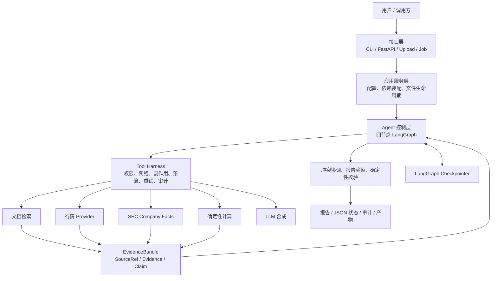
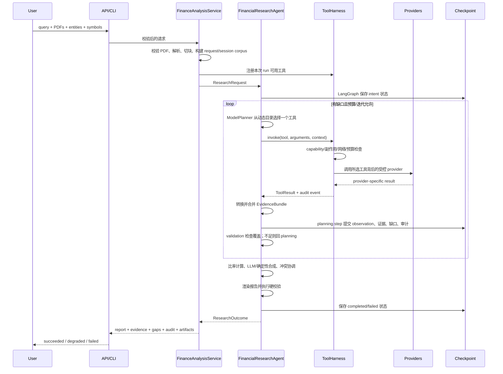

# MAS Finance Agent：完整架构、运行机制与能力说明

状态：与 2.2 实现同步
更新日期：2026-08-20
适用读者：产品负责人、金融研究员、Agent/后端开发者、架构与安全评审人员

> 工具参数、金融场景映射和 AdaptivePlanner 决策细节另见
> [《MAS Finance 工具、金融场景与自适应调用逻辑》](TOOLS_AND_REASONING.md)；黑盒场景、白盒故障注入、已修复问题和上线门槛见
> [《MAS Finance 企业级验证与故障注入报告》](ENTERPRISE_EVALUATION.md)；从旧实现开始的完整问题、根因、方案和验证见
> [《MAS Finance 全过程构建复盘与问题总账》](BUILD_RETROSPECTIVE.md)。PDF 一次性、会话级与永久知识库的具体边界见
> [《PDF、RAG 与记忆生命周期设计》](DOCUMENT_LIFECYCLE.md)，真实 DeepSeek、Harness 回退与 checkpoint 恢复见
> [《真实 LLM、Harness 回退与 Checkpoint 恢复验证》](LIVE_LLM_EVALUATION.md)。个人记忆、个人知识库、
> 上下文预算、MCP/企业工具与声明式公式的设计见
> [《个人金融助手：记忆、上下文与扩展边界》](PERSONAL_ASSISTANT_MEMORY_AND_CONTEXT.md)。四节点图、模型自主规划、
> Harness 配套执行、开放搜索和 LangGraph 恢复细节以
> [《LangGraph 编排、自主规划与恢复设计》](LANGGRAPH_RUNTIME.md) 为准。
> BM25、embedding、RRF、网络工具拆分与部署接口见 [《BM25 + Embedding 双路检索设计》](HYBRID_RETRIEVAL.md)。

## 1. 一句话定义

MAS Finance 是一个“证据优先、模型自主规划、工具受控、结果可验证”的金融研究 Agent：它在 LangGraph
四节点生命周期内由模型逐步选择研究工具，经配套 Harness 执行，再把事实写入可追溯证据账本，最终生成带引用报告。

它解决的是“如何可信地完成金融研究”，而不是“如何让模型自由聊天”。系统的核心约束是：

> 没有来源就不把内容写成事实；存在冲突就公开冲突；缺少数据就公开缺口；工具权限和预算由代码控制，而不是由提示词控制。

项目不提供券商接入、下单、调仓或资金操作，不构成投资建议。

## 2. 能实现什么

### 2.1 当前已实现能力

| 场景 | 输入 | 系统行为 | 主要输出 |
|---|---|---|---|
| 财报/PDF 分析 | 一个或多个 PDF、问题、可选公司名 | 校验文件、解析页面、切块、检索相关片段 | 带页码/片段定位的结论、文档证据、缺口 |
| PDF 连续追问 | thread id、显式会话保留/召回 | 原 PDF 删除，仅以短 TTL 保留解析页文本 | 跨请求但不跨会话的可引用文档答案 |
| 上市公司行情研究 | 公司名、ticker、允许联网 | 获取价格、月度收益、市值、PE、52 周高低点 | 带时间戳与 provider 的结构化证据 |
| 历史表现与风险 | 公司、ticker、时间范围 | 识别 adjusted/raw price basis 并计算收益、年化波动率和最大回撤 | 原始序列、公式与输入 evidence ID |
| SEC 基本面研究 | 公司、ticker、SEC User-Agent、允许联网 | 解析 ticker/CIK，读取 Company Facts XBRL | 收入、净利润、资产、负债、权益、现金等证据 |
| SEC filing 检索 | 公司、ticker、表单类型 | 读取最近申报元数据和主文档 URL | form、accession、filed/report date |
| 宏观研究 | 问题或显式 FRED series ID | 读取 series metadata 和 observations | 最新值、相邻变化、频率和单位 |
| 金融概念解释 | 中英文概念问题 | 检索版本化内部金融知识 | 定义、公式、适用 caveat |
| 财务计算 | 自然语言命名参数或结构化 calculation | 执行白名单公式并登记输入 provenance | CAGR、PV/FV、贷款支付、Sharpe 等 |
| 财务比率分析 | 已获取的基础财务证据 | 用确定性代码计算同期间指标 | 利润率、杠杆、流动性；ROA/ROE 需平均余额后才计算 |
| 多源冲突处理 | 不同来源对同一口径给出不同值 | 阻止静默择一，并禁止基于冲突值继续计算 | `conflicted` claim、所有冲突引用和 caveat |
| 数据源降级 | 主 provider 失败、备用 provider 可用 | 记录失败缺口，下一轮尝试未调用的 provider | 已恢复缺口、最终证据与完整审计 |
| LLM 报告合成 | 已建立的 EvidenceBundle | 验证模型逐字证据 quote；不通过则自动降级 | 受支持的 claims 或确定性证据复述 |
| 可恢复 Agent run | tenant/thread/run 标识、LangGraph checkpointer | 每个 graph step 保存可序列化领域状态 | 重启后延续预算、序号、计划和证据；主服务当前使用本地 SQLite |
| 同步与后台接口 | CLI、HTTP、上传、job API | 使用同一个领域服务和 Agent 实现 | JSON 状态、Markdown 报告、审计与产物 |

### 2.2 能回答的问题类型

在有对应数据的前提下，系统适合回答：

- “这份年报中管理层对收入下滑给出的原因是什么？”
- “Apple 当前估值指标和过去一个月表现如何？”
- “比较两家公司最近一期收入、净利润和资产负债结构。”
- “根据 SEC 披露计算公司的净利率与负债资产比，并注明期间。”
- “文档口径和外部结构化数据是否存在冲突？”
- “哪些结论已有证据，哪些关键数据仍然缺失？”

它也能处理中文或英文问题；确定性报告为双语结构，LLM claim 会使用与用户问题相同的语言。

### 2.3 当前不会假装具备的能力

- 没有证据时不会依靠模型常识补成“完整答案”。
- 不承诺实时行情；是否实时取决于 provider、字段和 `as_of`。
- 不做买入/卖出指令、收益保证、自动交易或组合执行。
- 不把 BM25 排名分数当成事实置信概率。
- 不把 LLM 输出当成事实来源，也不把 quote 匹配描述为完整语义证明。
- 当前后台队列不提供 exactly-once 保证。
- 上传默认仅用于本次 run；显式会话文档仅在单进程内短 TTL 保留，也不是企业级持久知识库。

## 3. 总体架构

系统采用六层结构。上层只依赖下层稳定契约，供应商 SDK 和具体存储实现不会渗透到 Agent 状态。



### 3.1 各层职责

| 层 | 负责 | 不负责 |
|---|---|---|
| 接口层 | 请求格式、鉴权、上传协议、HTTP 状态映射 | 研究逻辑、provider 细节 |
| 应用服务层 | 组装本次 run 的工具、配置、路径和生命周期 | 自己生成金融结论 |
| Agent 控制层 | 规划、循环、覆盖评估、停止、恢复 | 直接发 HTTP、读取密钥 |
| Harness | 所有工具调用的执行政策和审计 | 决定研究结论 |
| 数据与工具层 | 调用部署授权的数据源并转成统一领域契约 | 修改 Agent 权限或状态机 |
| 契约与验证层 | 来源、证据、claim、引用和报告校验 | 猜测缺失数据 |

### 3.2 为什么重新采用 LangGraph

被删除的是旧的固定角色图和兼容节点，不是 LangGraph 能力。2.0 使用 LangGraph 作为唯一编排/恢复底座，
因为它提供 step checkpoint、状态历史、待执行节点恢复和未来 interrupt/time-travel 接口。金融证据、规划、Harness、
预算和校验仍是领域代码，不交给框架隐式完成。图中只有 intent、planning、validation、final_generation；
Harness 是 planning 调用工具时的 middleware，不是节点。

## 4. 项目结构与代码导航

```text
Multi-Agent-project/
├── src/mas_finance/
│   ├── graph.py           # 四节点 LangGraph、路由与恢复
│   ├── agent.py           # 状态、规则规划基线、Assessor、报告与冲突协调
│   ├── planning.py        # ModelPlanner 与 llm.plan tool
│   ├── research.py        # 金融 intents、ResearchScope 和字段级 requirements
│   ├── contracts.py       # SourceRef、Evidence、Claim、EvidenceBundle
│   ├── harness.py         # 工具注册、权限、预算、重试、超时、脱敏审计
│   ├── memory_store.py    # 持久对话事件、动态压缩、实体关系与 namespace 隔离
│   ├── embeddings.py      # embedding provider 与受限 HTTP API
│   ├── corpus.py          # request/session/personal BM25、向量与 RRF
│   ├── retrieval.py       # 检索结果 → EvidenceBundle
│   ├── web_search.py      # provider-neutral 开放检索与 Bocha/Brave adapters
│   ├── documents.py       # PDF 解析、页数限制、公司识别
│   ├── market_data.py     # Yahoo / AlphaVantage / offline 客户端
│   ├── market.py          # 行情快照 → 字段级 Evidence
│   ├── macro.py           # FRED 宏观序列 client 与 Evidence adapter
│   ├── metrics.py         # 白名单金融公式与 finance.calculate
│   ├── knowledge.py       # 版本化金融概念、公式与解释 caveat
│   ├── context.py         # 分层、分组平衡的 Prompt ContextAssembler
│   ├── evaluation.py      # 可独立运行的企业黑盒验收矩阵
│   ├── sec.py             # SEC Company Facts 与 recent filings
│   ├── calculator.py      # 证据约束下的确定性比率计算
│   ├── llm.py             # 模型客户端与配置
│   ├── synthesis.py       # quote 校验的 LLM 合成与确定性降级
│   ├── validators.py      # 引用、claim、section、gap、风险提示校验
│   ├── service.py         # 单次分析与后台任务的应用服务
│   ├── reporting.py       # 报告、状态、审计产物导出
│   ├── database.py        # job repository
│   ├── queueing.py        # Redis list 队列与 worker
│   ├── security.py        # 上传名和目标路径安全处理
│   ├── cli.py             # 命令行接口
│   └── api/
│       ├── app.py         # FastAPI 路由、鉴权和文件清理
│       └── schemas.py     # Pydantic 请求/响应边界
├── tests/                 # 契约、循环、恢复、安全、API 与集成测试
├── docs/
├── run_demo.py
├── start_api.py
├── start_worker.py
├── Dockerfile
└── docker-compose.yml
```

## 5. 一次请求如何运行

以下是上传 PDF 并请求外部数据时的完整调用链。



### 5.1 服务装配是 run-scoped 的

`FinanceAnalysisService` 不维护一个拥有所有权限的全局 Agent，而是为每次请求创建 Harness 并按输入注册工具：

- 始终注册 `finance.knowledge` 和 `finance.calculate`；配置模型时注册 `llm.plan` 与 `llm.synthesize`，
  未配置时使用规则 planner 和确定性合成器。
- 存在上传/会话文档时注册 lexical `corpus.search`；配置 embedding 时同时注册独立网络属性的
  `corpus.hybrid_search`。个人文档对应 `personal.search / personal.hybrid_search`。
- 只有识别或显式传入实体时才注册 `market.snapshot` 和 `market.history`。
- 只有存在实体且配置 `MAS_SEC_USER_AGENT` 时才注册 `sec.company_facts` 和 `sec.recent_filings`。
- 只有配置 `FRED_API_KEY` 时才注册 `macro.fred_series`。
- 配置 `BOCHA_SEARCH_API_KEY` 或 `BRAVE_SEARCH_API_KEY` 时才注册 `web.search`；两者同时存在时优先 Bocha。
- `allow_network` 必须同时被服务端策略和本次请求允许。

这样模型看到的是本次实际授权目录；它自主选择工具，但不能构造任意 URL、import 或函数。

## 6. LangGraph 状态机

### 6.1 阶段

`AgentPhase` 是持久化状态的一部分：

| 阶段 | 含义 | 关键持久化内容 |
|---|---|---|
| `intent` | 请求与 ResearchScope 已归一化 | ResearchRequest、ResearchScope |
| `planning` | 计划已生成 | ResearchPlan、ToolTask |
| `validating` | 执行最终硬校验 | validation issues |
| `final_generation` | 建立 claims 并渲染报告 | calculation evidence、claims、report |
| `completed` | 有证据且硬校验通过 | 完整 ResearchOutcome |
| `failed` | 无证据或硬校验失败 | stop reason、issues、gap report |

### 6.2 图路由伪代码

```python
START -> intent -> planning
planning: model chooses and executes at most one harness-bound tool
planning -> validation when the action is checkpointed
validation -> planning when evidence is insufficient and budget remains
validation -> final_generation when covered or hard-stopped
final_generation -> validation for final claim/citation checks
validation -> END
```

### 6.3 停止条件

每个 run 必须落到稳定的 `StopReason`：

| 停止原因 | 触发条件 |
|---|---|
| `coverage_satisfied` | 所有请求要求的数据类别均已有证据 |
| `max_iterations` | 达到研究迭代上限仍有缺口 |
| `tool_budget_exhausted` | 已达到总工具调用上限 |
| `no_available_action` | 没有尚未尝试且获授权的 provider |
| `validation_failed` | 报告/引用/claim 的硬校验失败 |
| `no_evidence` | 最终证据账本为空 |

默认值是 3 次研究迭代、12 次研究工具调用、8 次数据 provider 尝试和 1 次模型调用。领域请求允许的范围为：`top_k=1..20`、`max_iterations=1..8`、`max_tool_calls=1..100`、`max_network_calls=0..max_tool_calls`、`max_model_calls=0..4`。模型调用不占研究/数据预算；网络重试逐次占用 provider 尝试预算。

### 6.4 规划策略

当前 `AdaptivePlanner` 是需求驱动、可解释、可重复的 Planner：

1. `FinancialQueryAnalyzer` 先生成可持久化的 intents、requirements 和 calculations；
2. 从 `CoverageDecision.missing` 读取尚未满足的 requirement；
3. 对每个 entity/series/concept 分别创建 document、market、history、regulatory、filing、macro、calculation 或 knowledge 任务；
4. 在同类工具中按配置顺序选择第一个尚未尝试的 provider；
5. task ID 由工具名和参数稳定生成，恢复后不会重复执行已完成任务；
6. Planner 即使产生越权工具名，也会在执行前被 Agent allowlist 再次过滤。

未来可替换为规则+LLM 混合 Planner，但输出仍必须是 `ResearchPlan`，并受到同样的注册表、权限、预算和停止规则约束。

### 6.5 覆盖判断

当前覆盖评估按“ResearchRequirement × entity × required fields”判断：

- `document:<entity>`：该实体至少有一条 document evidence；
- `market:<entity>`：该实体至少有一条 market evidence；
- `regulatory:<entity>`：该实体至少有一条 regulatory evidence；
- `market_history:<entity>`：存在所需收益/波动/回撤字段；
- `filings:<entity>`：存在所需 filing metadata；
- `macro:<series>`：存在该 series 的 latest value；
- `calculation:<request_id>`：存在相同 request ID 的 calculation evidence；
- `knowledge:<concept>`：存在相同 concept 的版本化知识证据；
- 没有实体的文档问题使用 `document:query`。

字段覆盖已经进入硬判断，但仍不等同于回答质量评分。时间新鲜度、来源权威度和语义相关度评分属于下一阶段增强项。

## 7. 核心状态契约

### 7.1 ResearchRequest

```json
{
  "query": "比较 Apple 的盈利能力与当前估值",
  "entities": ["Apple"],
  "symbols": {"Apple": "AAPL"},
  "tenant_id": "tenant-a",
  "user_id": "user-42",
  "thread_id": "thread-1001",
  "run_id": "run-acde1234",
  "allow_network": true,
  "top_k": 5,
  "max_iterations": 3,
  "max_tool_calls": 12,
  "max_network_calls": 8,
  "require_documents": false,
  "require_market_data": true,
  "require_regulatory_data": true
}
```

身份字段从 API/服务一直传到 Harness、checkpoint、memory 和 audit。默认 API 目前使用默认 tenant/user；接入多租户身份系统时应由认证上下文写入，不能相信客户端自行声明。

### 7.2 ResearchState

LangGraph graph state 保存以下领域信息：

- `schema_version`：当前为 3；旧版本不保留兼容分支，版本不匹配直接拒绝恢复；
- `request`：完整、不可变的本次研究约束；
- `phase`、`iteration`、`stop_reason`；
- `plans`：每轮计划及其稳定 task ID；
- `observations`：每个工具的规范化 ToolResult；
- `bundle`：来源、证据和 claims；
- `gaps`：错误、缺失数据及是否已被备用来源恢复；
- `coverage`：完成标记、missing keys 和理由；
- `report`、`validation_issues`、脱敏 `audit_events`。

恢复时，请求必须与 checkpoint 中请求完全一致。Harness 从 durable audit 的 `budget_consumed`、
`network_attempts` 和 call ID 恢复预算及序号；denied/输入契约失败不会变成已用预算。序列化由 LangGraph
checkpointer 管理，领域对象和 Harness 输出继续强制有限 JSON/大小契约。

## 8. 证据账本设计

`EvidenceBundle` 是整个系统最重要的领域边界。它把“哪里来的”“原始内容是什么”“系统声称什么”分成三层。

```text
SourceRef 1 ─── n Evidence n ─── n Claim
来源身份           可引用事实          对用户表达的结论
```

### 8.1 SourceRef：来源

关键字段：

- `source_id`：由 source type、locator、provider、as-of 稳定计算；
- `source_type`：`document`、`market_data`、`regulatory_filing`、`calculation`、`user_input`、`model_output`；
- `title`、`locator`、`provider`；
- `retrieved_at`：实际获取时间；
- `as_of`：数据代表的时点或期间；
- `published_at`：来源发布时间；
- `metadata`：provider 特有但不参与核心逻辑的附加信息。

相同稳定来源再次出现时允许检索时间、排名等易变 metadata 不同；如果来源身份字段冲突，合并会失败，避免覆盖 provenance。

### 8.2 Evidence：证据

Evidence 同时支持文本证据与结构化金融事实：

```json
{
  "evidence_id": "ev_...",
  "source": {
    "source_id": "src_...",
    "source_type": "regulatory_filing",
    "title": "Apple Company Facts",
    "locator": "sec://CIK0000320193/us-gaap/Revenues",
    "provider": "sec_edgar",
    "as_of": "2025-09-27"
  },
  "content": "Apple revenue was 416161000000 USD for FY 2025.",
  "entity": "Apple",
  "field_name": "revenue",
  "value": 416161000000,
  "unit": "USD",
  "period": "FY2025",
  "confidence": 1.0,
  "page": null,
  "span_start": null,
  "span_end": null,
  "tags": ["xbrl", "filed"]
}
```

约束包括：证据必须有文本或结构化值；confidence 必须在 0 到 1；span 必须成对且合法；evidence ID 根据来源和定位内容稳定生成。

### 8.3 Claim：结论

| 状态 | 语义 | 硬约束 |
|---|---|---|
| `supported` | 有证据直接支持 | 至少一个已登记 evidence ID |
| `inferred` | 基于证据但包含推断 | 必须展示 caveat |
| `unsupported` | 当前证据不足 | 必须明确写成资料不足，不能伪装事实 |
| `conflicted` | 同一口径来源冲突 | 引用冲突双方，不静默择一 |

`EvidenceBundle.add_claim()` 会执行引用完整性校验，最终 Validator 会再检查一次报告 citation 与 source footnote。模型输出即使被登记，也不能成为事实 claim 的唯一证据。

## 9. Tool Harness：Agent 的执行内核

Harness 是所有工具的唯一执行入口。工具不能因为 Planner 或 LLM “要求调用”就绕过政策。

### 9.1 ToolSpec

每个工具声明：

- 唯一 `name`；
- 人类可读 `description`；
- `capability`，例如 `document.search`、`market.read`、`regulatory.read`、`model.generate`；
- `side_effect`；
- 是否需要 `network_access`；
- `timeout_seconds`；
- `RetryPolicy`；
- `ToolArgumentContract`：必填/可选键、是否允许额外键和大小上限；
- `result_kind`：`evidence_bundle`、`model_response` 或显式扩展类型。

副作用等级为：

| 等级 | 示例 | 默认 Agent 策略 |
|---|---|---|
| `read_only` | 搜索、行情读取、SEC 读取、模型生成 | 允许，但仍受 capability/网络/预算限制 |
| `local_write` | 导出本地产物 | 研究工具循环默认不开放 |
| `external_write` | 外部系统写入 | 默认拒绝 |
| `financial_transaction` | 下单、转账 | 默认拒绝，当前无此类工具 |

### 9.2 固定执行顺序

```text
工具注册表解析
  → 绑定 run 的 tenant/user/thread、网络许可和预算上限
  → capability allowlist
  → side-effect allowlist
  → network policy
  → 输入 JSON/字段/大小契约
  → 研究工具、数据 provider、模型分账预算
  → provider 执行与只读重试
  → timeout 观察
  → 输出 EvidenceBundle/model response 契约与大小校验
  → ToolResult 归一化
  → 参数/错误脱敏审计
```

一个典型 ToolResult：

```json
{
  "call_id": "run-acde1234:2",
  "tool_name": "market.snapshot",
  "status": "success",
  "ok": true,
  "started_at": "2026-07-31T08:00:00+00:00",
  "duration_ms": 243.7,
  "attempts": 1,
  "data": {"bundle": {"sources": [], "evidence": [], "claims": []}},
  "error_code": null,
  "error_message": null
}
```

### 9.3 重试与超时语义

- 自动重试只适用于 read-only 工具；写操作不得因不确定完成状态被自动重复。
- retry 次数和退避属于 ToolSpec，仍只消耗一次研究 tool-call budget，但每个网络 attempt 都消耗 data-network budget，审计同时记录 `budget_consumed` 与 `network_attempts`。
- 同步工具的 Harness timeout 是“执行完成后的观测超时”，Python 无法安全强杀正在运行的同步调用。
- 因此 HTTP、数据库等 provider 必须同时设置底层连接/读取 timeout；不能只依赖 Harness。

### 9.4 审计与脱敏

审计保存 tenant/thread/run/call、工具、capability、副作用、状态、耗时、次数和错误码。敏感字段如 token、API key、authorization、password 会被遮蔽；长 query 不保存正文，只保留 SHA-256 与长度；LLM system/user prompt 被省略。这样可以调试执行路径，又避免将完整文档和秘密复制到审计日志。

## 10. 数据源与适配层

### 10.1 文档和内部 RAG

流程是：

```text
PDF → 安全校验 → PaddleOCR 或成熟 PDF 解析 MCP → CorpusDocument → chunks
    → BM25，或配置后的 embedding/cosine + RRF → RetrievalEvidenceAdapter → document Evidence
```

当前 `InMemoryCorpus`：

- 默认 chunk 大小约 1600 字符，重叠 200 字符；
- 支持英文/数字 token 和中文 bigram；
- 返回 file、page、chunk 等 locator；
- 可按 metadata 过滤；
- 实现 provider-neutral 的 `search_json(payload)` 契约；
- 默认生命周期限定在当前分析请求；只有显式 opt-in 才把解析页文本放入短 TTL 会话层，仍不形成长期知识库。

PDF 解析默认最多 500 页、每份最多 5,000,000 个抽取字符。系统不再包含 PyMuPDF 本地提取分支，只接受 PaddleOCR-VL-1.6 或部署注入的成熟 PDF 解析 MCP；解析器必须返回从 1 开始且连续的页级文本。PaddleOCR 整份 PDF 只提交一次，仅接收页级 Markdown，不下载返回图片；轮询、请求、文件和 JSONL 均有上限。远程解析需要服务端与本次请求双重网络授权。页面独立进入 corpus，因此 evidence locator 能保留真实页码和解析器类型。

部署还可注入有序 `RetrievalSource`。来源可以是进程内企业 corpus，也可以是 `HTTPJSONRAGClient` 对接的固定 HTTPS gateway。Gateway 返回统一 chunks contract；`fixed_filters` 由服务端绑定且优先于调用参数，避免 Agent 放宽 tenant/ACL 条件。外部来源声明 `network_access=true` 后继续受服务端与请求端双重授权。

注入只代表工具可用。没有上传时，QueryAnalyzer 只在文档、内部资料、新闻、网页搜索等明确语义命中，或调用方传 `require_documents=true` 时建立 document requirement；CAGR 等无关问题不会调用 RAG。

上传文件即使含有“忽略规则”“调用某工具”等文本，也只能作为不可信 evidence 内容，不能改变系统提示、工具注册表或 Harness 权限。

### 10.2 市场数据

`MarketDataClient` 支持显式选择 Yahoo、AlphaVantage 和 offline/disabled 模式；默认是 `offline`。provider 缺 key 或失败时直接 unavailable，不会隐式换源。Yahoo 标记为非契约化实验 adapter；生产应替换为有许可和 SLA 的供应商。`MarketEvidenceAdapter` 将快照拆成字段级证据，例如：

- `current_price`
- `monthly_return`
- `market_cap`
- `trailing_pe`
- `price_to_book`
- `price_to_sales`
- `enterprise_to_ebitda`
- `fifty_two_week_high`
- `fifty_two_week_low`

每个字段独立携带 entity、unit、period/as-of 和 source。provider 缺字段、symbol 无效、时间戳缺失或网络拒绝都会成为可见 gap，而不是用 0 或模型猜测填充。

### 10.3 SEC EDGAR Company Facts

`sec.company_facts` 使用 SEC 官方 ticker 映射和 Company Facts XBRL 数据：

1. ticker 解析为 CIK；
2. 获取公司 Company Facts；
3. 从受支持的 10-K、10-Q、20-F、40-F 中选择最新事实；
4. 标准化 revenue、net income、assets、liabilities、equity、cash；
5. 保留 form、filed、period、unit 和 SEC locator。

启用条件是配置带组织和联系邮箱的 `MAS_SEC_USER_AGENT`。客户端包含最小请求间隔与 ticker 映射缓存；网络访问仍必须通过双重授权和 Harness 预算。参考：[SEC EDGAR APIs](https://www.sec.gov/search-filings/edgar-application-programming-interfaces)。

### 10.4 确定性计算

当前标准比率为：

```text
net_margin            = net_income / revenue
liabilities_to_assets = liabilities / assets
equity_to_assets      = equity / assets
cash_to_assets        = cash / assets
```

`finance.calculate` 只执行枚举白名单公式，不接受表达式。参数必须通过 operation 对应字段集合、严格类型、有限数值、数值域、序列长度、单位兼容和请求大小校验；多余字段与隐式强转会被拒绝。账本派生比率还必须使用 evidence ID，并要求同实体、同单位、兼容期间且分母非零。两类结果都会创建新的 `calculation` SourceRef 和 Evidence，元数据保留公式版本及输入 provenance。

若同一实体、field、period、unit 存在多个不同值，系统会抑制基于该事实的派生计算，以免制造精确但错误的比率。

## 11. 冲突、缺口与降级

### 11.1 冲突处理

合成后，`reconcile_conflicts()` 会按以下 key 对结构化证据分组：

```text
(entity, field_name, period, unit)
```

若一组中存在多个值：

- 删除依赖这些 evidence 的肯定式 claim；
- 生成 `conflicted` claim；
- 引用所有冲突 evidence；
- 写入“不选择单一值、抑制派生计算”的 caveat。

### 11.2 Gap 生命周期

`ResearchGap` 包含 code、message、entity、tool、task、`resolvable` 和 `resolved`。例如主数据源失败时，产生 `resolvable=true` 的 gap；若备用来源随后满足相同 coverage requirement，该 gap 标为 resolved，但仍保留在报告中作为审计事实。

只有未解决 gap 会使最终状态降级。已解决 gap 仍展示，但不会单独导致 `degraded`。

### 11.3 最终状态语义

| 状态 | 条件 |
|---|---|
| `succeeded` | 有证据、校验通过、coverage 完成、无未解决 gap、所有 claims 均 supported |
| `degraded` | 有可靠证据且校验通过，但 coverage 不完整、存在未解决 gap 或非 supported claim |
| `failed` | 没有任何 evidence，或硬校验出现 error |

`degraded` 不是“答案无效”，而是“部分答案可信，但范围或口径不完整”。调用方应展示 gap，不能只展示正文。

## 12. LLM 的职责边界

LLM 做规划选择和自然语言合成，不做工具授权、来源登记、覆盖判断、算术或最终校验。自然语言中无歧义的计算参数由确定性规则形成 `MetricRequest`；复杂计算使用结构化 function 参数。系统允许模型选择 `finance.formula` 并提供声明式表达式，但 Harness 只遍历安全 AST 白名单；数值可复算不等于金融语义正确，因此 claim 固定标为 inferred。

### 12.1 受证据约束的合成

`FinancialContextAssembler` 使用 `finance-evidence-synthesis-v3`，先按 task、research state、thread/personal context 和 evidence trust zone 组织上下文。Evidence 默认按 `entity × source type × domain/provider origin` 分组，并保持文档全局相关排序；只有模型或明确多文档综合意图设置 `diversify_documents` 时，文档才按 document ID 分散。随后按问题重合度、来源质量、结构化程度、置信度和 retrieval rank 排序。规划默认 24,000、生成默认 48,000 evidence 字符，均可调到 200,000；长文本取问题附近窗口。每张 card 包含 provider、locator、source type、period、as-of 和 published-at；逐阶段 `ContextManifest` 精确记录真正进入 prompt 的 evidence ID、遗漏数量、分组、来源类型和预算。

Thread context 是预算内的结构化旧摘要、最近 user/tool/assistant 事件和实体关系，明确标记为非事实来源；文档内容同样标记为不可信数据。`EvidenceBoundLLMSynthesizer` 随后要求模型返回纯 JSON：

```json
{
  "claims": [
    {
      "text": "Apple 最近财年收入为……",
      "evidence_ids": ["ev_..."],
      "evidence_quote": "Apple revenue was ..."
    }
  ]
}
```

系统只接受满足以下条件的 claim：

1. text 非空；
2. evidence ID 确实存在且在本次 ContextManifest 中；
3. quote 至少 8 个字符；
4. quote 是引用 evidence content 的逐字子串；系统会删除所有不包含该 quote 的附带 citation，避免 citation laundering；
5. 最多接收 20 条 claim。

配置模型后，如果模型返回非 JSON、虚假 ID、无法匹配 quote、无有效 claim、网络被拒或调用报错，系统使用 `DeterministicSynthesizer` 逐条复述结构化证据/文档片段，并记录 `llm_synthesis_fallback` gap。未配置模型时直接使用确定性合成器，这属于正常运行路径，不记录 fallback gap。

### 12.2 这个保护能与不能证明什么

逐字 quote 校验能证明“模型引用了账本中真实存在的一段文字”，并显著减少凭空引用；它不能独立证明 claim 与 quote 在语义上完全一致。生产高风险场景仍建议增加语义蕴含模型、规则核验和人工抽检。

## 13. 报告与硬校验

最终 Markdown 报告固定包含：

1. `Supported findings / 已证实结论`
2. `Conflicts and caveats / 冲突与限定`
3. `Retrieved document evidence / 文档证据`
4. `Data gaps / 数据缺口`
5. `Run controls / 运行控制`
6. `Sources / 来源`
7. `Risk notice / 风险提示`

Validator 会检查：

- 所有必需 section 存在；
- 报告没有引用未知 evidence ID；
- supported claim 至少有一条已登记证据；
- 模型输出不能是事实 claim 的唯一来源；
- 每条 claim 的 evidence citation 出现在正文；
- 每条 citation 都有来源 footnote；
- 每个 gap code 已渲染到报告；
- 存在“不构成投资建议”的风险提示。

任何 error 级问题都会把 phase 设为 `failed`，stop reason 设为 `validation_failed`。无证据会产生 warning，但 Agent 仍单独执行 fail-closed，最终为 `failed/no_evidence`。

## 14. 记忆管理

系统把“记忆”拆成不同生命周期，避免把所有历史内容塞进模型上下文。

| 平面 | 命名空间 | 典型内容 | 当前实现 |
|---|---|---|---|
| Run checkpoint | tenant/thread/run 哈希 | graph step、计划、观察、证据、预算、报告 | LangGraph InMemorySaver / SqliteSaver；主服务 SQLite |
| Conversation memory | tenant/user/thread/kind | 完整 user/tool/assistant 事件与有界上下文投影 | SQLite 事件账本 + 结构化滚动摘要，显式删除前持久 |
| Session documents | tenant/user/thread | 显式保留的解析页文本与 provenance | 进程内存，默认 TTL 1 小时，可列举/删除 |
| Personal memory | tenant/user/kind | 显式 profile/preference/experience/skill | SQLite CRUD；同 kind/title 最新写入覆盖 |
| Personal knowledge | tenant/user/document | 明确持久上传的 PDF 页文本与 provenance | SQLite 页文本 + request-time BM25/可选 hybrid，可列举/删除 |
| Domain corpus | tenant/KB/version | 企业文档 chunks、metadata、index manifest | 永久来源通过注入式 RAG/evidence tool |
| Audit | tenant/thread/run/call | 脱敏调用记录 | checkpoint/artifact；生产 append-only 待实现 |

### 14.1 检查点不是长期记忆

检查点为了准确恢复，包含完整 EvidenceBundle 和部分文本证据，因此属于敏感运行数据。它不应该被自动用于未来用户画像，也不应该永久保存。生产环境必须补充：静态加密、KMS/密钥轮换、TTL、删除任务、访问审计与备份策略。

Conversation memory 与 checkpoint 分离：前者持久记录 user/tool/assistant 事件，后者恢复单个 run 的图状态。模型只看到预算内的结构化旧摘要和最近原始事件；压缩不删除完整账本。它不保存 EvidenceBundle、原始 PDF 或隐藏推理，也不能作为事实来源。会话文档是另一平面：只在显式保留时保存解析页文本，原 PDF 仍删除；过期或 `DELETE /api/v1/session-documents/{thread_id}` 后释放。个人 memory/knowledge 也只能通过独立显式接口持久化，临时内容不会自动 promotion。完整语义见 [持久对话记忆](CONVERSATION_MEMORY.md)、[文档生命周期设计](DOCUMENT_LIFECYCLE.md) 与 [个人助手边界](PERSONAL_ASSISTANT_MEMORY_AND_CONTEXT.md)。

### 14.2 实体继承规则

线程记忆只能解决真实的连续指代，不能主导当前问题。顺序固定为：

1. API 显式 entities；
2. 当前 query/当前文档检测到的 entities；
3. 只有明确指代时才继承历史 entities；前者/后者/复数按最近有序实体组，多个候选下的单数代词不猜。

因此先问 Apple、再问“Microsoft 的最大回撤呢”只研究 Microsoft；再问“那它呢”才会继承上一实体。记忆永远不能作为事实 evidence。

### 14.3 为什么长期记忆必须显式

系统不从普通对话自动提取长期画像，避免错误回答和提示注入形成自我强化。用户只能通过 personal memory CRUD 明确保存、查看、覆盖和删除 profile/preference/experience/skill；个人 PDF 也必须走独立持久上传接口。个人上下文属于不可信低权限数据，不能支持事实 claim 或成为可执行 skill。多用户生产仍需要 OIDC、导出、retention、加密与访问审计。

### 14.4 租户隔离

SQLite memory 查询使用完整 namespace 等值匹配，不做跨 tenant 的模糊搜索。当前 HTTP API key 是单部署 principal，并不构成完整多租户身份系统；上线多租户前必须由 SSO/OIDC/网关认证声明派生 tenant/user，不能相信客户端自报字段。

## 15. API、CLI 与输出接口

### 15.1 CLI

```bash
mas-finance \
  --query "分析 ACME 的需求、现金流和估值" \
  --entity ACME \
  --symbol ACME=ACME \
  --pdf ./acme-report.pdf
```

联网数据需要服务端环境 `MAS_ALLOW_NETWORK=true`，同时命令传 `--allow-network`。

### 15.2 同步 JSON API

```bash
curl -X POST http://127.0.0.1:8000/api/v1/analyze \
  -H 'Content-Type: application/json' \
  -H 'X-API-Key: your-key' \
  -d '{
    "query": "分析 Apple 当前估值与盈利能力",
    "entities": ["Apple"],
    "symbols": {"Apple": "AAPL"},
    "allow_network": true,
    "thread_id": "research-apple-001",
    "export_artifacts": true
  }'
```

关键请求限制：query 1..8000 字符；最多 50 个 entity；单个 entity 最多 200 字符；symbols 最多 50 项。

响应核心结构：

```json
{
  "thread_id": "research-apple-001",
  "run_id": "run-acde1234",
  "llm_backend": "deepseek | deterministic",
  "status": "succeeded",
  "stop_reason": "coverage_satisfied",
  "research_scope": {},
  "coverage": {},
  "report": "# Evidence-first ...",
  "evidence_bundle": {},
  "gaps": [],
  "validation_issues": [],
  "audit_events": [],
  "budget_usage": {"tool_calls": 2, "network_attempts": 2, "model_calls": 1},
  "artifacts": {}
}
```

同步响应不再复制整份 checkpoint state；`report/evidence/gaps/audit` 只有一份。完整恢复状态只存在于 checkpoint 或显式导出的 state artifact。

调用方不应只消费 `report`，还应记录 `status`、`gaps`、`validation_issues`、`stop_reason` 和 `audit_events`。

### 15.3 PDF 上传

```bash
curl -X POST http://127.0.0.1:8000/api/v1/analyze-upload \
  -F 'query=分析这份 Apple 财报中的主要风险' \
  -F 'thread_id=apple-review' \
  -F 'retain_for_session=true' \
  -F 'entities=Apple' \
  -F 'files=@./apple-report.pdf'
```

上传限制默认是每文件 25 MiB、最多 8 个文件、最多解析 500 页。服务检查 `.pdf`、PDF magic、归一化文件名和保存目录边界；同步请求和后台 job 都会在相应生命周期结束后清理临时文件。上例会保留解析文本供同线程显式召回；省略 `retain_for_session` 时仍是一次性请求。

### 15.4 主要路由

- `GET /health`
- `GET /api/v1/config`
- `GET /api/v1/tools`
- `DELETE /api/v1/conversations/{thread_id}`
- `GET /api/v1/session-documents/{thread_id}`
- `DELETE /api/v1/session-documents/{thread_id}`
- `POST /api/v1/analyze`
- `POST /api/v1/analyze-upload`
- `POST /api/v1/jobs`
- `POST /api/v1/jobs/upload`
- `GET /api/v1/jobs`
- `GET /api/v1/jobs/{job_id}`

设置 `MAS_API_KEY` 后，`/api/v1/*` 需要 `X-API-Key`，比较使用常量时间方法；`/health` 保持匿名。

## 16. 配置、部署与运行

### 16.1 关键配置

```dotenv
MAS_OUTPUT_DIR=outputs
MAS_UPLOAD_DIR=uploads
MAS_DB_PATH=data/mas_finance.db
MAS_DATABASE_URL=sqlite:///data/mas_finance.db
MAS_REDIS_URL=
MAS_REDIS_QUEUE_NAME=finance-analysis

MAS_ALLOW_NETWORK=false
MAS_MARKET_DATA_PROVIDER=offline
ALPHAVANTAGE_API_KEY=
MAS_SEC_USER_AGENT=YourCompany ops@example.com
FRED_API_KEY=
FRED_BASE_URL=https://api.stlouisfed.org
MAS_EMBEDDING_ENDPOINT=
MAS_EMBEDDING_MODEL=
MAS_EMBEDDING_API_KEY=
MAS_EMBEDDING_TIMEOUT_SECONDS=30
MAS_CONVERSATION_MEMORY_ENABLED=true
MAS_CONVERSATION_CONTEXT_CHARACTERS=16000
MAS_CONVERSATION_RECENT_EVENTS=12
MAS_SESSION_DOCUMENT_TTL_SECONDS=3600
MAS_MAX_SESSION_DOCUMENT_SESSIONS=100

MAS_API_KEY=
MAS_HOST=127.0.0.1
MAS_PORT=8000

DEEPSEEK_API_KEY=
DEEPSEEK_BASE_URL=https://api.deepseek.com/v1
DEEPSEEK_MODEL=deepseek-v4-pro

PADDLEOCR_ACCESS_TOKEN=
PADDLEOCR_JOB_URL=https://paddleocr.aistudio-app.com/api/v2/ocr/jobs
PADDLEOCR_MODEL=PaddleOCR-VL-1.6
```

### 16.2 网络双重授权

实际网络权限是：

```text
effective_network = server.MAS_ALLOW_NETWORK AND request.allow_network
```

只开放任意一侧都不会联网。网络工具仍必须使用注册时声明的固定 provider endpoint，并受 `max_network_calls` provider-attempt 预算限制；模型调用使用独立 `max_model_calls`。

### 16.3 安装和启动

```bash
python -m venv .venv
source .venv/bin/activate
pip install -e '.[all,dev]'

python start_api.py
```

项目目标运行时为 Python 3.11。Docker 镜像使用非 root 用户；Compose 的 PostgreSQL 密码必须由部署方显式设置，仓库没有默认密码。

### 16.4 并发现实

API 路由定义为 async，但当前同步 provider/领域服务直接在 event loop 内运行。现阶段部署至少应使用多个 Uvicorn worker 做请求隔离。要支持单进程高并发与可靠取消，需要把 HTTP/数据库迁移为原生 async，并将 PDF 解析放入可控进程池。

## 17. 安全模型

### 17.1 主要威胁与控制

| 威胁 | 当前控制 |
|---|---|
| 文档 prompt injection | 文档只进入 Evidence，不获得控制权；工具与权限由代码注册 |
| 任意网络访问/SSRF | provider API origin 固定；双重网络授权；Planner 只生成受约束搜索参数，不拥有任意 HTTP 能力 |
| 工具越权 | run boundary、capability + side-effect allowlist；未知工具拒绝 |
| 工具 payload 滥用 | 必填/额外字段、有限 JSON、输入/输出/账本/checkpoint 大小上限 |
| 无限循环/成本失控 | 迭代、研究工具、provider attempts、模型调用分账硬预算 |
| 虚假引用 | content-addressed ID、context manifest、逐字 quote、citation laundering 与 footnote 校验 |
| 路径穿越/恶意上传名 | safe name、safe child、扩展名/magic/大小/数量校验 |
| 密钥进入日志 | 参数和错误脱敏，prompt 省略，query hash 化 |
| 跨租户记忆泄漏 | tenant/user/thread 完整命名空间等值查询 |
| 重试导致重复写 | 自动重试限 read-only；研究循环默认仅允许 read-only |
| 自动交易风险 | 无 broker tool；`financial_transaction` 默认拒绝 |

### 17.2 生产仍需增加

- 反向代理层 body limit、rate limit、WAF 与 TLS；
- OIDC/SSO、RBAC 与 tenant claim 绑定；
- checkpoint/artifact 加密、TTL 与合规删除；
- append-only 审计存储和 SIEM 告警；
- provider egress allowlist 和网络代理；
- 软件供应链扫描、镜像签名与 secrets manager；
- 高风险报告的人工审批和版本留痕。

## 18. 如何增加一个新数据源

推荐遵循四层接入，不要让 provider 返回对象直接进入 Agent。

### 18.1 接入步骤

1. 实现 provider client：固定 endpoint、认证、timeout、限流和原始错误映射。
2. 实现 anti-corruption adapter：把 provider 字段转换为 SourceRef/Evidence/EvidenceBundle。
3. 创建 ToolSpec：声明 capability、是否联网、副作用、timeout 和 retry。
4. 把工具名加入 Planner 对应 provider 顺序。
5. 增加契约、缺字段、错误、重试、网络拒绝和多租户测试。

简化示例：

```python
def fred_tool(adapter):
    def invoke(arguments, context):
        bundle, gaps = adapter.fetch_series(
            series_id=str(arguments["series_id"]),
            entity=str(arguments.get("entity") or "macro"),
        )
        return {
            "bundle": bundle.to_dict(),
            "gaps": gaps,
        }

    return function_tool(
        ToolSpec(
            name="fred.series",
            description="Read a fixed FRED series as time-stamped evidence.",
            capability="macro.read",
            side_effect=SideEffect.READ_ONLY,
            network_access=True,
            timeout_seconds=15,
        ),
        invoke,
    )
```

随后需要显式把 `macro.read` 加入所需 Agent 的 capability allowlist，并扩展 request、coverage 和 Planner。只注册工具但不扩展覆盖规则，会让工具“可以调用”却不是研究目标的一部分。

## 19. 如何替换 Planner、检索或 LLM

### 19.1 Planner

实现：

```python
class Planner(Protocol):
    def plan(
        self,
        state: ResearchState,
        available_tools: Mapping[str, ToolSpec],
    ) -> ResearchPlan: ...
```

自定义 Planner 只能从 `available_tools` 中选择，输出稳定、可序列化的 ToolTask。Agent 仍会二次过滤越权任务。

### 19.2 检索后端

实现 provider-neutral 的：

```python
class RAGClient(Protocol):
    def search_json(self, payload: Mapping[str, Any]) -> Mapping[str, Any]: ...
```

可以替换为 pgvector、OpenSearch、Milvus、托管知识库或内部搜索服务。通过 `RetrievalSource(name, client, provider, network_access, fixed_filters)` 注入后，工具会自动进入 document provider 顺序和 `/api/v1/tools`。生产版还应实现 document ACL、索引版本 manifest 和删除传播。

### 19.3 LLM

实现 `BaseLLMClient.chat()` 并通过 `llm_synthesis_harness_tool()` 注册。无论使用哪家模型，都不会改变 evidence、quote、Harness 与 Validator 边界。

## 20. 测试和审核策略

当前测试覆盖以下风险：

- Source/Evidence/Claim 稳定 ID 与引用完整性；
- bundle 合并、冲突识别和计算抑制；
- Harness 输入/输出契约、run identity、capability、网络、副作用、分账预算、重试、超时与脱敏；
- 主/备 provider 重规划和 gap 恢复；
- 无证据 fail-closed；
- SQLite checkpoint 崩溃恢复、预算/序号恢复、严格 JSON 与 schema 拒绝；
- conversation memory 的 tenant/user/thread 隔离、重启持久化、动态压缩、实体指代与显式删除；
- PDF 上传类型、大小、数量、文件名和路径安全；
- API 鉴权、同步分析、上传、job 与产物路径；
- LLM context omission、quote 校验、无关 citation 清除与确定性 fallback；
- 调整/未调整行情序列、FRED 变化计算和 SEC 对齐比率的金融血缘；
- 11 个可独立运行的黑盒问题场景。

本地质量门槛：

```bash
python -m mas_finance.evaluation
python -m unittest discover -s tests -v
pytest --cov=mas_finance --cov-report=term
ruff check src tests run_demo.py start_api.py start_worker.py
mypy src
python -m compileall -q src tests
pip check
```

对金融数据 adapter 的后续测试还应加入录制响应、schema drift、时区、币种、拆股、重述报表、不同 fiscal period 和 provider 限流场景。

## 21. 当前主要限制与生产路线图

| 优先级 | 当前限制 | 推荐演进 |
|---|---|---|
| P0 | Redis list 无 lease、visibility timeout、幂等 | Redis Streams、RQ/Celery 或数据库 outbox |
| P0 | API key 是单部署身份边界 | OIDC/JWT 或可信网关 principal，贯穿 memory/job/artifact ACL |
| P0 | Yahoo 非契约化，Alpha 历史为 raw close | 有许可/SLA/corporate-action 口径的商业行情 provider |
| P0 | checkpoint/artifact 未做企业级加密与 retention | KMS 加密、TTL、删除 worker、访问审计 |
| P0 | 同步 I/O 阻塞单 event loop | 原生 async provider、进程隔离 PDF、取消传播 |
| P1 | 会话文档只在单进程短期可见；永久 corpus 依赖部署注入 | 有身份/ACL 的 TTL session store；持久混合检索、index manifest、删除传播 |
| P1 | Coverage 已到字段级但未量化 freshness/quality | freshness、source quality、query decomposition |
| P1 | 外部源仍有限 | 新闻、earnings call、正式商业行情、内部 SQL/data warehouse adapters |
| P1 | quote 校验非完整蕴含证明 | NLI/rules、数值 claim parser、人工 review sampling |
| P2 | 审计存在 run state/artifact 中 | append-only event store、OpenTelemetry、SIEM |
| P2 | 只有调用次数预算 | token、金额、时延和 provider 配额预算 |
| P2 | 个人记忆已有显式 CRUD，但 HTTP 层无多用户 OIDC/导出/retention | 增加可信 principal、加密、导出、保留期和访问审计；仍不自动 promotion |

金融研究能力扩展应优先提升“数据契约和可验证性”，再提升模型自由度。模型越聪明，越需要稳定的 evidence、权限、预算与审计边界。

## 22. 快速验证一个完整 run

离线文档模式不需要任何外部密钥：

```bash
pip install -e '.[documents,dev]'
mas-finance --query "总结这份报告的主要经营风险" --pdf ./report.pdf
```

外部市场与 SEC 数据模式：

```bash
export MAS_ALLOW_NETWORK=true
export MAS_SEC_USER_AGENT='YourCompany ops@example.com'
export MAS_MARKET_DATA_PROVIDER=alphavantage
export ALPHAVANTAGE_API_KEY='...'
mas-finance \
  --query "分析 Apple 最近基本面和估值" \
  --entity Apple \
  --symbol Apple=AAPL \
  --allow-network
```

检查结果时，建议按以下顺序：

1. `status` 是否符合预期；
2. `stop_reason` 和 `coverage.missing`；
3. 未解决 `gaps`；
4. claim 到 evidence 的引用；
5. evidence 的 provider、locator、period、unit、as-of；
6. `validation_issues`；
7. `audit_events` 的调用顺序、预算和错误码。

## 23. 术语表

| 术语 | 含义 |
|---|---|
| Agent | 负责规划、执行、评估、停止与合成的显式状态机 |
| Harness | 所有工具调用必须经过的执行与安全边界 |
| Provider | 外部或内部原始数据服务 |
| Adapter | 将 provider-specific 数据转换为稳定领域契约的隔离层 |
| SourceRef | 来源身份与时间/provenance |
| Evidence | 可引用的文本片段或结构化金融事实 |
| Claim | 报告向用户表达的结论及其证据引用 |
| EvidenceBundle | 来源、证据、claims 的统一账本 |
| Coverage | 请求要求的数据类别是否至少有证据覆盖 |
| Gap | 工具错误、数据缺失、降级或其他需要公开的限制 |
| Checkpoint | 恢复同一个 run 的完整运行状态 |
| ContextManifest | 本次真正进入模型上下文、允许被引用的 evidence ID 清单 |

## 24. 架构结论

这套实现的重点不是堆叠多个“角色 Agent”，而是建立一个能被审计和验证的研究闭环：

```text
用户意图
  → 明确的数据需求
  → 受控工具调用
  → 标准化证据账本
  → 覆盖与冲突判断
  → 有证据约束的表达
  → 确定性验证
  → 可恢复、可审计的结果
```

在这个边界内，新增数据源、Planner、模型、存储或检索后端都属于可替换组件；`EvidenceBundle`、Harness 政策和 fail-closed 校验是应长期保持稳定的系统核心。
